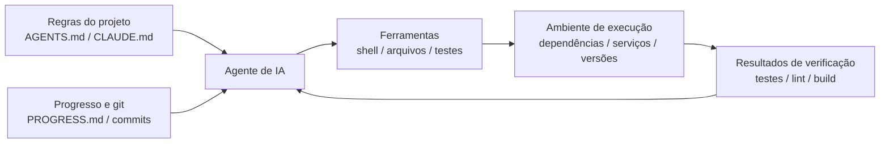

[中文版 →](../../../zh/lectures/lecture-02-what-a-harness-actually-is/)

> Exemplos de código: [code/](https://github.com/walkinglabs/learn-harness-engineering/blob/main/docs/en/lectures/lecture-02-what-a-harness-actually-is/code/)
> Projeto prático: [Projeto 01. Apenas Prompt vs. Regras Primeiro](./../../projects/project-01-baseline-vs-minimal-harness/index.md)

# Aula 02. O Que um Harness Realmente É

A palavra “harness” é usada o tempo todo em discussões sobre agentes de IA para programação, mas na maioria das vezes, quando alguém diz “harness”, na verdade está se referindo apenas a um arquivo de prompt. Um arquivo de prompt não é um harness.

Esta aula define harness de forma precisa e prática — não como uma abstração acadêmica, mas como um framework que você pode aplicar hoje mesmo. Um harness consiste em cinco subsistemas: instruções, ferramentas, ambiente, estado e feedback. Cada subsistema possui responsabilidades e critérios claros de avaliação.

## Comece com uma Analogia

Imagine que você é um engenheiro recém-contratado, jogado em um projeto sem nenhuma documentação. Sem README, sem comentários no código, ninguém explica como rodar os testes, a configuração do CI está escondida em algum lugar. Você consegue escrever um bom código? Talvez — se for inteligente e paciente o suficiente. Mas gastará uma quantidade enorme de tempo tentando descobrir “sobre o que é este projeto” em vez de “resolver o problema”.

Um agente de IA enfrenta exatamente a mesma situação — e ainda pior. Você pelo menos pode perguntar para um colega. O agente só consegue enxergar os arquivos colocados à sua frente e os comandos que pode executar.

A OpenAI define o princípio central da harness engineering como “o repositório É a especificação” — todo contexto necessário deve existir dentro do repositório, entregue através de arquivos de instrução estruturados, comandos explícitos de verificação e uma organização clara de diretórios. A documentação da Anthropic sobre agentes de longa duração enfatiza persistência de estado, caminhos explícitos de recuperação e rastreamento estruturado de progresso. As duas empresas focam em aspectos diferentes, mas estão dizendo essencialmente a mesma coisa: **toda a infraestrutura de engenharia fora do modelo determina quanto da capacidade do modelo realmente será aproveitada.**

Veja alguns exemplos de ferramentas que você provavelmente já conhece:

**Claude Code** incorpora o pensamento de harness. Ele lê o arquivo `CLAUDE.md` do repositório, pode executar comandos shell, roda no ambiente local, mantém histórico de sessão e consegue executar testes para verificar resultados. Mas, se você não informar como rodar os testes, ele não tem como saber se fez tudo corretamente.

**Cursor** segue uma lógica semelhante. Seu arquivo `.cursorrules` funciona como fonte de instruções, o terminal é a ferramenta e ele consegue ler a estrutura do projeto e configurações de lint. Porém, o gerenciamento de estado do Cursor é relativamente fraco — feche a IDE e abra novamente, e o contexto anterior desaparece.

**Codex** (o agente de programação da OpenAI) utiliza git worktrees para isolar o ambiente de execução de cada tarefa, combinado com uma stack local de observabilidade (logs, métricas e traces), permitindo verificar cada alteração em um ambiente independente. Ele apresenta desempenho muito melhor em repositórios com `AGENTS.md` e comandos claros de verificação do que em repositórios “crus”.

**AutoGPT** é o exemplo de alerta. A ausência de gerenciamento estruturado de estado faz o contexto crescer indefinidamente durante tarefas longas, e a ausência de mecanismos precisos de feedback faz o agente entrar em loops. Muitas pessoas dizem que “o AutoGPT não funciona”, mas, na prática, é o harness que não funciona.

## Conceitos Fundamentais

- **O que é um harness**: Tudo na infraestrutura de engenharia fora dos pesos do modelo. A OpenAI resume o trabalho central do engenheiro em três pontos: projetar ambientes, expressar intenção e construir loops de feedback. A Anthropic chama diretamente o SDK de agentes do Claude de um “harness de propósito geral para agentes”.
- **O repositório é a única fonte da verdade**: Qualquer coisa que o agente não consiga enxergar, na prática, não existe. A OpenAI trata o repositório como o “system of record” — todo contexto necessário precisa viver nele, entregue através de arquivos estruturados e organização clara de diretórios.
- **Forneça um mapa, não um manual**: A experiência da OpenAI mostra que o `AGENTS.md` deve funcionar como uma página de navegação, não como uma enciclopédia. Aproximadamente 100 linhas costumam ser suficientes. Se não couber, divida em uma pasta `docs/` e deixe o agente consultar sob demanda.
- **Restrinja, não microgerencie**: Um bom harness utiliza regras executáveis para restringir o agente, em vez de enumerar instruções uma a uma. A OpenAI afirma “faça enforcement de invariantes, não microgerencie implementação”; a Anthropic observou que agentes tendem a elogiar excessivamente o próprio trabalho, e a solução encontrada foi separar “quem executa o trabalho” de “quem verifica o trabalho”.
- **Remova um componente por vez e observe**: Para medir a contribuição marginal de cada componente do harness, remova-os individualmente e veja qual remoção causa a maior queda de desempenho. Isso revela quais componentes têm mais valor naquele momento — e também quais ainda não estão contribuindo de forma significativa. A Anthropic utilizou esse método e descobriu que, conforme os modelos ficam mais fortes, alguns componentes deixam de ser críticos — mas novos componentes críticos sempre surgem.

## O Modelo de Harness com Cinco Subsistemas

Voltando à analogia. Um harness possui cinco subsistemas:


**Subsistema de instruções**: Crie um `AGENTS.md` (ou `CLAUDE.md`) contendo uma visão geral e o propósito do projeto, stack tecnológica e versões, comandos da primeira execução, restrições obrigatórias e links para documentações mais detalhadas.

**Subsistema de ferramentas**: Garanta que o agente tenha acesso suficiente às ferramentas. Não desabilite o shell por “motivos de segurança” — se o agente não consegue sequer executar `pip install`, como ele deveria concluir qualquer tarefa? Mas também não abra tudo indiscriminadamente — siga o princípio do menor privilégio.

**Subsistema de ambiente**: Faça o estado do ambiente ser autoexplicativo. Utilize `pyproject.toml` ou `package.json` para travar dependências, `.nvmrc` ou `.python-version` para especificar versões de runtime, e Docker ou devcontainers para tornar o ambiente reproduzível.

**Subsistema de estado**: Tarefas longas precisam de rastreamento de progresso. Utilize um arquivo simples `PROGRESS.md` registrando: o que foi concluído, o que está em andamento e o que está bloqueado. Atualize antes do fim de cada sessão e leia no início da próxima.

**Subsistema de feedback**: Este é o subsistema com maior retorno sobre investimento. Liste explicitamente os comandos de verificação no `AGENTS.md`:
```txt
Comandos de verificação:
- Testes: pytest tests/ -x
- Verificação de tipos: mypy src/ --strict
- Lint: ruff check src/
- Verificação completa: make check (inclui todos os itens acima)
```

A ausência de qualquer um dos cinco subsistemas significa um harness incompleto, e o agente sempre parecerá desconfortável de usar.

**Quantificando o valor dos componentes do harness**: Utilize um “teste de exclusão com variável controlada”. Mantenha o modelo fixo, remova os cinco subsistemas um de cada vez e observe qual remoção causa a maior queda de desempenho. O componente cuja remoção gera a maior queda possui a maior contribuição marginal para a tarefa atual e vale priorizar. Decidir se ele deve ser fortalecido depende da atribuição das falhas, não apenas do tamanho da queda. Componentes com impacto próximo de zero não devem ser descartados imediatamente: eles podem ser redundantes, mal projetados ou simplesmente não exercitados pela tarefa atual. Esse experimento responde “qual componente é mais valioso agora” — mas, sozinho, não consegue provar “onde está o gargalo”. Para realmente localizar um gargalo, primeiro é necessário examinar registros e atribuições de falha: a tarefa estava mal definida? O contexto era insuficiente? O ambiente não era reproduzível? Faltava feedback de verificação? O gerenciamento de estado estava quebrado? Resultados de ablação de componentes servem apenas como evidência complementar.

## A História Real de um Time

Um time utilizou o GPT-4o para desenvolver uma aplicação frontend em TypeScript + React (~20.000 linhas de código). Eles passaram por quatro etapas, que basicamente consistiram em adicionar componentes de harness um de cada vez:

**Etapa 1**: Apenas uma descrição básica do projeto no README. Apenas 1 de 5 execuções teve sucesso (20%). Principais falhas: escolha do gerenciador de pacotes errado (npm vs yarn), não seguir convenções de nomenclatura de componentes e incapacidade de executar testes.

**Etapa 2**: Adição de um `AGENTS.md` especificando versões da stack, convenções de nomenclatura e decisões importantes de arquitetura. A taxa de sucesso subiu para 60%. As falhas restantes estavam principalmente relacionadas a problemas de ambiente e ausência de verificação.

**Etapa 3**: Inclusão de comandos de verificação no `AGENTS.md`: `yarn test && yarn lint && yarn build`. A taxa de sucesso aumentou para 80%.

**Etapa 4**: Introdução de templates de arquivos de progresso, onde o agente registrava o que havia sido concluído e o que permanecia incompleto em cada execução. A taxa de sucesso estabilizou entre 80% e 100%.

Foram quatro iterações, o modelo não mudou em nenhum momento, e a taxa de sucesso saiu de 20% para quase 100%. Você não trocou para um modelo melhor — o que mudou foi o harness.

## Principais Aprendizados

- Harness = Instruções + Ferramentas + Ambiente + Estado + Feedback. Os cinco subsistemas são essenciais.
- Se não forem os pesos do modelo, então é harness. O seu harness determina quanto da capacidade do modelo realmente será aproveitada.
- Entre os cinco subsistemas, o de feedback geralmente possui o menor custo e o maior retorno. Comece acertando os comandos de verificação.
- Utilize “testes de exclusão com variável controlada” para medir a contribuição marginal de cada subsistema; para encontrar o gargalo real, baseie-se em registros e atribuições de falha, não apenas em ablação.
- Harness também sofre deterioração, assim como código. Faça auditorias regularmente e trate dívida de harness da mesma forma que dívida técnica.

## Leituras Complementares

- [OpenAI: Harness Engineering](https://openai.com/index/harness-engineering/)
- [Anthropic: Harnesses Eficazes para Agentes de Longa Duração](https://www.anthropic.com/engineering/effective-harnesses-for-long-running-agents)
- [HumanLayer: Harness Engineering para Agentes de Programação](https://humanlayer.dev/articles/harness-engineering-for-coding-agents/)
- [SWE-agent: Interfaces entre Agentes e Computadores](https://github.com/princeton-nlp/SWE-agent)
- [Thoughtworks: Harness Engineering no Technology Radar](https://www.thoughtworks.com/radar)

## Exercícios

1. **Auditoria do harness em cinco dimensões**: Escolha um projeto onde você já utiliza agentes de IA e faça uma auditoria completa usando o framework dos cinco subsistemas. Dê uma nota de 1 a 5 para cada subsistema. Encontre o subsistema com menor nota, dedique 30 minutos para melhorá-lo e observe a mudança no desempenho do agente.

2. **Teste de exclusão com variável controlada**: Escolha um modelo e uma tarefa desafiadora. Remova sequencialmente as instruções (apague o `AGENTS.md`), remova o feedback (não forneça comandos de verificação), remova o estado (sem arquivos de progresso) — sempre removendo apenas um item por vez — e meça a queda de desempenho. Use os resultados para classificar o valor marginal de cada subsistema para a tarefa atual. Se quiser encontrar o gargalo, também será necessário registrar logs de falha e fazer atribuição de causa raiz junto com a ablação.

3. **Análise de affordance**: Encontre um cenário no seu projeto em que o agente “quer fazer algo, mas não consegue” (por exemplo: sabe que deveria usar queries parametrizadas, mas não conhece os padrões de ORM do projeto). Analise se isso é um Gulf of Execution (não sabe como operar) ou um Gulf of Evaluation (não sabe se fez corretamente) e, então, projete uma melhoria no harness para reduzir essa lacuna.
