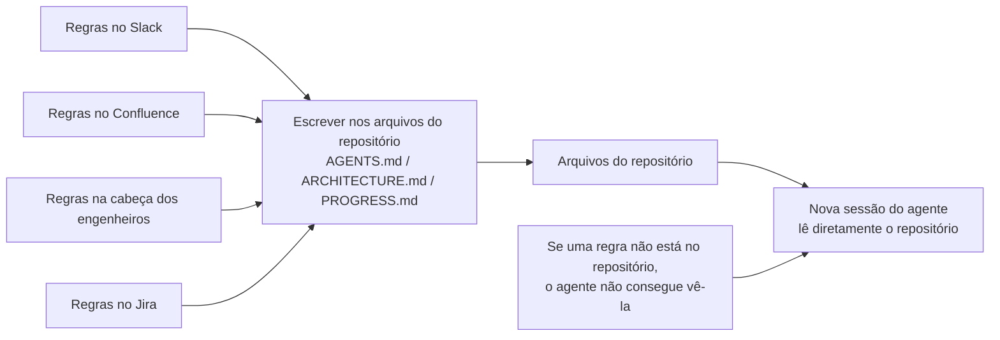
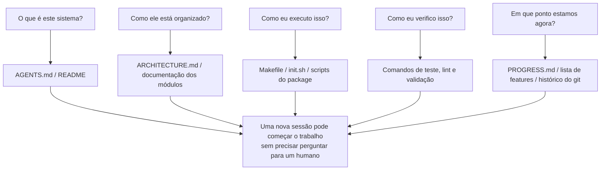

[中文版 →](../../../zh/lectures/lecture-03-why-the-repository-must-become-the-system-of-record/)

> Exemplos de código: [code/](https://github.com/walkinglabs/learn-harness-engineering/blob/main/docs/en/lectures/lecture-03-why-the-repository-must-become-the-system-of-record/code/)
> Projeto prático: [Projeto 02. Faça o Agente Ler o Projeto e Retomar de Onde Parou](./../../projects/project-02-agent-readable-workspace/index.md)

# Aula 03. Tornando o Repositório a Fonte Única da Verdade

As decisões de arquitetura da sua equipe estão espalhadas entre Confluence, Slack, Jira e a cabeça de alguns engenheiros mais experientes. Para humanos isso mal funciona — você pode perguntar para um colega, pesquisar no histórico do chat, vasculhar documentação e, se tudo falhar, encontrar alguém na copa para tirar uma dúvida. Mas, para um agente de IA, informações que não estão no repositório simplesmente não existem.

Isso não é exagero. Um agente possui apenas três fontes de entrada: prompts de sistema e descrições de tarefas, conteúdos de arquivos do repositório e saídas de execução de ferramentas. Seu histórico do Slack, tickets do Jira, páginas do Confluence e aquela decisão de arquitetura discutida com um colega numa sexta-feira à tarde — o agente não consegue ver nada disso. Ele não pode “perguntar para alguém” ou “pesquisar no histórico do chat”. Todo o universo de trabalho dele é o próprio repositório. Tudo o que está fora dele é desconhecido.

Então a verdadeira pergunta é: você vai entregar um mapa bom o suficiente?

## O Que Deve Estar no Mapa

A OpenAI afirma isso de forma direta em seu artigo sobre harness engineering: **informações que não existem no repositório não existem para o agente.** Eles chamam isso de princípio “repo as spec” — o próprio repositório é o documento de especificação de maior autoridade.

A documentação da Anthropic sobre agentes de longa duração reforça uma ideia parecida: estado persistente é uma condição necessária para continuidade em tarefas longas, e a capacidade de recuperar conhecimento entre sessões determina diretamente a taxa de sucesso das tarefas. E esse estado precisa existir no repositório — porque esse é o único armazenamento estável e acessível de forma confiável para o agente.

Você pode pensar: “Nossa equipe é pequena, o conhecimento está na cabeça de todo mundo e funciona bem.” E funciona mesmo — para humanos. Mas, se você quer usar um agente, precisa aceitar um fato: o agente não consegue perguntar para as pessoas. Tudo o que ele precisa saber deve estar documentado e colocado em algum lugar onde consiga encontrar.

Esse não é um problema de “escrever mais documentação” — é um problema de “colocar informações de decisão no lugar certo”. Um `ARCHITECTURE.md` de 50 linhas dentro do diretório `src/api/` é muito mais útil do que um documento de design de 500 páginas no Confluence que ninguém mantém atualizado. Proximidade importa mais do que tamanho, porque uma informação só é realmente útil quando está ao alcance exatamente no momento em que é necessária.

## Visibilidade do Conhecimento



Como você testa se o seu mapa é bom o suficiente? Execute um “teste de sessão nova”: abra uma sessão totalmente nova do agente, forneça apenas o conteúdo do repositório e veja se ele consegue responder cinco perguntas básicas.



Se ele não consegue responder, o mapa tem lacunas. Onde o mapa é incompleto, o agente precisa adivinhar — e adivinhações erradas viram bugs, enquanto adivinhações excessivas desperdiçam contexto. E cada nova sessão precisa adivinhar tudo novamente. O custo de adivinhar é sempre muito maior do que o custo de desenhar o mapa corretamente desde o início.

## Conceitos Principais

- **Knowledge Visibility Gap (Lacuna de Visibilidade do Conhecimento)**: A proporção do conhecimento total do projeto que NÃO está no repositório. Quanto maior a lacuna, maior a taxa de falha do agente. Você pode estimar isso assim: conte todo o conhecimento implícito sobre o projeto que vive na cabeça das pessoas e veja quanto realmente foi parar no repositório. A diferença é a sua lacuna de visibilidade.
- **System of Record (Sistema de Registro)**: O repositório de código como fonte autoritativa para decisões do projeto, restrições arquiteturais, estado de execução e padrões de verificação. O repositório é a palavra final — nenhum outro lugar conta. Se a informação “essa estrada está fechada” existe apenas na cabeça do João, então toda vez alguém vai precisar perguntar para o João. Coloque isso no repositório e ninguém mais precisa perguntar.
- **Fresh Session Test (Teste de Sessão Limpa)**: As cinco perguntas da seção anterior. Quantas delas o agente consegue responder determina o quão completo é o seu mapa.
- **Discovery Cost (Custo de Descoberta)**: Quanto orçamento de contexto o agente consome para encontrar uma única informação importante dentro do repositório. Quanto mais escondida a informação, maior o custo de descoberta e menor o orçamento restante para a tarefa real. Informações críticas devem ficar onde o agente as vê primeiro — não enterradas dez níveis abaixo na árvore de diretórios.
- **Knowledge Decay Rate (Taxa de Decaimento do Conhecimento)**: A proporção de entradas de conhecimento no repositório que ficam desatualizadas ao longo do tempo. Documentação fora de sincronia com o código é o maior inimigo — pior do que não ter documentação é ter documentação desatualizada.
- **ACID Analogy (Analogia ACID)**: Aplicar os princípios de transações de banco de dados (Atomicidade, Consistência, Isolamento e Durabilidade) ao gerenciamento de estado de agentes. Vamos expandir isso mais adiante.

## Como Desenhar um Bom Mapa

**Princípio 1: O conhecimento vive ao lado do código.** Uma regra sobre autenticação de endpoints da API deve ficar próxima ao código da API, e não escondida em um documento global gigantesco. Coloque um documento curto em cada diretório de módulo explicando responsabilidades, interfaces e restrições especiais daquele módulo. O próprio diretório do módulo é um índice natural — quando o agente chega ao código, ele também encontra as restrições, sem precisar procurar.

**Princípio 2: Use um arquivo de entrada padronizado.** `AGENTS.md` (ou `CLAUDE.md`) é a “landing page” do agente. Ele não precisa conter todas as informações, mas deve permitir que o agente responda rapidamente a três perguntas: “O que é este projeto?”, “Como eu executo isso?” e “Como eu verifico isso?”. Entre 50 e 100 linhas é suficiente.

**Princípio 3: Minimalista, mas completo.** Cada informação deve ter um caso de uso claro. Se remover uma regra não altera a qualidade das decisões do agente, essa regra não deveria existir. Mas todas as perguntas do fresh session test precisam ter resposta. Esse é um equilíbrio contínuo — nem demais, nem de menos, apenas o suficiente.

**Princípio 4: Atualize junto com o código.** Vincule atualizações de conhecimento às mudanças de código. A abordagem mais simples: mantenha documentos de arquitetura dentro do diretório correspondente ao módulo. Quando você modifica o código, naturalmente percebe a documentação. Após mudanças no código, o CI pode lembrar você de verificar se os documentos precisam ser atualizados.

**Estrutura concreta do repositório**:

```text
project/
├── AGENTS.md              # Entrada: visão geral do projeto, comandos de execução e restrições rígidas
├── src/
│   ├── api/
│   │   ├── ARCHITECTURE.md  # Decisões arquiteturais da camada de API
│   │   └── ...
│   ├── db/
│   │   ├── CONSTRAINTS.md   # Restrições rígidas para operações de banco de dados
│   │   └── ...
│   └── ...
├── PROGRESS.md             # Progresso atual: concluído, em andamento, bloqueado
└── Makefile                # Comandos padronizados: setup, teste, lint e verificação
```

## Gerenciando Estado de Agentes com Princípios ACID

Essa analogia vem do gerenciamento de transações em bancos de dados. Pode parecer exagerado à primeira vista, mas na prática ela fornece um framework extremamente útil:

- **Atomicidade (Atomicity)**: Cada “operação lógica” (por exemplo: “adicionar novo endpoint e atualizar os testes”) deve gerar um único commit git. Se algo falhar no meio do caminho, use `git stash` para voltar atrás. Tudo ou nada — nada de “meio pronto”.
- **Consistência (Consistency)**: Defina predicados de verificação para um “estado consistente” — todos os testes passando, lint sem erros, etc. O agente deve executar verificações após cada operação; estados intermediários inconsistentes não devem ser commitados. Após cada operação, o sistema precisa estar em um estado verificavelmente correto.
- **Isolamento (Isolation)**: Quando múltiplos agentes trabalham em paralelo, projete arquivos de estado de forma a evitar condições de corrida. Uma abordagem simples: cada agente utiliza seu próprio arquivo de progresso, ou cada um trabalha em uma branch git separada. Escritas concorrentes no mesmo arquivo são uma fonte comum de problemas.
- **Durabilidade (Durability)**: Conhecimento crítico do projeto deve viver em arquivos versionados pelo git. Estado temporário pode permanecer apenas na memória da sessão, mas qualquer conhecimento que precise sobreviver entre sessões deve ser escrito em arquivos. O que está apenas na sua cabeça não conta — só o que foi registrado conta.

## Uma História Real de Transformação

Uma equipe mantinha uma plataforma de e-commerce com aproximadamente 30 microsserviços. As decisões de arquitetura — protocolos de comunicação entre serviços, estratégias de consistência de dados, regras de versionamento de APIs — estavam espalhadas por:
- Confluence (parcialmente desatualizado)
- Slack (difícil de pesquisar)
- A cabeça de alguns engenheiros seniores (não escalável)
- Comentários esporádicos no código (não sistemáticos)

Depois de introduzirem agentes de IA, 70% das tarefas exigiam intervenção humana. Quase todas as falhas envolviam o agente violando alguma restrição implícita que “todo mundo conhece, mas ninguém nunca documentou”. O agente não tinha como saber o que não sabia — ele apenas agia com base no entendimento disponível e acabava caindo em armadilhas.

A equipe executou uma transformação:
1. Criou um `AGENTS.md` na raiz do repositório contendo visão geral do projeto, versões da stack tecnológica e restrições globais rígidas
2. Adicionou um `ARCHITECTURE.md` em cada diretório de microsserviço descrevendo responsabilidades, interfaces e dependências daquele serviço
3. Criou um `CONSTRAINTS.md` centralizado usando linguagem explícita com “MUST / MUST NOT” para restrições críticas
4. Adicionou um `PROGRESS.md` em cada diretório de serviço para rastrear o estado atual do trabalho

Após a transformação: o mesmo agente passou a conseguir responder todas as perguntas-chave do projeto em uma sessão limpa, e a qualidade de conclusão das tarefas melhorou significativamente.

## Principais Conclusões

- Conhecimento que não está no repositório não existe para o agente. Colocar informações críticas de decisão dentro do repositório é o investimento mais fundamental em harness engineering — desenhe um bom mapa para não se perder.
- Use o “fresh session test” para avaliar a qualidade do repositório: uma sessão completamente nova consegue responder cinco perguntas básicas usando apenas o conteúdo do repo?
- O conhecimento deve ficar próximo ao código, ser minimalista mas completo, e ser atualizado junto com o código. Não se trata de escrever mais documentação — trata-se de colocar a informação no lugar certo.
- Use princípios ACID para estado de agentes: commits atômicos, verificação de consistência, isolamento de concorrência e persistência durável de conhecimento crítico.
- Decaimento de conhecimento é o maior inimigo. Documentação desatualizada é mais perigosa do que ausência de documentação — ela leva o agente para a direção errada enquanto ele acredita estar seguindo o caminho certo.

## Leitura Complementar

- [OpenAI: Harness Engineering](https://openai.com/index/harness-engineering/)
- [Anthropic: Effective Harnesses for Long-Running Agents](https://www.anthropic.com/engineering/effective-harnesses-for-long-running-agents)
- [Infrastructure as Code — Martin Fowler](https://martinfowler.com/bliki/InfrastructureAsCode.html)
- [ADR: Architecture Decision Records (Registros de Decisões Arquiteturais)](https://adr.github.io/)
- [The Twelve-Factor App](https://12factor.net/)

## Exercícios

1. **Fresh session test**: Abra uma sessão completamente nova do agente no seu projeto (sem fornecer nenhum contexto verbal), permita que ele veja apenas o conteúdo do repositório e faça cinco perguntas:
   - O que é este sistema?
   - Como ele está organizado?
   - Como eu executo isso?
   - Como eu verifico isso?
   - Qual é o progresso atual?
   
   Registre quais perguntas ele não consegue responder e melhore o repositório até que consiga responder todas.

2. **Quantificação da externalização de conhecimento**: Liste todas as decisões e restrições importantes para o desenvolvimento do seu projeto. Marque cada item como “dentro” ou “fora” do repositório. Calcule sua knowledge visibility gap (a proporção de itens fora do repo). Crie um plano para reduzir essa lacuna para menos de 10%.

3. **Avaliação ACID**: Avalie o gerenciamento de estado do seu projeto usando a analogia ACID desta aula.
   - Atomicidade — as operações do agente podem ser revertidas de forma limpa?
   - Consistência — o repositório possui verificações de “estado consistente”?
   - Isolamento — múltiplos agentes concorrentes interferem entre si?
   - Durabilidade — todo o conhecimento entre sessões está devidamente persistido?