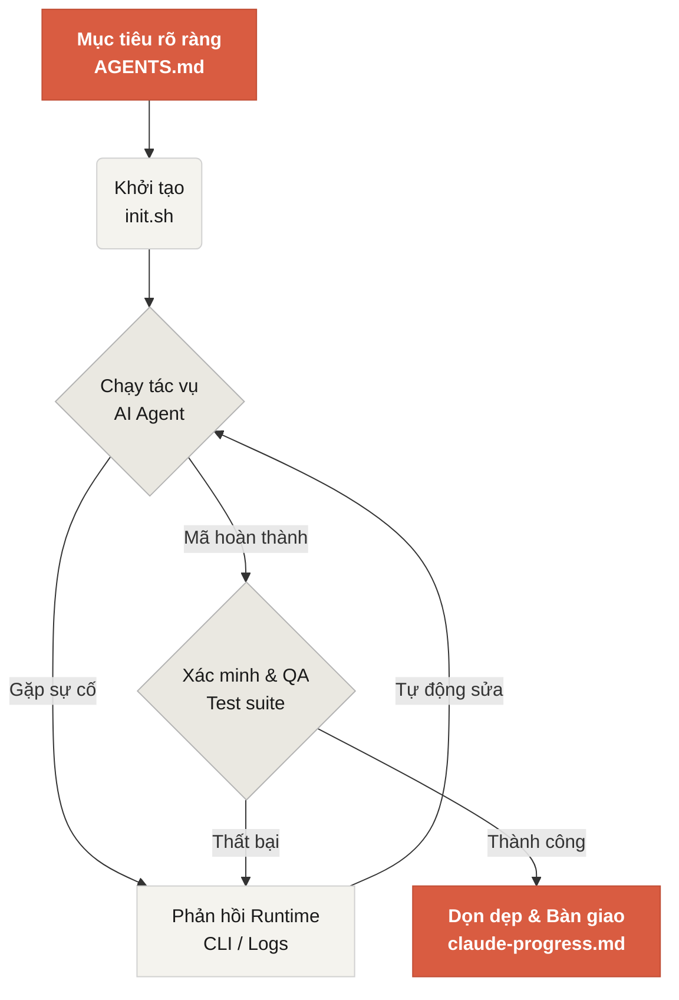

# Chào mừng đến với Learn Harness Engineering

Learn Harness Engineering là khóa học chuyên sâu về kỹ thuật dành cho các AI coding agent. Chúng tôi đã dày công nghiên cứu và tổng hợp những lý thuyết cùng thực tiễn tốt nhất về Harness Engineering hiện nay. Bốn tài liệu tham khảo cốt lõi của khóa học bao gồm:

- [OpenAI: Harness engineering: leveraging Codex in an agent-first world](https://openai.com/index/harness-engineering/)
- [Anthropic: Effective harnesses for long-running agents](https://www.anthropic.com/engineering/effective-harnesses-for-long-running-agents)
- [Anthropic: Harness design for long-running application development](https://www.anthropic.com/engineering/harness-design-long-running-apps)
- [Awesome Harness Engineering](https://github.com/walkinglabs/awesome-harness-engineering)

Qua cách thiết kế môi trường có hệ thống, quản lý trạng thái, xác minh kết quả và kiểm soát chặt chẽ, khóa học giúp bạn biến các công cụ lập trình agent như Codex và Claude Code thành những trợ thủ thực sự đáng tin cậy. Bạn sẽ được hướng dẫn để xây dựng tính năng, sửa lỗi và tự động hóa các tác vụ phát triển, bằng cách ràng buộc trợ lý lập trình AI của bạn trong một bộ quy tắc và ranh giới rõ ràng.

## Bắt đầu

Hãy chọn lộ trình phù hợp để bắt đầu hành trình của bạn. Khóa học gồm ba phần chính: các bài giảng lý thuyết, các dự án thực hành và thư viện tài nguyên có thể sao chép ngay.

  <a href="./lectures/lecture-01-why-capable-agents-still-fail/" class="card">
    <h3>Bài giảng</h3>
    
Hiểu vì sao những mô hình mạnh vẫn thất bại, đồng thời nắm lý thuyết đằng sau các harness hiệu quả.

  </a>
  <a href="./projects/" class="card">
    <h3>Dự án</h3>
    
Thực hành xây dựng một môi trường đáng tin cậy dành cho AI agent từ số 0.

  </a>
  <a href="./resources/" class="card">
    <h3>Thư viện Tài nguyên</h3>
    
Các mẫu sẵn sàng sao chép (AGENTS.md, feature_list.json) để bạn đưa vào kho lưu trữ của riêng mình.

  </a>

## Cơ chế cốt lõi của một Harness

Harness không "làm cho mô hình thông minh hơn"; thay vào đó, nó tạo ra một hệ thống làm việc khép kín cho mô hình. Bạn có thể hình dung quy trình cốt lõi qua sơ đồ đơn giản dưới đây:

## Những gì bạn sẽ học

Dưới đây là những khái niệm trọng tâm mà bạn sẽ nắm vững sau khóa học:

<ul class="index-list">
  <li><strong>Ràng buộc hành vi của agent</strong> bằng các quy tắc và ranh giới rõ ràng.</li>
  <li><strong>Duy trì ngữ cảnh</strong> xuyên suốt các tác vụ dài hạn, đa phiên.</li>
  <li><strong>Ngăn agent tuyên bố thành công</strong> khi công việc chưa thực sự hoàn tất.</li>
  <li><strong>Xác minh kết quả</strong> bằng bộ kiểm thử end-to-end và cơ chế tự phản ánh.</li>
  <li><strong>Giúp runtime có thể quan sát</strong> và dễ dàng gỡ lỗi.</li>
</ul>

## Các bước tiếp theo

Khi đã nắm được các khái niệm cốt lõi, bạn có thể đi sâu hơn theo những hướng sau:

<ul class="index-list">
  <li><a href="./lectures/lecture-01-why-capable-agents-still-fail/">Bài giảng 01: Tại sao các agent mạnh vẫn thất bại</a>: Khởi đầu với lý thuyết nền tảng của harness engineering.</li>
  <li><a href="./projects/project-01-baseline-vs-minimal-harness/">Dự án 01: Baseline vs Minimal Harness</a>: Trải nghiệm tác vụ thực tế đầu tiên của bạn.</li>
  <li><a href="./resources/templates/">Các mẫu</a>: Lấy ngay gói minimal harness (AGENTS.md, feature_list.json, claude-progress.md) cho dự án của bạn.</li>
</ul>
