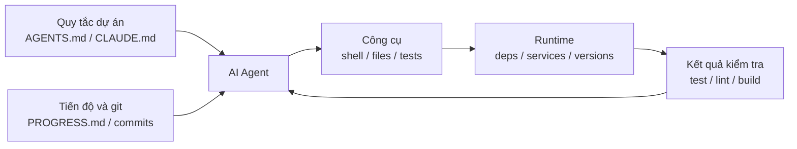

[English Version →](../../../en/lectures/lecture-02-what-a-harness-actually-is/) | [中文版本 →](../../../zh/lectures/lecture-02-what-a-harness-actually-is/)

> Ví dụ code: [code/](https://github.com/walkinglabs/learn-harness-engineering/blob/main/docs/vi/lectures/lecture-02-what-a-harness-actually-is/code/)
> Dự án thực hành: [Dự án 01. Chỉ Prompt vs. Ưu tiên Quy tắc](./../../projects/project-01-baseline-vs-minimal-harness/index.md)

# Bài 02. Harness thực sự có nghĩa là gì

Từ "harness" xuất hiện khắp nơi trong giới AI coding agent, nhưng thành thật mà nói, phần lớn thời gian khi người ta nói "harness", họ thực ra chỉ muốn nói đến một tệp prompt. Một tệp prompt thì không phải là harness.

Bài giảng này đưa ra một định nghĩa chính xác và có thể áp dụng ngay cho harness, không phải sự trừu tượng học thuật, mà là một khung bạn có thể dùng được hôm nay. Một harness gồm năm hệ thống phụ: hướng dẫn, công cụ, môi trường, trạng thái và phản hồi. Mỗi hệ thống phụ có trách nhiệm rõ ràng và tiêu chí đánh giá cụ thể.

## Bắt đầu bằng một phép loại suy

Hãy tưởng tượng bạn là một kỹ sư mới vào làm, được thả vào một dự án không có tài liệu gì cả. Không có README, không có chú thích trong code, không ai chỉ cho bạn cách chạy test, cấu hình CI bị chôn đâu đó. Bạn có viết được code tốt không? Có thể, nếu bạn đủ thông minh và đủ kiên nhẫn. Nhưng bạn sẽ tốn rất nhiều thời gian cho chuyện "tìm hiểu dự án này là cái gì" thay vì "giải quyết bài toán".

Một AI agent rơi vào đúng tình cảnh ấy, mà thậm chí còn tệ hơn. Ít nhất bạn còn có thể hỏi đồng nghiệp. Còn agent thì chỉ thấy được những tệp bạn đặt trước mặt nó và những lệnh nó có quyền thực thi.

OpenAI đúc kết nguyên tắc cốt lõi của harness engineering thành "repo chính là spec": mọi ngữ cảnh cần thiết phải nằm trong kho lưu trữ, được truyền tải qua các tệp hướng dẫn có cấu trúc, lệnh xác minh rõ ràng và tổ chức thư mục rành mạch. Tài liệu về long-running agent của Anthropic lại nhấn mạnh tính liên tục của trạng thái, đường phục hồi tường minh và theo dõi tiến độ có cấu trúc. Hai công ty tập trung vào những khía cạnh khác nhau, nhưng họ đang nói cùng một điều: **mọi thứ trong cơ sở hạ tầng kỹ thuật nằm ngoài mô hình quyết định bao nhiêu phần năng lực của mô hình thực sự được hiện thực hóa.**

Hãy nhìn qua vài công cụ bạn đã biết:

**Claude Code** thể hiện tư duy harness. Nó đọc `CLAUDE.md` từ repo, có thể chạy lệnh shell, thực thi trong môi trường cục bộ của bạn, duy trì lịch sử phiên và có thể chạy test để xem kết quả. Nhưng nếu bạn không chỉ cho nó cách chạy test, nó không có cách nào xác minh nó đã làm đúng chưa.

**Cursor** đi theo logic tương tự. Tệp `.cursorrules` là nguồn hướng dẫn, terminal là công cụ, nó đọc được cấu trúc dự án và cấu hình lint. Tuy nhiên, quản lý trạng thái của Cursor tương đối yếu, đóng IDE rồi mở lại, ngữ cảnh trước đó biến mất.

**Codex** (coding agent của OpenAI) dùng git worktrees để cô lập môi trường runtime của từng tác vụ, kết hợp với ngăn xếp quan sát cục bộ (logs, metrics, traces), nhờ đó mỗi thay đổi đều được xác minh trong một môi trường độc lập. Nó hoạt động tốt hơn hẳn trong những repo có `AGENTS.md` và lệnh xác minh rõ ràng so với repo "trần trụi".

**AutoGPT** là câu chuyện cảnh báo. Thiếu quản lý trạng thái có cấu trúc khiến ngữ cảnh tích lũy vô tận trong các tác vụ dài, và thiếu cơ chế phản hồi chính xác khiến agent bị lặp vòng. Nhiều người nói AutoGPT "không hoạt động", nhưng thực ra chính là cái harness không hoạt động.

## Các khái niệm cốt lõi

- **Harness là gì**: Mọi thứ trong cơ sở hạ tầng kỹ thuật nằm ngoài trọng số mô hình. OpenAI chắt lọc công việc cốt lõi của kỹ sư thành ba việc: thiết kế môi trường, diễn đạt ý định và xây dựng vòng phản hồi. Anthropic thì trực tiếp gọi Claude Agent SDK của họ là "harness agent đa năng".
- **Repo là nguồn sự thật duy nhất**: Bất cứ thứ gì agent không nhìn thấy, về mọi phương diện thực tế, đều không tồn tại. OpenAI coi repo là "hệ thống ghi chép" (system of record): mọi ngữ cảnh cần thiết phải sống ở đó, được truyền tải qua các tệp có cấu trúc và tổ chức thư mục rõ ràng.
- **Đưa bản đồ, đừng đưa cẩm nang**: Kinh nghiệm của OpenAI cho thấy `AGENTS.md` nên đóng vai trò trang thư mục, không phải bách khoa toàn thư. Khoảng 100 dòng là đủ. Nếu không chứa nổi, hãy tách vào thư mục `docs/` và để agent đọc theo yêu cầu.
- **Ràng buộc, đừng vi quản lý**: Một harness tốt dùng các quy tắc có thể thực thi để ràng buộc agent, thay vì liệt kê hết từng hướng dẫn nhỏ. OpenAI nói "thực thi bất biến, đừng vi quản lý triển khai"; Anthropic nhận ra các agent rất tự tin khen công việc của chính mình, và cách xử lý là tách "người làm việc" ra khỏi "người kiểm tra việc".
- **Gỡ từng thứ một và quan sát**: Để định lượng đóng góp biên của từng thành phần harness, hãy lần lượt gỡ chúng ra và xem việc gỡ cái nào gây giảm hiệu suất lớn nhất. Cách này cho bạn biết thành phần nào đang có giá trị nhất ngay lúc này, đồng thời cũng phơi bày những thành phần chưa thực sự đóng góp. Anthropic từng dùng phương pháp này và nhận ra rằng khi mô hình mạnh hơn, một số thành phần sẽ mất đi vai trò tối quan trọng, nhưng những thành phần mới tối quan trọng khác lại luôn xuất hiện.

## Mô hình harness năm hệ thống phụ

Một harness có năm hệ thống phụ:



**Hệ thống phụ Hướng dẫn**: Tạo `AGENTS.md` (hoặc `CLAUDE.md`) chứa tổng quan và mục đích dự án, tech stack cùng phiên bản, các lệnh chạy lần đầu, các ràng buộc cứng không thể thương lượng, và liên kết đến tài liệu chi tiết hơn.

**Hệ thống phụ Công cụ**: Đảm bảo agent có đủ quyền truy cập công cụ. Đừng vô hiệu shell vì "lý do bảo mật", vì nếu agent không thể chạy nổi `pip install` thì bảo nó hoàn thành việc gì? Nhưng cũng đừng mở tất cả, hãy tuân theo nguyên tắc đặc quyền tối thiểu.

**Hệ thống phụ Môi trường**: Làm cho trạng thái môi trường tự mô tả được. Dùng `pyproject.toml` hoặc `package.json` để khóa dependencies, `.nvmrc` hoặc `.python-version` để chỉ định phiên bản runtime, và Docker hoặc devcontainer để môi trường tái lập được.

**Hệ thống phụ Trạng thái**: Tác vụ dài phải có cơ chế theo dõi tiến độ. Dùng một tệp `PROGRESS.md` đơn giản ghi lại: cái gì đã xong, cái gì đang làm, cái gì bị chặn. Cập nhật trước khi phiên kết thúc, đọc lại khi phiên mới bắt đầu.

**Hệ thống phụ Phản hồi**: Đây là hệ thống phụ có ROI cao nhất. Liệt kê rõ các lệnh xác minh trong `AGENTS.md`:
```
Lệnh xác minh:
- Test: pytest tests/ -x
- Type check: mypy src/ --strict
- Lint: ruff check src/
- Xác minh đầy đủ: make check (bao gồm tất cả những mục trên)
```

Thiếu bất kỳ hệ thống phụ nào trong năm cái trên thì harness chưa trọn vẹn, và agent sẽ luôn có cảm giác dùng rất gượng gạo.

**Định lượng giá trị từng thành phần harness**: Dùng thí nghiệm "loại trừ biến có kiểm soát". Giữ cố định mô hình, lần lượt gỡ từng hệ thống phụ trong năm hệ thống, xem hệ thống nào khi bị gỡ gây giảm hiệu suất lớn nhất. Thành phần có mức giảm lớn nhất chính là thành phần có đóng góp biên cao nhất cho tác vụ hiện tại và đáng ưu tiên củng cố. Có nên củng cố nó hay không thì phụ thuộc vào quy kết nguyên nhân lỗi, chứ không riêng vào độ lớn của mức giảm. Những thành phần gần như không có tác động cũng không nên vội loại bỏ: chúng có thể đang dư thừa, được thiết kế chưa tốt, hoặc đơn giản là tác vụ hiện tại chưa khai thác đến. Thí nghiệm này trả lời câu hỏi "thành phần nào đang có giá trị nhất ngay lúc này", bản thân nó không chứng minh được "điểm nghẽn nằm ở đâu". Để thật sự xác định điểm nghẽn, bạn phải xem xét nhật ký lỗi và quy kết nguyên nhân trước: tác vụ có mơ hồ không, ngữ cảnh có thiếu không, môi trường có tái lập được không, phản hồi xác minh có bị thiếu không, hay quản lý trạng thái đang đứt gãy? Kết quả ablation chỉ đóng vai trò bằng chứng hỗ trợ mà thôi.

## Câu chuyện thật của một nhóm

Một nhóm dùng GPT-4o để phát triển ứng dụng frontend TypeScript + React (khoảng 20.000 dòng code). Họ trải qua bốn giai đoạn, về bản chất là thêm từng thành phần harness vào từng bước một:

**Giai đoạn 1**: Chỉ có mô tả dự án sơ khai trong README. 1 trên 5 lần chạy thành công (20%). Lỗi chính: chọn sai package manager (npm thay vì yarn), không tuân theo quy ước đặt tên component, không chạy được test.

**Giai đoạn 2**: Thêm `AGENTS.md` chỉ định phiên bản tech stack, quy ước đặt tên và các quyết định kiến trúc chính. Tỷ lệ thành công tăng lên 60%. Lỗi còn lại chủ yếu đến từ môi trường và thiếu xác minh.

**Giai đoạn 3**: Liệt kê các lệnh xác minh trong `AGENTS.md`: `yarn test && yarn lint && yarn build`. Tỷ lệ thành công tăng lên 80%.

**Giai đoạn 4**: Bổ sung các mẫu tệp tiến độ, trong đó agent ghi lại công việc đã hoàn thành và chưa hoàn thành ở mỗi lần chạy. Tỷ lệ thành công ổn định ở 80-100%.

Bốn vòng lặp, mô hình không hề thay đổi, mà tỷ lệ thành công đã đi từ 20% lên gần 100%. Bạn không đổi sang một mô hình tốt hơn, thứ thay đổi chính là harness.

## Những điểm chính cần nhớ

- Harness = Hướng dẫn + Công cụ + Môi trường + Trạng thái + Phản hồi. Cả năm hệ thống phụ đều cần thiết.
- Không phải trọng số mô hình, thì đó là harness. Harness của bạn quyết định bao nhiêu phần năng lực mô hình được hiện thực hóa.
- Trong năm hệ thống phụ, hệ thống phụ phản hồi thường có chi phí đầu tư thấp nhất mà lợi nhuận cao nhất. Hãy chuẩn hóa lệnh xác minh trước tiên.
- Dùng "thí nghiệm loại trừ biến có kiểm soát" để định lượng đóng góp biên của từng hệ thống phụ. Còn muốn xác định điểm nghẽn thật, hãy dựa vào nhật ký lỗi và quy kết nguyên nhân, không chỉ dựa vào ablation.
- Harness mục ruỗng giống như code vậy. Hãy kiểm tra định kỳ và trả nợ harness y như cách bạn trả nợ kỹ thuật.

## Đọc thêm

- [OpenAI: Harness Engineering](https://openai.com/index/harness-engineering/)
- [Anthropic: Effective Harnesses for Long-Running Agents](https://www.anthropic.com/engineering/effective-harnesses-for-long-running-agents)
- [HumanLayer: Harness Engineering for Coding Agents](https://humanlayer.dev/articles/harness-engineering-for-coding-agents/)
- [SWE-agent: Agent-Computer Interfaces](https://github.com/princeton-nlp/SWE-agent)
- [Thoughtworks: Harness Engineering on Technology Radar](https://www.thoughtworks.com/radar)

## Bài tập

1. **Kiểm toán harness năm tuple**: Lấy một dự án bạn đang dùng AI agent và kiểm toán đầy đủ bằng khung năm tuple. Chấm điểm từng hệ thống phụ trên thang 1-5. Tìm hệ thống phụ có điểm thấp nhất, dành 30 phút cải thiện, rồi quan sát sự thay đổi về hiệu suất agent.

2. **Thí nghiệm loại trừ biến có kiểm soát**: Chọn một mô hình và một tác vụ đầy thách thức. Lần lượt gỡ hướng dẫn (xóa AGENTS.md), gỡ phản hồi (không cung cấp lệnh xác minh), gỡ trạng thái (không có tệp tiến độ), mỗi lần chỉ gỡ một thứ, rồi đo mức giảm hiệu suất. Dùng kết quả để xếp hạng giá trị biên của từng hệ thống phụ cho tác vụ hiện tại. Nếu muốn tìm điểm nghẽn, bạn cũng phải ghi nhật ký lỗi và quy kết nguyên nhân song song với ablation.

3. **Phân tích affordance**: Tìm một tình huống trong dự án của bạn mà agent "muốn làm điều gì đó nhưng không làm được" (ví dụ: biết nên dùng truy vấn có tham số hóa nhưng không biết các pattern ORM của dự án). Phân tích xem đây là Gulf of Execution (không biết cách thao tác) hay Gulf of Evaluation (không biết mình đã làm đúng chưa), rồi thiết kế một cải tiến harness để bắc cầu qua khoảng trống đó.
