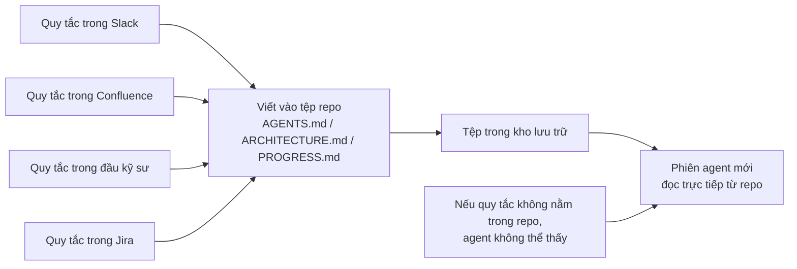
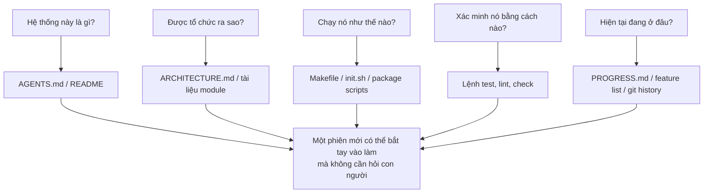

[English Version →](../../../en/lectures/lecture-03-why-the-repository-must-become-the-system-of-record/) | [中文版本 →](../../../zh/lectures/lecture-03-why-the-repository-must-become-the-system-of-record/)

> Ví dụ code: [code/](https://github.com/walkinglabs/learn-harness-engineering/blob/main/docs/vi/lectures/lecture-03-why-the-repository-must-become-the-system-of-record/code/)
> Dự án thực hành: [Dự án 02. Không gian làm việc Agent đọc được](./../../projects/project-02-agent-readable-workspace/index.md)

# Bài 03. Biến kho lưu trữ thành nguồn sự thật duy nhất

Các quyết định kiến trúc của nhóm bạn đang nằm rải rác khắp Confluence, Slack, Jira và đầu của vài kỹ sư cấp cao. Với con người thì cách này gượng gạo mà xong: bạn có thể hỏi đồng nghiệp, tìm trong lịch sử chat, đào tài liệu. Tệ hơn nữa thì chặn ai đó ngoài hành lang cũng xong. Nhưng với AI agent, thông tin không có trong kho lưu trữ thì đơn giản là không tồn tại.

Điều này không phải phóng đại. Agent chỉ có ba nguồn đầu vào: system prompt và mô tả tác vụ, nội dung tệp trong kho lưu trữ, và kết quả thực thi công cụ. Lịch sử Slack, ticket Jira, trang Confluence, hay quyết định kiến trúc bạn bàn với đồng nghiệp trong cafe chiều thứ Sáu, agent không thấy bất kỳ thứ nào cả. Nó không thể "đi hỏi ai" hay "tìm trong lịch sử chat". Toàn bộ thế giới làm việc của nó chính là cái kho lưu trữ, mọi thứ nằm ngoài đó, nó hoàn toàn mù tịt.

Vậy câu hỏi đặt ra là: bạn có sẵn sàng đưa cho nó một tấm bản đồ đủ tốt hay không?

## Những gì thuộc về bản đồ

OpenAI phát biểu rất thẳng trong bài viết về harness engineering: **thông tin không tồn tại trong repo thì không tồn tại với agent.** Họ gọi đây là nguyên tắc "repo là spec": bản thân kho lưu trữ chính là tài liệu đặc tả có thẩm quyền cao nhất.

Tài liệu về long-running agent của Anthropic cũng cùng quan điểm: trạng thái liên tục là điều kiện cần cho sự liên tục của tác vụ dài, và khả năng phục hồi kiến thức xuyên phiên quyết định trực tiếp tỷ lệ thành công của tác vụ. Trạng thái này bắt buộc phải nằm trong kho lưu trữ, vì đó là nơi lưu trữ ổn định và truy cập đáng tin cậy duy nhất mà agent có.

Bạn có thể nghĩ: "Nhóm mình nhỏ, kiến thức nằm trong đầu mọi người, vẫn chạy ổn". Đúng vậy, với người thì ổn. Nhưng nếu muốn dùng agent, bạn phải chấp nhận một sự thật: agent không thể hỏi ai. Mọi thứ nó cần biết đều phải viết ra và đặt ở chỗ nó tìm thấy được.

Đây không phải chuyện "viết thêm tài liệu", mà là chuyện "đặt thông tin quyết định vào đúng chỗ". Một tệp `ARCHITECTURE.md` 50 dòng nằm trong thư mục `src/api/` hữu ích hơn gấp mười lần so với một tài liệu thiết kế 500 trang trên Confluence mà không ai bảo trì. Khoảng cách vật lý quan trọng hơn độ dài, bởi vì thông tin chỉ thật sự hữu dụng khi nó ở ngay trước mặt đúng lúc bạn cần.

## Khả năng hiển thị kiến thức



Làm sao kiểm tra bản đồ đã đủ tốt chưa? Hãy chạy "bài kiểm tra phiên mới" (fresh session test): mở một phiên agent hoàn toàn mới, chỉ cung cấp nội dung repo, rồi xem nó có trả lời được năm câu hỏi cơ bản hay không.



Nếu nó không trả lời được, bản đồ của bạn đang có lỗ hổng. Chỗ nào bản đồ trống, agent phải đoán. Đoán sai biến thành bug, đoán quá nhiều làm lãng phí ngữ cảnh. Và mỗi phiên mới lại đoán lại từ đầu. Chi phí đoán bao giờ cũng đắt hơn rất nhiều so với chi phí vẽ bản đồ cho đúng ngay từ đầu.

## Các khái niệm cốt lõi

- **Khoảng cách hiển thị kiến thức (Knowledge Visibility Gap)**: Tỷ lệ tổng kiến thức dự án mà KHÔNG nằm trong kho lưu trữ. Khoảng cách càng lớn, tỷ lệ thất bại của agent càng cao. Bạn có thể ước lượng bằng cách: liệt kê mọi kiến thức ẩn về dự án đang nằm trong đầu người, sau đó xem bao nhiêu phần trong số đó thật sự đã vào repo. Phần chênh lệch chính là khoảng cách hiển thị của bạn.
- **Hệ thống ghi chép (System of Record)**: Kho lưu trữ code là nguồn có thẩm quyền cho các quyết định dự án, ràng buộc kiến trúc, trạng thái thực thi và tiêu chuẩn xác minh. Repo phát ngôn cuối cùng, không nơi nào khác có giá trị. Nếu thông tin "con đường này đang đóng" chỉ nằm trong đầu bác Tư, thì lần nào bạn cũng phải đi hỏi bác Tư. Viết vào repo, không ai phải hỏi nữa.
- **Bài kiểm tra phiên mới (Fresh Session Test)**: Năm câu hỏi ở phần trên. Agent trả lời được bao nhiêu thì bản đồ của bạn đầy đủ bấy nhiêu.
- **Chi phí khám phá (Discovery Cost)**: Lượng ngân sách ngữ cảnh mà agent đốt để tìm ra một thông tin quan trọng trong repo. Thông tin càng giấu kín, chi phí khám phá càng cao, và ngân sách còn lại cho tác vụ thực càng ít. Những thông tin mang tính quyết định nên đặt ở chỗ agent nhìn thấy đầu tiên, chứ đừng chôn ở mười cấp thư mục sâu.
- **Tốc độ suy giảm kiến thức (Knowledge Decay Rate)**: Tỷ lệ các mục kiến thức trong repo trở nên lỗi thời trên một đơn vị thời gian. Tài liệu lệch khỏi code là kẻ thù lớn nhất, tệ hơn cả việc không có tài liệu nào cả.
- **Phép loại suy ACID**: Áp dụng các nguyên tắc giao dịch cơ sở dữ liệu (Atomicity, Consistency, Isolation, Durability) vào quản lý trạng thái agent. Chúng ta sẽ mở rộng điều này ngay bên dưới.

## Cách vẽ một tấm bản đồ tốt

**Nguyên tắc 1: Kiến thức sống cạnh code.** Một quy tắc về xác thực API endpoint thuộc về cạnh đoạn code API, không bị chôn trong một tài liệu toàn cục khổng lồ. Đặt một tài liệu ngắn trong thư mục mỗi module, giải thích trách nhiệm, giao diện và các ràng buộc đặc biệt của module đó. Bản thân thư mục module đã là một chỉ mục tự nhiên, agent chạm tới code là chạm tới luôn ràng buộc, không cần tìm kiếm gì thêm.

**Nguyên tắc 2: Dùng một tệp đầu vào chuẩn hóa.** `AGENTS.md` (hoặc `CLAUDE.md`) là "trang đích" của agent. Nó không cần chứa hết thông tin, nhưng phải giúp agent nhanh chóng trả lời ba câu hỏi: "Dự án này là gì", "Chạy nó như thế nào" và "Xác minh nó ra sao". 50-100 dòng là đủ.

**Nguyên tắc 3: Tối giản nhưng đầy đủ.** Mỗi mảnh kiến thức cần có một trường hợp sử dụng rõ ràng. Nếu bỏ một quy tắc đi mà chất lượng quyết định của agent không đổi, quy tắc đó không nên tồn tại. Nhưng mỗi câu hỏi trong bài kiểm tra phiên mới đều phải có câu trả lời. Đây là sự cân bằng cần duy trì liên tục, không thừa không thiếu, vừa đủ dùng.

**Nguyên tắc 4: Cập nhật song song với code.** Buộc cập nhật kiến thức phải đi kèm thay đổi code. Cách đơn giản nhất: đặt tài liệu kiến trúc trong thư mục module tương ứng. Khi bạn sửa code, bạn tự nhiên để ý tới tài liệu. Sau khi code thay đổi, CI có thể nhắc bạn kiểm tra tài liệu có cần cập nhật theo không.

**Cấu trúc repo cụ thể**:

```
project/
├── AGENTS.md              # Đầu vào: tổng quan dự án, lệnh chạy, ràng buộc cứng
├── src/
│   ├── api/
│   │   ├── ARCHITECTURE.md  # Quyết định kiến trúc của lớp API
│   │   └── ...
│   ├── db/
│   │   ├── CONSTRAINTS.md   # Ràng buộc cứng trong thao tác cơ sở dữ liệu
│   │   └── ...
│   └── ...
├── PROGRESS.md             # Tiến độ hiện tại: xong, đang làm, đang chặn
└── Makefile                # Lệnh chuẩn hóa: setup, test, lint, check
```

## Quản lý trạng thái agent theo nguyên tắc ACID

Phép loại suy này xuất phát từ quản lý giao dịch cơ sở dữ liệu. Trông có vẻ phức tạp hóa vấn đề, nhưng thực ra nó cho bạn một khung rất thực dụng:

- **Tính nguyên tử (Atomicity)**: Mỗi "thao tác logic" (ví dụ: "thêm endpoint mới và cập nhật test") gói gọn trong một git commit. Nếu thất bại giữa chừng, dùng `git stash` để quay lại. Tất cả hoặc không có gì, không tồn tại trạng thái "làm dở".
- **Tính nhất quán (Consistency)**: Định nghĩa các vị từ xác minh "trạng thái nhất quán" (toàn bộ test pass, lint báo số lỗi bằng 0). Agent chạy xác minh sau mỗi thao tác, và không commit những trạng thái trung gian chưa nhất quán. Sau một thao tác, hệ thống phải ở trạng thái xác minh được là đúng.
- **Tính cô lập (Isolation)**: Khi nhiều agent chạy đồng thời, hãy thiết kế các tệp trạng thái để tránh race condition. Cách đơn giản: mỗi agent dùng tệp tiến độ riêng, hoặc dùng git branch để cô lập. Ghi đồng thời vào cùng một tệp là nguồn cơn trục trặc thường gặp.
- **Tính bền vững (Durability)**: Kiến thức dự án quan trọng phải nằm trong các tệp được git theo dõi. Trạng thái tạm có thể nằm trong bộ nhớ phiên, nhưng kiến thức cần sống sót qua các phiên thì bắt buộc phải ghi vào tệp. Thứ trong đầu bạn không tính, chỉ thứ viết ra mới tính.

## Câu chuyện chuyển đổi thật

Một nhóm vận hành một nền tảng thương mại điện tử gồm khoảng 30 microservice. Các quyết định kiến trúc (giao thức giao tiếp giữa dịch vụ, chiến lược nhất quán dữ liệu, quy tắc phiên bản API) nằm rải rác ở: Confluence (một phần đã lỗi thời), Slack (khó tìm kiếm), đầu vài kỹ sư cấp cao (không mở rộng được), và các chú thích code lác đác (không có hệ thống).

Sau khi đưa AI agent vào, 70% tác vụ phải cần con người can thiệp. Gần như mọi thất bại đều xoay quanh việc agent vi phạm một ràng buộc ngầm nào đó mà "ai cũng biết nhưng chẳng ai viết ra". Agent không có cách nào biết được thứ mà nó không biết là mình chưa biết, nó chỉ có thể hành động theo hiểu biết của nó, rồi rơi thẳng vào bẫy.

Nhóm đó đã thực hiện một cuộc cải tổ:
1. Tạo `AGENTS.md` ở thư mục gốc repo với tổng quan dự án, phiên bản tech stack và các ràng buộc cứng toàn cục
2. Thêm `ARCHITECTURE.md` trong thư mục mỗi microservice, mô tả trách nhiệm, giao diện và phụ thuộc của dịch vụ đó
3. Tạo một `CONSTRAINTS.md` tập trung, dùng ngôn ngữ "PHẢI / KHÔNG ĐƯỢC" rõ ràng cho các ràng buộc cứng
4. Thêm `PROGRESS.md` trong thư mục mỗi dịch vụ để theo dõi trạng thái công việc hiện tại

Sau cải tổ: cùng một agent có thể trả lời tất cả câu hỏi quan trọng của dự án ngay trong một phiên mới, và chất lượng hoàn thành tác vụ cải thiện rõ rệt.

## Những điểm chính cần nhớ

- Kiến thức không nằm trong repo thì không tồn tại với agent. Đưa thông tin quyết định quan trọng vào kho lưu trữ là khoản đầu tư harness nền tảng nhất, hãy vẽ bản đồ cho tốt để không lạc.
- Dùng "bài kiểm tra phiên mới" để đánh giá chất lượng repo: một phiên mới có trả lời được năm câu hỏi cơ bản khi chỉ nhìn vào nội dung repo không?
- Kiến thức phải nằm cạnh code, tối giản nhưng đầy đủ, và cập nhật song song với code. Vấn đề không phải viết thêm tài liệu, mà là đặt thông tin vào đúng chỗ.
- Vận dụng nguyên tắc ACID cho trạng thái agent: commit nguyên tử, xác minh nhất quán, cô lập đồng thời và bền vững hóa kiến thức quan trọng.
- Suy giảm kiến thức là kẻ thù lớn nhất. Tài liệu lỗi thời còn nguy hiểm hơn không có tài liệu, vì nó đẩy agent đi hướng sai trong khi agent vẫn nghĩ mình đang đi đúng hướng.

## Đọc thêm

- [OpenAI: Harness Engineering](https://openai.com/index/harness-engineering/)
- [Anthropic: Effective Harnesses for Long-Running Agents](https://www.anthropic.com/engineering/effective-harnesses-for-long-running-agents)
- [Infrastructure as Code — Martin Fowler](https://martinfowler.com/bliki/InfrastructureAsCode.html)
- [ADR: Architecture Decision Records](https://adr.github.io/)
- [The Twelve-Factor App](https://12factor.net/)

## Bài tập

1. **Bài kiểm tra phiên mới**: Mở một phiên agent hoàn toàn mới trong dự án của bạn (không cung cấp bất kỳ ngữ cảnh lời nói nào), chỉ cho nó thấy nội dung repo, rồi hỏi năm câu: Hệ thống này là gì? Được tổ chức ra sao? Chạy nó như thế nào? Xác minh nó bằng cách nào? Tiến độ hiện tại ra sao? Ghi lại những câu không trả lời được, sau đó cải thiện repo cho tới khi nó trả lời được hết.

2. **Định lượng mức độ ngoại hóa kiến thức**: Liệt kê tất cả quyết định và ràng buộc quan trọng cho việc phát triển trong dự án. Đánh dấu mỗi mục là đã nằm trong repo hay nằm ngoài repo. Tính khoảng cách hiển thị kiến thức (tỷ lệ mục nằm ngoài repo). Lập kế hoạch đưa con số này xuống dưới 10%.

3. **Đánh giá ACID**: Đánh giá khâu quản lý trạng thái dự án theo phép loại suy ACID của bài giảng. Tính nguyên tử: các thao tác của agent có cuộn lại gọn ghẽ được không? Tính nhất quán: repo có vị từ xác minh "trạng thái nhất quán" không? Tính cô lập: các agent chạy đồng thời có giẫm lên nhau không? Tính bền vững: mọi kiến thức xuyên phiên đã được lưu trữ đúng cách chưa?
