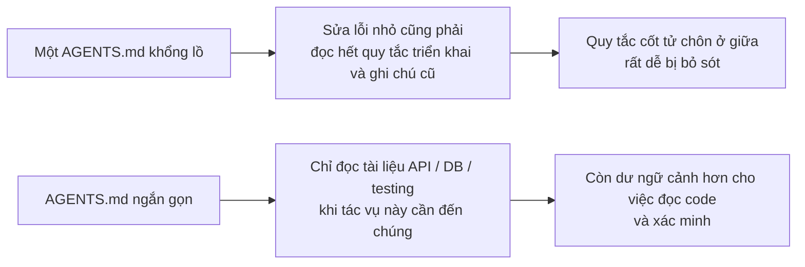
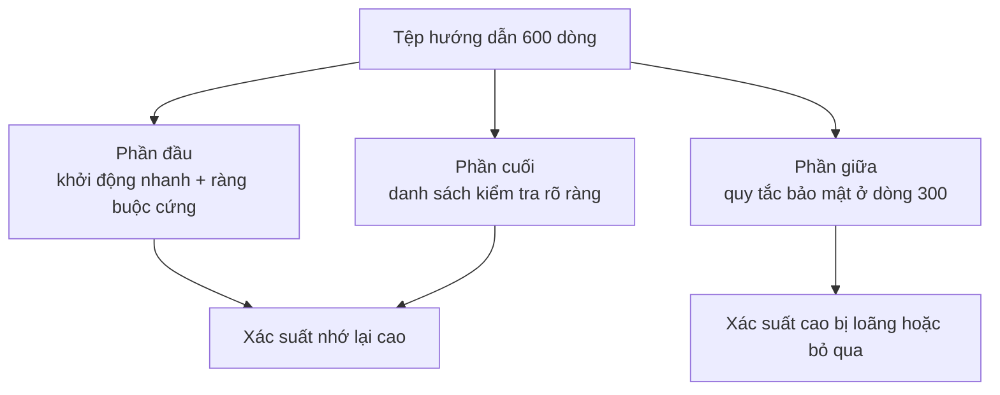

[English Version →](../../../en/lectures/lecture-04-why-one-giant-instruction-file-fails/) | [中文版本 →](../../../zh/lectures/lecture-04-why-one-giant-instruction-file-fails/)

> Ví dụ code: [code/](https://github.com/walkinglabs/learn-harness-engineering/blob/main/docs/vi/lectures/lecture-04-why-one-giant-instruction-file-fails/code/)
> Dự án thực hành: [Dự án 02. Không gian làm việc Agent đọc được](./../../projects/project-02-agent-readable-workspace/index.md)

# Bài 04. Chia hướng dẫn ra thành nhiều tệp

Bạn đã bắt đầu nghiêm túc với harness engineering, điều đó tốt. Bạn tạo một `AGENTS.md` rồi nhồi vào đó mọi quy tắc, ràng buộc và bài học mà bạn nghĩ ra. Một tháng sau tệp phình lên 300 dòng, hai tháng 450 dòng, ba tháng 600 dòng. Rồi bạn nhận ra hiệu suất agent lại đang tệ đi: với một sửa lỗi đơn giản, agent đốt một lượng lớn ngữ cảnh để xử lý mấy hướng dẫn triển khai chẳng liên quan; một ràng buộc bảo mật cốt tử chôn ở dòng 300 bị bỏ qua phăng phăng; ba quy tắc phong cách code mâu thuẫn khiến agent mỗi lần chọn đại một cái.

Đó chính là bẫy "tệp hướng dẫn khổng lồ". Mọi thứ trông đều hữu ích, thế là bạn nhồi hết vào, và muốn tìm một quy tắc cụ thể phải lục tung cả tệp. Bạn viết 600 dòng, nhưng tác vụ trước mắt chỉ cần đúng một phần ba.

## Vòng xoáy bệnh lý ở gốc rễ

Vòng xoáy thường gặp nhất diễn ra thế này: agent mắc lỗi, bạn nghĩ "thêm một quy tắc để chặn chuyện này", thêm vào AGENTS.md, nó ăn ngay. Tạm thời. Rồi agent mắc lỗi khác, bạn thêm quy tắc khác. Lặp lại cho tới khi tệp phình mất kiểm soát.

Phản ứng này hoàn toàn tự nhiên. "Thêm quy tắc" mỗi khi có sự cố nghe có vẻ hợp lý. Nhưng tác động tích lũy lại tai hại. Hãy xem cụ thể chuyện gì đang đi sai.

**Ngân sách ngữ cảnh bị ăn mòn.** Cửa sổ ngữ cảnh của agent là hữu hạn. Giả sử agent có cửa sổ 200K token (tiêu chuẩn của Claude). Một tệp hướng dẫn phình to có thể ngốn mất 10-20K token. Tưởng vẫn còn dư dả lắm? Nhưng tác vụ phức tạp có thể cần đọc hàng chục tệp nguồn, kết quả thực thi công cụ cũng chiếm ngữ cảnh, lịch sử hội thoại lại cứ nối dài. Đến lúc agent thật sự cần hiểu code thì ngân sách đã cạn kiệt.

**Lạc giữa chừng.** Bài báo "Lost in the Middle" (Liu et al., 2023) chứng minh rất rõ rằng LLM tận dụng thông tin ở phần giữa văn bản dài kém hiệu quả hơn hẳn so với ở đầu hoặc cuối. `AGENTS.md` của bạn dài 600 dòng, và dòng 300 ghi "mọi truy vấn cơ sở dữ liệu phải dùng truy vấn có tham số hóa", đó là ràng buộc cứng về bảo mật. Nhưng nó bị chôn ở giữa, và agent gần như chắc chắn sẽ bỏ qua.

**Xung đột ưu tiên.** Cùng một tệp trộn lẫn ràng buộc cứng không thể thương lượng ("không bao giờ dùng eval()"), hướng dẫn thiết kế quan trọng ("ưu tiên phong cách hàm") và một bài học lịch sử cụ thể ("tuần trước sửa rò rỉ bộ nhớ WebSocket, chú ý các pattern tương tự"). Ba quy tắc này có tầm quan trọng hoàn toàn khác nhau, nhưng trong tệp chúng trông giống hệt nhau. Agent không có tín hiệu đáng tin nào để phân biệt đâu là vạch đỏ, đâu chỉ là gợi ý.

**Suy giảm khả năng bảo trì.** Tệp lớn vốn dĩ khó bảo trì. Hướng dẫn lỗi thời hiếm khi bị xóa, vì hậu quả của việc xóa thì mù mờ ("biết đâu có thứ gì khác đang phụ thuộc quy tắc này?"), trong khi thêm hướng dẫn mới trông có vẻ chẳng tốn gì. Kết quả: tệp chỉ tăng, không bao giờ giảm, tỷ lệ tín hiệu trên nhiễu cứ tuột dốc. Đây cũng chính là bài toán nợ kỹ thuật trong phần mềm.

**Tích lũy mâu thuẫn.** Hướng dẫn thêm vào ở những thời điểm khác nhau bắt đầu mâu thuẫn với nhau, cái nói "dùng TypeScript strict mode", cái khác nói "một số tệp cũ được phép dùng any". Agent mỗi lần chọn đại một cái để tuân theo.

## Các khái niệm cốt lõi

- **Phình hướng dẫn (Instruction Bloat)**: Khi tệp hướng dẫn chiếm 10-15% cửa sổ ngữ cảnh, nó bắt đầu chiếm mất ngân sách dành cho việc đọc code và suy luận tác vụ. Một `AGENTS.md` 600 dòng có thể ngốn 10.000-20.000 token, tức 8-15% cửa sổ 128K bị ăn mất trước khi agent kịp bắt đầu.
- **Lạc giữa chừng (Lost in the Middle)**: Thông tin ở phần giữa văn bản dài dễ bị bỏ qua. Nghiên cứu năm 2023 của Liu et al. cho thấy LLM tận dụng thông tin ở giữa văn bản dài kém hiệu quả hơn hẳn so với ở đầu hoặc cuối. Một ràng buộc cốt tử bị chôn ở dòng 300 trong tệp 600 dòng có xác suất rất cao bị bỏ qua.
- **Tỷ lệ tín hiệu trên nhiễu của hướng dẫn (Instruction SNR)**: Tỷ lệ hướng dẫn trong một tệp thật sự liên quan đến tác vụ đang làm. Bị ép đọc 50 dòng hướng dẫn triển khai trong khi sửa lỗi, đó là SNR thấp.
- **Tệp đầu vào (Entry File)**: Một tệp đầu vào ngắn, mục đích chính là dẫn agent tới tài liệu chi tiết hơn, chứ không ôm đồm mọi thứ. 50-200 dòng là đủ.
- **Tiết lộ theo yêu cầu (Reveal on Demand)**: Đưa thông tin tổng quan trước, thông tin chi tiết đưa khi cần. Thiết kế harness tốt giống thiết kế UI tốt, đừng đổ hết tuỳ chọn lên đầu người dùng cùng lúc.
- **Không phân biệt được tầm quan trọng (Can't Tell What Matters)**: Khi mọi hướng dẫn xuất hiện ở cùng định dạng và vị trí, agent không phân biệt nổi ràng buộc cứng không thể thương lượng với gợi ý mềm.

## Kiến trúc hướng dẫn





## Cách chia

Nguyên tắc cốt lõi: giữ thông tin dùng thường xuyên ở tầm tay, cất thông tin thỉnh thoảng mới cần sang một bên, và bỏ lại những thứ sẽ chẳng bao giờ dùng tới.

Tệp đầu vào `AGENTS.md` giữ ở mức 50-200 dòng, chỉ chứa những mục thiết yếu nhất: tổng quan dự án (một đến hai câu cho rõ đây là cái gì), lệnh chạy lần đầu (`make setup && make test`), ràng buộc cứng toàn cục (không quá 15 quy tắc không thể thương lượng), và liên kết tới các tài liệu chủ đề (mô tả một dòng cộng điều kiện áp dụng).

```markdown
# AGENTS.md

## Tổng quan dự án
Backend FastAPI Python 3.11, cơ sở dữ liệu PostgreSQL 15.

## Khởi động nhanh
- Cài đặt: `make setup`
- Test: `make test`
- Xác minh đầy đủ: `make check`

## Ràng buộc cứng
- Tất cả API phải dùng xác thực OAuth 2.0
- Tất cả truy vấn cơ sở dữ liệu phải dùng cú pháp SQLAlchemy 2.0
- Tất cả PR phải pass pytest + mypy --strict + ruff check

## Tài liệu chủ đề
- Mẫu thiết kế API (`docs/api-patterns.md`) — Đọc bắt buộc khi thêm endpoint
- Quy tắc cơ sở dữ liệu (`docs/database-rules.md`) — Bắt buộc khi sửa thao tác cơ sở dữ liệu
- Tiêu chuẩn testing (`docs/testing-standards.md`) — Tham khảo khi viết test
```

Mỗi tài liệu chủ đề 50-150 dòng, được sắp xếp theo chủ đề trong thư mục `docs/` hoặc đặt cạnh module tương ứng. Agent chỉ đọc chúng khi cần. Cũng giống như dùng các túi đựng đồ trong vali, đồ lót một túi, đồ vệ sinh một túi, sạc pin một túi. Muốn tìm gì không cần đổ tung cả vali ra.

Một số thông tin nên đặt trực tiếp trong code, ví dụ định nghĩa kiểu, chú thích giao diện, giải thích trong tệp cấu hình. Agent đọc code sẽ tự nhiên thấy chúng, không cần lặp lại trong phần hướng dẫn.

Mỗi hướng dẫn nên ghi rõ nguồn gốc ("vì sao quy tắc này ra đời?"), điều kiện áp dụng ("khi nào quy tắc này cần thiết?") và điều kiện hết hạn ("trong trường hợp nào có thể bỏ quy tắc này?"). Kiểm tra định kỳ và xoá các mục lỗi thời, thừa hoặc mâu thuẫn. Hãy quản lý hướng dẫn y như cách bạn quản lý dependency, dependency không dùng nên được gỡ, nếu không nó chỉ làm hệ thống chậm thêm.

Nếu một hướng dẫn bắt buộc phải nằm trong tệp đầu vào, hãy đặt ở đầu hoặc ở cuối, đừng bao giờ đặt ở giữa. Hiệu ứng "lạc giữa chừng" cho thấy LLM tận dụng thông tin ở hai cực của văn bản dài tốt hơn hẳn phần trung tâm. Nhưng cách làm tốt hơn vẫn là chuyển hướng dẫn sang các tài liệu chủ đề, để tải theo yêu cầu.

Cả OpenAI và Anthropic đều ngầm ủng hộ cách tiếp cận chia nhỏ. OpenAI nói tệp đầu vào nên "ngắn và thiên về định tuyến", còn Anthropic nói thông tin điều khiển cho long-running agent nên "súc tích và ưu tiên cao". Hai bên đang nói cùng một điều: đừng nhồi hết vào một tệp.

## Ví dụ thật

Một nhóm SaaS có `AGENTS.md` phình từ 50 dòng lên 600. Nội dung trộn lẫn phiên bản tech stack, tiêu chuẩn code, ghi chú sửa lỗi lịch sử, hướng dẫn sử dụng API, quy trình triển khai và cả sở thích cá nhân của thành viên trong nhóm, mọi thứ đều ở trong đó, nhưng tìm phần liên quan tới tác vụ hiện tại là một cuộc hành xác.

Hiệu suất agent bắt đầu tụt rõ rệt: với những sửa lỗi đơn giản, agent tốn nhiều ngữ cảnh để xử lý hướng dẫn triển khai chẳng liên quan; ràng buộc bảo mật "mọi truy vấn cơ sở dữ liệu phải dùng truy vấn có tham số hóa" bị chôn ở dòng 300 và thường xuyên bị bỏ qua; ba quy tắc phong cách code mâu thuẫn khiến agent mỗi lần chọn đại một cái.

Nhóm đã thực hiện một cuộc tái cấu trúc kiểu "sắp lại vali":
1. `AGENTS.md` cắt xuống còn 80 dòng: chỉ tổng quan dự án, lệnh chạy và 15 ràng buộc cứng toàn cục
2. Tạo các tài liệu chủ đề: `docs/api-patterns.md` (120 dòng), `docs/database-rules.md` (60 dòng), `docs/testing-standards.md` (80 dòng)
3. Thêm liên kết tới các tài liệu chủ đề ngay trong tệp đầu vào
4. Ghi chú lịch sử thì chuyển thành test case hoặc xoá luôn

Sau tái cấu trúc: tỷ lệ thành công trên cùng bộ tác vụ tăng từ 45% lên 72%. Mức tuân thủ ràng buộc bảo mật tăng từ 60% lên 95%, vì quy tắc chuyển từ giữa tệp lên đầu tệp đầu vào, không còn bị "lạc giữa chừng" nữa.

## Những điểm chính cần nhớ

- "Thêm quy tắc" là giảm đau ngắn hạn, nhưng là thuốc độc dài hạn. Trước khi thêm quy tắc, hãy nghĩ xem nó có chỗ đứng tốt hơn trong một tài liệu chủ đề không.
- Tệp đầu vào là bộ định tuyến, không phải bách khoa toàn thư. 50-200 dòng chỉ gồm tổng quan, ràng buộc cứng và liên kết.
- Tận dụng hiệu ứng "lạc giữa chừng": thông tin quan trọng đặt ở đầu hoặc cuối, mục kém quan trọng chuyển sang tài liệu chủ đề.
- Quản lý sự phình hướng dẫn y như quản lý nợ kỹ thuật. Kiểm tra định kỳ, mỗi hướng dẫn cần có nguồn gốc, điều kiện áp dụng và điều kiện hết hạn.
- Sau khi chia, SNR tăng lên, agent dành nhiều ngân sách ngữ cảnh hơn cho tác vụ thật thay vì xử lý hướng dẫn lan man.

## Đọc thêm

- [OpenAI: Harness Engineering](https://openai.com/index/harness-engineering/)
- [Anthropic: Effective Harnesses for Long-Running Agents](https://www.anthropic.com/engineering/effective-harnesses-for-long-running-agents)
- [Lost in the Middle: How Language Models Use Long Contexts](https://arxiv.org/abs/2307.03172)
- [HumanLayer: Harness Engineering for Coding Agents](https://humanlayer.dev/articles/harness-engineering-for-coding-agents/)
- [Nielsen Norman Group: Progressive Disclosure](https://www.nngroup.com/articles/progressive-disclosure/)

## Bài tập

1. **Kiểm toán SNR**: Lấy tệp hướng dẫn đầu vào hiện tại của bạn, liệt kê tất cả các mục hướng dẫn. Chọn 5 loại tác vụ thường gặp khác nhau, đánh dấu từng hướng dẫn xem có liên quan tới tác vụ đó không. Tính SNR cho mỗi loại tác vụ. Những hướng dẫn là nhiễu với phần lớn tác vụ nên được chuyển sang tài liệu chủ đề.

2. **Tái cấu trúc tiết lộ theo yêu cầu**: Nếu bạn có tệp hướng dẫn trên 300 dòng, hãy chia thành: (a) tệp đầu vào dưới 100 dòng, (b) 3-5 tài liệu chủ đề. Chạy cùng bộ tác vụ (ít nhất 5) trước và sau, so sánh tỷ lệ thành công.

3. **Xác minh lạc giữa chừng**: Trong một tệp hướng dẫn dài, đặt một ràng buộc cốt tử ở đầu, giữa và cuối theo từng lượt, chạy cùng bộ tác vụ mỗi lần (ít nhất 5 lần cho mỗi vị trí). Xem có khác biệt rõ rệt về tỷ lệ tuân thủ hay không. Có thể bạn sẽ ngạc nhiên về mức độ mạnh của hiệu ứng vị trí.
