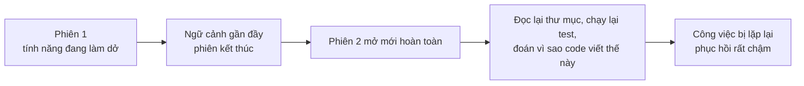
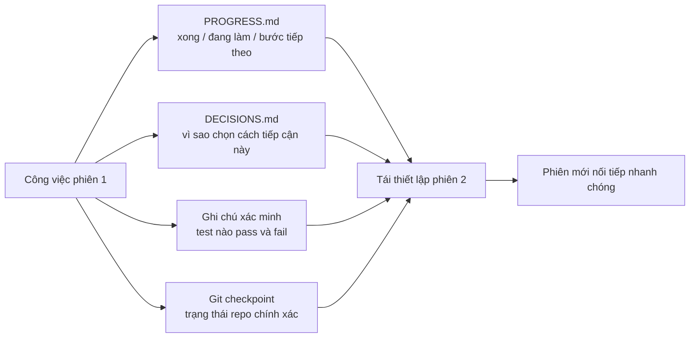

[English Version →](../../../en/lectures/lecture-05-why-long-running-tasks-lose-continuity/) | [中文版本 →](../../../zh/lectures/lecture-05-why-long-running-tasks-lose-continuity/)

> Ví dụ code: [code/](https://github.com/walkinglabs/learn-harness-engineering/blob/main/docs/vi/lectures/lecture-05-why-long-running-tasks-lose-continuity/code/)
> Dự án thực hành: [Dự án 03. Tính liên tục đa phiên](./../../projects/project-03-multi-session-continuity/index.md)

# Bài 05. Duy trì ngữ cảnh xuyên suốt các phiên

Bạn yêu cầu Claude Code triển khai một tính năng hoàn chỉnh. Nó chạy 30 phút, xong phần lớn công việc, nhưng ngữ cảnh bắt đầu cạn. Bạn mở một phiên mới để tiếp tục, và phát hiện nó chẳng nhớ lần trước đã quyết định gì, vì sao lại chọn phương án A thay vì B, đã sửa những tệp nào, hay trạng thái test đang ra sao. Nó tốn 15 phút để khám phá lại dự án, rồi có khi còn đi theo hướng khác với lần trước.

Hãy tưởng tượng bạn là một người thợ mộng, mỗi buổi sáng thức dậy lại quên sạch chuyện hôm qua. Bạn phải làm quen lại với toàn bộ công trường: bức tường nào xây dở, vì sao chọn gạch đỏ thay vì gạch xanh, hệ thống ống nước đang chạy tới đâu. Tệ hơn nữa, bạn có thể tháo cả cái cửa sổ hôm qua đã lắp, chỉ vì không nhớ nó đã xong từ trước.

Đó chính là bài toán mà AI coding agent phải đối mặt trong các tác vụ xuyên phiên. Bài giảng này giải thích vì sao agent "mất sợi dây" khi tác vụ kéo dài, và cách lưu trữ trạng thái có cấu trúc giúp phiên mới nhanh chóng nối tiếp phiên cũ.

## Cửa sổ ngữ cảnh không phải vô hạn

Cửa sổ ngữ cảnh là hữu hạn. Đây không phải chuyện nâng cấp mô hình là giải quyết được, vì ngay cả khi cửa sổ phình lên 1M token, tác vụ phức tạp vẫn sẽ làm cạn kiệt nó. Agent không chỉ sinh code, nó còn phải hiểu codebase, theo dõi lịch sử quyết định của chính mình, xử lý kết quả công cụ và duy trì ngữ cảnh hội thoại. Tất cả những thứ này phình ra nhanh hơn tốc độ cửa sổ được mở rộng.

Một vấn đề sâu hơn: thông tin agent tạo ra không đồng đều về tầm quan trọng. Các bước lý luận trung gian chứa "vì sao" của những quyết định: vì sao chọn phương án B thay vì A, vì sao dùng thư viện này thay vì thư viện kia, vì sao bỏ qua một bước tối ưu nào đó. Kết quả cuối cùng chỉ giữ "cái gì": bản thân đoạn code. Các chiến lược nén thường giữ lại phần sau mà đánh mất phần trước. Phiên tiếp theo nhìn thấy code nhưng không biết vì sao nó được viết như vậy, và có khi còn "tối ưu hóa" đi mất một quyết định thiết kế có chủ đích.

Nghiên cứu về long-running agent của Anthropic quan sát thấy một điều thú vị: khi agent cảm nhận ngữ cảnh sắp cạn, chúng thể hiện hành vi "vội vàng kết thúc", tức là lao đi hoàn thành nốt phần việc đang làm, bỏ qua bước xác minh, hoặc chọn giải pháp đơn giản thay vì giải pháp tối ưu. Anthropic gọi đây là "context anxiety" (lo lắng ngữ cảnh).

## Luồng liên tục giữa các phiên

Không có tệp lưu trữ trạng thái, mỗi phiên mới đều phải bắt đầu lại từ đầu:



Khi có tệp lưu trữ trạng thái, phiên mới nối tiếp nhanh chóng:



## Các khái niệm cốt lõi

- **Cửa sổ ngữ cảnh là hữu hạn**: Dù kích thước cửa sổ được quảng bá là bao nhiêu (128K, 200K, 1M), tác vụ dài rồi cũng sẽ cạn kiệt. Sau khi cạn, chỉ có hai lối: nén (mất thông tin) hoặc reset (mở phiên mới), cả hai đều mất thứ gì đó.
- **Tệp lưu trữ trạng thái (State persistence files)**: Các tệp trạng thái được lưu lại, để phiên mới có thể tiếp tục rõ ràng ngay từ chỗ phiên trước dừng lại. Dạng cơ bản nhất gồm nhật ký tiến độ, bản ghi xác minh và các bước kế tiếp.
- **Chi phí tái thiết lập (Rebuild cost)**: Thời gian phiên mới cần để đạt tới trạng thái có thể thực thi. Một harness tốt có thể nén chi phí này từ 15 phút xuống còn 3 phút.
- **Trôi dạt (Drift)**: Khoảng cách giữa hiểu biết của agent và trạng thái thật của kho lưu trữ code. Mỗi ranh giới phiên lại tạo ra trôi dạt; không kiểm soát, nó sẽ tích tụ qua từng phiên.
- **Lo lắng ngữ cảnh (Context anxiety)**: Hiện tượng Anthropic quan sát thấy: agent thể hiện hành vi vội vàng kết thúc khi ngữ cảnh gần tới giới hạn, kết thúc tác vụ sớm để tránh mất thông tin. Bản chất là sự lo lắng tài nguyên vô lý.
- **Nén so với đặt lại (Compaction vs. reset)**: Nén tóm tắt ngữ cảnh trong cùng phiên (giữ "cái gì", có thể mất "vì sao"); đặt lại mở phiên mới, tái thiết lập từ trạng thái đã lưu (sạch sẽ nhưng phụ thuộc vào độ đầy đủ của các artifact).

## Chuyện gì xảy ra khi tính liên tục bị đứt gãy

Phiên trước đã tốn một lượng lớn ngân sách ngữ cảnh để phân tích ba cách tiếp cận rồi chọn phương án B. Phiên này, agent không biết gì về phân tích đó và có thể quyết lại dựa trên thông tin chưa đầy đủ, có khi lại chọn phương án A. Cùng dữ liệu, kết luận khác, chỉ vì bối cảnh ra quyết định đã biến mất.

Tệ hơn cả là trùng lặp công việc. Agent không chắc phần nào đã xong, nên làm lại. Hoặc tệ hơn, làm được nửa chừng, phát hiện xung đột với phần triển khai đang có, rồi phải sửa lại từ đầu. Nếu không có bản ghi tiến độ, phiên mới không hề biết phần việc nào đã hoàn thành.

Qua nhiều phiên, hướng triển khai có thể âm thầm trôi xa khỏi yêu cầu ban đầu. Mỗi phiên mới lại hiểu mục tiêu dự án hơi khác đi một chút. Mỗi lệch hướng chồng lên lệch hướng trước, và kết quả cuối cùng có khi chẳng còn giống ý đồ gốc.

Còn có cả khoảng cách xác minh. Kết quả xác minh của phiên trước (test nào pass, test nào fail, vì sao fail) không được ghi lại. Phiên mới phải chạy lại toàn bộ xác minh để hiểu trạng thái hiện tại. Mỗi phiên lại chẩn đoán lại từ đầu, mỗi lần đều lãng phí ngữ cảnh quý giá.

Cả OpenAI và Anthropic đều nhấn mạnh tầm quan trọng của lưu trữ trạng thái có cấu trúc trong tài liệu. Bài viết về harness engineering của OpenAI xem kho lưu trữ là "bản ghi hoạt động": kết quả của mỗi thao tác phải để lại bằng chứng truy vết được trong repo. Tài liệu về long-running agent của Anthropic đặc biệt khuyến nghị dùng "handoff files", tức các tài liệu có cấu trúc ghi rõ trạng thái hiện tại, các vấn đề đã biết và các bước kế tiếp.

## Cách tiếp cận thực tế để lưu trữ trạng thái

Cách tiếp cận cốt lõi: **hãy đối xử với agent như một kỹ sư mà bộ nhớ ngắn hạn bị xóa sạch mỗi phiên.** Trước khi "tan ca", nó phải ghi lại thông tin quan trọng để agent "ca sau" nối tiếp nhanh chóng.

**Công cụ 1: Tệp tiến độ (PROGRESS.md).** Tệp lưu trữ trạng thái cơ bản nhất:

```markdown
# Tiến độ dự án

## Trạng thái hiện tại
- Commit mới nhất: abc1234 (feat: add user preferences endpoint)
- Trạng thái test: 42/43 vượt qua (test_pagination_edge_case đang fail)
- Lint: pass

## Đã hoàn thành
- [x] User model và database migration
- [x] Các endpoint CRUD cơ bản
- [x] Tích hợp auth middleware

## Đang thực hiện
- [ ] Tính năng phân trang (90% - edge case test đang fail)

## Vấn đề đã biết
- test_pagination_edge_case trả về 500 với result set rỗng
- Cần xác nhận người dùng đã xoá có nên hiển thị trong danh sách không

## Các bước tiếp theo
1. Sửa lỗi edge case phân trang
2. Thêm query param "include deleted users"
3. Cập nhật tài liệu API
```

**Công cụ 2: Nhật ký quyết định (DECISIONS.md).** Ghi lại các quyết định thiết kế quan trọng cùng lý do. Không cần tài liệu thiết kế chi tiết, chỉ cần "quyết định gì, vì sao, khi nào":

```markdown
# Các quyết định thiết kế

## 2024-01-15: Dùng Redis để cache tùy chọn người dùng
- Lý do: Tần suất đọc cao (mỗi lần gọi API), kích thước dữ liệu nhỏ
- Phương án bị loại: PostgreSQL materialized view (tần suất thay đổi cao khiến chi phí bảo trì không xứng)
- Ràng buộc: TTL cache 5 phút, chủ động vô hiệu khi ghi
```

**Công cụ 3: Git commit làm checkpoint.** Commit sau khi hoàn thành mỗi đơn vị công việc nguyên tử. Commit message phải giải thích đã làm gì và vì sao. Đây là các snapshot trạng thái miễn phí, tự động được phiên bản hoá.

**Công cụ 4: init.sh hoặc luồng khởi tạo harness.** Ghi trong `AGENTS.md` các thói quen "vào ca" và "tan ca":

```markdown
## Khi bắt đầu phiên (vào ca)
1. Đọc PROGRESS.md để nắm trạng thái hiện tại
2. Đọc DECISIONS.md để nắm các quyết định quan trọng
3. Chạy make check để xác nhận repo đang ở trạng thái nhất quán
4. Tiếp tục từ mục "Các bước tiếp theo" trong PROGRESS.md

## Trước khi kết thúc phiên (tan ca)
1. Cập nhật PROGRESS.md
2. Chạy make check để xác nhận trạng thái nhất quán
3. Commit tất cả phần việc đã hoàn thành
```

**Chiến lược hỗn hợp**: Không phải tác vụ nào cũng cần reset ngữ cảnh. Tác vụ ngắn (dưới 30 phút) có thể xử lý gọn trong một phiên. Tác vụ dài (trải nhiều phiên) bắt buộc phải dùng tệp tiến độ và nhật ký quyết định để duy trì tính liên tục. Tiêu chí quyết định: nếu tác vụ cần hơn 60% cửa sổ ngữ cảnh, hãy bắt đầu chuẩn bị bàn giao.

### Tìm hiểu sâu hơn về lo lắng ngữ cảnh

Nghiên cứu tháng 3 năm 2026 của Anthropic tiếp tục hé lộ các biểu hiện cụ thể của context anxiety: trên Sonnet 4.5, khi ngữ cảnh tiệm cận giới hạn cửa sổ, agent thể hiện hành vi "vội vàng kết thúc" rất mạnh. Cũng giống như nhận ra thời gian trong phòng thi sắp hết, rồi điền đại đáp án ngẫu nhiên vào các câu trắc nghiệm còn lại.

Hai chiến lược xử lý chuyện này:

**Nén (Compaction)**: Tóm tắt phần đầu cuộc hội thoại trong cùng phiên. Ưu điểm: duy trì tính liên tục, agent vẫn thấy "cái gì". Nhược điểm: "vì sao" thường bị mất trong các bản tóm tắt, ví dụ vì sao chọn phương án B thay vì A, vì sao bỏ qua một bước tối ưu nào đó. Nghiêm trọng hơn, nén không loại bỏ context anxiety: agent biết ngữ cảnh từng rất lớn, về mặt tâm lý vẫn có xu hướng vội vàng kết thúc.

**Đặt lại ngữ cảnh (Context reset)**: Xóa sạch ngữ cảnh, mở phiên mới, tái thiết lập từ các artifact đã lưu. Ưu điểm: trạng thái tinh thần sạch sẽ, phiên mới không còn nỗi lo "mình sắp hết thời gian". Nhược điểm: phụ thuộc vào độ đầy đủ của các artifact bàn giao. Nếu tệp tiến độ thiếu thông tin quan trọng, phiên mới có thể lãng phí thời gian đi theo hướng sai.

Dữ liệu thực tế từ Anthropic: với Sonnet 4.5, context anxiety nghiêm trọng đến mức chỉ nén là chưa đủ, đặt lại ngữ cảnh trở thành thành phần cốt lõi của thiết kế harness. Nhưng với Opus 4.5, hành vi này giảm hẳn, nén đã có thể quản lý ngữ cảnh mà không cần dựa vào reset. Điều này có nghĩa: **thiết kế harness cần hiểu rõ mô hình mục tiêu, không dùng chung một khuôn cho tất cả.**

> Nguồn: [Anthropic: Harness design for long-running application development](https://www.anthropic.com/engineering/harness-design-long-running-apps)

## Ví dụ thật

Một agent được giao triển khai hệ thống blog có xác thực người dùng, 12 điểm tính năng, ước tính cần 5 phiên.

**Baseline không có tệp lưu trữ trạng thái**: Phiên 1 triển khai user model và các route cơ bản. Phiên 2 mở ra mà agent chẳng nhớ hợp đồng giao diện của auth middleware, tốn khoảng 15 phút để dò lại ý đồ thiết kế trước đó. Đến phiên 3, trôi dạt tích tụ khiến agent bắt đầu triển khai lại các tính năng đã hoàn thành. Sang phiên 5, repo chứa nhiều code thừa nhưng tính năng auth cốt lõi vẫn chưa qua được test end-to-end. Chỉ 7 trên 12 điểm tính năng hoàn thành, trong đó 3 điểm có lỗi ngầm.

**Có tệp lưu trữ trạng thái**: Dùng tệp tiến độ, nhật ký quyết định, bản ghi xác minh và git checkpoint. Báo cáo trạng thái tự động cập nhật ở cuối mỗi phiên. Chi phí tái thiết lập của phiên 2 giảm xuống còn khoảng 3 phút. Đến phiên 5, đủ cả 12 điểm tính năng được hoàn thành và xác minh.

So sánh định lượng: thời gian tái thiết lập giảm khoảng 78%, tỷ lệ hoàn thành tính năng từ 58% lên 100%, tỷ lệ lỗi ngầm từ 43% giảm còn 8%.

## Những điểm chính cần nhớ

- Cửa sổ ngữ cảnh là tài nguyên hữu hạn. Tác vụ dài sẽ trải qua nhiều phiên, và các phiên sẽ mất thông tin, đó là thực tế khách quan.
- Giải pháp không phải cửa sổ lớn hơn, mà là lưu trữ trạng thái tốt hơn. Tệp tiến độ, nhật ký quyết định và git checkpoint phối hợp với nhau, để phiên mới nối tiếp phiên cũ.
- Hãy đối xử với agent như một kỹ sư bị xóa trắng bộ nhớ ngắn hạn mỗi phiên: trước khi "tan ca", phải ghi lại đã làm gì, vì sao, và bước tiếp theo là gì.
- Chi phí tái thiết lập là chỉ số then chốt. Một harness tốt cần đưa phiên mới vào trạng thái có thể thực thi trong vòng 3 phút.
- Chiến lược hỗn hợp: tác vụ ngắn xử lý trong phiên, tác vụ dài dùng artifact có cấu trúc để duy trì tính liên tục.

## Đọc thêm

- [Anthropic: Effective Harnesses for Long-Running Agents](https://www.anthropic.com/engineering/effective-harnesses-for-long-running-agents)
- [OpenAI: Harness Engineering](https://openai.com/index/harness-engineering/)
- [Lost in the Middle: How Language Models Use Long Contexts](https://arxiv.org/abs/2307.03172)
- [Claude Code Documentation](https://docs.anthropic.com/en/docs/claude-code)
- [HumanLayer: Harness Engineering for Coding Agents](https://humanlayer.dev/articles/harness-engineering-for-coding-agents/)

## Bài tập

1. **Đo lường chi phí tái thiết lập**: Chọn một tác vụ phát triển cần ít nhất 3 phiên. Không cung cấp bất kỳ tệp lưu trữ trạng thái nào, ở mỗi lần mở phiên hãy ghi lại xem agent tốn bao nhiêu ngữ cảnh để "tìm hiểu lần trước đã xảy ra chuyện gì". Sau mỗi phiên, tạo một tệp tiến độ rồi để phiên kế tiếp mở từ đó. So sánh chi phí tái thiết lập giữa có và không có tệp tiến độ.

2. **Thiết kế mẫu bàn giao**: Thiết kế một mẫu bàn giao tối giản với bốn trường: trạng thái repo (hash commit), trạng thái runtime (tỷ lệ test pass), các chướng ngại, hành động kế tiếp. Để một phiên agent hoàn toàn mới khôi phục trạng thái dự án chỉ dựa trên mẫu này. Ghi lại các điểm mơ hồ phát sinh trong quá trình khôi phục, rồi lặp lại để cải thiện mẫu.

3. **Thí nghiệm chiến lược hỗn hợp**: Với một tác vụ phát triển 5 phiên, so sánh ba chiến lược: (a) luôn mở phiên mới kết hợp tệp tiến độ, (b) cố gắng làm trọn trong một phiên (nén ngữ cảnh), (c) chiến lược hỗn hợp (tác vụ ngắn trong phiên, tác vụ dài qua nhiều phiên cộng tệp tiến độ). So sánh thời gian tái thiết lập, tỷ lệ hoàn thành tính năng và tính nhất quán của các quyết định.
