[English Version →](../../../en/lectures/lecture-06-why-initialization-needs-its-own-phase/) | [中文版本 →](../../../zh/lectures/lecture-06-why-initialization-needs-its-own-phase/)

> Ví dụ code: [code/](https://github.com/walkinglabs/learn-harness-engineering/blob/main/docs/vi/lectures/lecture-06-why-initialization-needs-its-own-phase/code/)
> Dự án thực hành: [Dự án 03. Tính liên tục đa phiên](./../../projects/project-03-multi-session-continuity/index.md)

# Bài 06. Khởi tạo trước mỗi phiên agent

Bạn mở một phiên agent mới và nói "thêm tính năng tìm kiếm". Nó lao thẳng vào code, nhiệt tình đáng khen. 20 phút sau nó phát hiện khung test chưa cấu hình xong, mất thêm 10 phút sửa, rồi lại thấy script migration cơ sở dữ liệu sai định dạng, lại loay hoay tiếp. Tính năng tìm kiếm cuối cùng cũng xong, nhưng cả phiên rất kém hiệu quả. Phần lớn thời gian đổ vào chuyện "tìm hiểu dự án này vận hành ra sao" thay vì viết tính năng tìm kiếm.

Cách làm tốt hơn: trước khi cho agent bắt tay vào việc, hãy dành một giai đoạn riêng để chuẩn bị môi trường nền, chạy thông suốt các lệnh xác minh, và nắm được cấu trúc dự án. Việc khởi tạo không nên bị nhồi chung với việc triển khai tính năng, vì chúng là hai loại công việc về bản chất khác nhau.

Bài giảng này phân tích vì sao khởi tạo phải là một giai đoạn riêng, chứ không trộn lẫn với triển khai.

## Móng và tường: hai công việc khác nhau về bản chất

Khởi tạo và triển khai có mục tiêu tối ưu hoàn toàn khác nhau. Giai đoạn triển khai tối ưu cho số lượng và chất lượng tính năng được xác minh. Giai đoạn khởi tạo tối ưu cho độ tin cậy và hiệu quả của mọi phần triển khai phía sau.

Khi trộn khởi tạo với triển khai, agent đối mặt bài toán tối ưu đa mục tiêu: vừa xây hạ tầng, vừa viết code tính năng. Không có thiết lập ưu tiên rõ ràng, agent tự nhiên nghiêng về việc viết code (vì đó là sản phẩm nhìn thấy ngay), còn hạ tầng bị xem nhẹ (vì giá trị chỉ bộc lộ ở các phiên sau). Hệ quả là hạ tầng không được xây cho ra hồn, và độ tin cậy của code tính năng cũng bị kéo theo.

## Vòng đời khởi tạo

```mermaid
flowchart TB
    subgraph Wrong["Phiên hỗn hợp (sai)"]
        W1["Bắt đầu ngay vào code tính năng"] --> W2["Phát hiện env và test thiếu sót giữa chừng"]
        W2 --> W3["Tích tụ code chưa xác minh"]
        W3 --> W4["Phiên sau phải khám phá lại trạng thái dự án"]
    end

    subgraph Right["Khởi tạo riêng biệt (đúng)"]
        R1["Phiên 1: môi trường chạy được"] --> R2["Test mẫu pass"]
        R2 --> R3["Viết startup checklist + danh sách tác vụ"]
        R3 --> R4["Commit checkpoint sạch"]
        R4 --> R5["Phiên sau bắt đầu thẳng vào tác vụ đã xác minh"]
    end
```



## Chuyện gì xảy ra khi bạn trộn chúng

Vấn đề trực tiếp nhất: hạ tầng không được xây cho ra hồn. Agent dành 80% sức cho code tính năng, 20% còn lại tiện tay dựng đại vài thứ cho hạ tầng. Khung test cấu hình xong nhưng chưa bao giờ được xác minh, quy tắc lint đặt ra nhưng quá lỏng, không có tệp tiến độ nào được tạo. Những khiếm khuyết ấy không lộ ra ở phiên đầu (vì agent vẫn còn nhớ mình đã làm gì), nhưng bùng lên ở phiên thứ hai: agent mới không biết cách chạy dự án, không biết test ở đâu, không biết mọi thứ đang tới đâu.

Một chi phí ẩn hơn là "tích tụ chưa xác minh". Code tính năng viết trước khi khung test được cấu hình chuẩn, bản thân nó là code không có xác minh. Khi bạn quay lại thêm test, có khi phát hiện ra ngay từ đầu thiết kế đã sai, nếu biết trước, bạn đã triển khai khác đi. Code viết trước càng nhiều, phần phải đập đi làm lại càng lớn.

Ngân sách ngữ cảnh cũng đang bị lãng phí. Phần việc khởi tạo (cấu hình môi trường, dựng test, hiểu cấu trúc dự án) ngốn một mảng lớn ngân sách, để lại ít hơn cho phần triển khai tính năng thật sự. Kết quả: phiên đầu chỉ xong một nửa tính năng, phiên thứ hai vẫn phải bắt đầu lại từ chỗ hiểu dự án. Ngân sách đã đổ vào khởi tạo, mà khởi tạo cũng chẳng ra sao, tệ nhất ở cả hai đầu.

Vấn đề dễ bị bỏ qua nhất là bãi mìn giả định ngầm. Những quyết định agent đưa ra trong lúc khởi tạo (dùng khung test nào, tổ chức thư mục ra sao, quản lý dependency thế nào) nếu không ghi lại tường minh, các phiên sau có thể đưa ra lựa chọn mâu thuẫn. Phiên đầu chọn Vitest làm khung test, phiên sau agent không biết, lại đưa Jest vào. Hai khung test cùng tồn tại, chi phí bảo trì nhân đôi.

Nghiên cứu về phát triển ứng dụng chạy lâu của Anthropic đặc biệt khuyến nghị tách khởi tạo khỏi triển khai. Dữ liệu thực nghiệm của họ: các dự án có giai đoạn khởi tạo riêng biệt đạt tỷ lệ hoàn thành tính năng cao hơn 31% trong kịch bản đa phiên, so với cách trộn lẫn. Thời gian đầu tư cho khởi tạo được thu hồi hoàn toàn trong 3-4 phiên kế tiếp.

Hướng dẫn harness engineering cho Codex của OpenAI cũng nhấn mạnh nguyên tắc "kho lưu trữ là bản ghi hoạt động": thiết lập cấu trúc vận hành rõ ràng ngay từ lần chạy đầu tiên, nếu không mỗi phiên mới sẽ phải tự suy ra quy ước dự án.

## Các khái niệm cốt lõi

- **Giai đoạn khởi tạo (Initialization Phase)**: Giai đoạn đầu tiên trong vòng đời agent, chỉ thiết lập tiền đề cho mọi giai đoạn triển khai về sau, không phát triển tính năng. Đầu ra của nó là hạ tầng, không phải code nghiệp vụ.
- **Danh sách kiểm tra sẵn sàng (Startup Readiness Checklist)**: Tập các điều kiện để dự án có thể được một phiên agent mới vận hành một cách rõ ràng: chạy được, test được, thấy tiến độ được, chọn được bước tiếp theo. Bốn điều kiện, tất cả đều cần.
- **Từ đầu hay từ mẫu (From Scratch vs From Template)**: Từ đầu nghĩa là agent phải tự suy ra cấu trúc dự án từ một thư mục rỗng. Từ mẫu nghĩa là hạ tầng đã có sẵn. Từ mẫu vượt trội hơn hẳn so với từ đầu.
- **Luôn sẵn sàng bàn giao (Always Ready to Hand Off)**: Dự án ở bất kỳ thời điểm nào cũng trong trạng thái một agent mới có thể tiếp quản. Không cần giải thích bằng lời, chỉ cần nhìn nội dung repo là đủ tiếp tục.
- **Thời gian từ bắt đầu tới test pass đầu tiên (Time from Start to First Passing Test)**: Khoảng thời gian từ lúc khởi động dự án đến khi điểm tính năng đầu tiên qua được xác minh. Đây là chỉ số cốt lõi để đo hiệu quả khởi tạo.
- **Tỷ lệ thành công của các phiên sau (Success Rate of Subsequent Sessions)**: Tỷ lệ các phiên tiếp theo có thể thực thi tác vụ thành công mà không dựa vào kiến thức ngầm. Đây là thước đo tốt nhất cho chất lượng khởi tạo.

## Cách làm khởi tạo cho đúng

**Hãy coi khởi tạo là một giai đoạn riêng biệt.** Phiên đầu tiên chỉ làm khởi tạo, hoàn toàn không có code tính năng nghiệp vụ. Khởi tạo cần tạo ra:

**1. Môi trường chạy được.** Dự án khởi động, dependencies đã cài, không có vấn đề môi trường.

**2. Khung test xác minh được.** Ít nhất một test mẫu phải pass, chứng minh bản thân khung test đã được cấu hình đúng.

**3. Tài liệu danh sách sẵn sàng.** Một tài liệu rõ ràng dành cho các phiên sau:
```markdown
# Danh sách kiểm tra sẵn sàng

## Lệnh khởi động
- Cài dependencies: `make setup`
- Chạy dev server: `make dev`
- Chạy test: `make test`
- Xác minh đầy đủ: `make check`

## Trạng thái hiện tại
- Tất cả dependencies đã cài và khóa
- Khung test đã cấu hình (Vitest + React Testing Library)
- Test mẫu đang pass (1/1)
- Quy tắc lint đã cấu hình (ESLint + Prettier)

## Cấu trúc dự án
- src/ — Mã nguồn
- src/components/ — React components
- src/api/ — API client
- tests/ — Tệp test
```

**4. Phân rã tác vụ.** Chia toàn bộ dự án thành danh sách tác vụ có thứ tự, mỗi tác vụ có tiêu chí chấp nhận rõ ràng:
```markdown
# Phân rã tác vụ

## Tác vụ 1: Xác thực người dùng cơ bản
- Triển khai JWT auth middleware
- Thêm endpoint đăng nhập/đăng ký
- Chấp nhận: pytest tests/test_auth.py tất cả đều pass

## Tác vụ 2: Trang hồ sơ người dùng
- Triển khai CRUD hồ sơ người dùng
- Thêm form chỉnh sửa hồ sơ
- Chấp nhận: pytest tests/test_profile.py tất cả đều pass

## Tác vụ 3: Tính năng tìm kiếm
- ...
```

**5. Git commit làm checkpoint.** Sau khi khởi tạo xong, commit một checkpoint sạch. Mọi phần việc sau đó bắt đầu từ checkpoint này.

**Khởi động từ mẫu**: Đừng bắt đầu từ thư mục rỗng. Hãy dùng template dự án (create-react-app, fastapi-template, v.v.) để dựng sẵn cấu trúc thư mục chuẩn, cấu hình dependency và khung test. Đúc sẵn các bước khởi tạo thông dụng vào template, chỉ chừa lại phần khởi tạo riêng cho dự án.

**Tiêu chí hoàn thành khởi tạo**: Không phải "viết được bao nhiêu code", mà là bốn điều kiện trong danh sách sẵn sàng có được đáp ứng hay không: chạy được, test được, thấy tiến độ được, chọn được bước tiếp theo. Hãy dùng danh sách này để xác nhận khởi tạo:

```markdown
## Danh sách chấp nhận khởi tạo
- [ ] `make setup` chạy thành công từ đầu
- [ ] `make test` có ít nhất một test pass
- [ ] Một phiên agent mới có thể trả lời "chạy thế nào" và "test thế nào" chỉ dựa vào nội dung repo
- [ ] Tệp phân rã tác vụ tồn tại, có ít nhất 3 tác vụ
- [ ] Tất cả đã được commit vào git
```

## Ví dụ thật

Hai cách khởi tạo cho một dự án frontend React, đặt cạnh nhau để so sánh:

**Cách trộn lẫn**: Agent vừa tạo scaffolding dự án, vừa triển khai tính năng đầu tiên ngay trong phiên 1. Kết thúc phiên, repo có code chạy được nhưng không có tài liệu lệnh start/test rõ ràng, không có tệp theo dõi tiến độ, không có phân rã tác vụ. Phiên 2 mất khoảng 20 phút để dò ra cấu trúc dự án, khung test và quy trình build.

**Khởi tạo riêng biệt**: Phiên 1 chỉ làm khởi tạo, tạo cấu trúc thư mục từ template, cấu hình khung test (Vitest + React Testing Library), viết và xác minh một test mẫu, tạo danh sách sẵn sàng và tệp phân rã tác vụ, commit checkpoint khởi đầu. Chi phí tái thiết lập của phiên 2 dưới 3 phút, và nó bắt đầu làm việc ngay từ danh sách tác vụ.

So sánh toàn chu kỳ dự án: tổng thời gian tái thiết lập (cộng dồn qua các phiên) của cách trộn lẫn cao hơn khoảng 60% so với cách khởi tạo riêng. 20 phút thêm dành cho khởi tạo được thu hồi gấp nhiều lần trong các phiên tiếp theo. Đầu tư thêm chút thời gian ở đầu để khởi tạo cho đúng, hiệu quả về sau thực ra cao hơn hẳn.

## Những điểm chính cần nhớ

- Khởi tạo và triển khai có mục tiêu tối ưu khác nhau, trộn lẫn chỉ kéo cả hai xuống.
- Đầu ra của khởi tạo không phải code nghiệp vụ, mà là hạ tầng: môi trường chạy được, test xác minh được, danh sách sẵn sàng, phân rã tác vụ.
- Xác nhận khởi tạo bằng bốn điều kiện trong danh sách sẵn sàng: chạy được, test được, thấy tiến độ được, chọn được bước tiếp theo.
- Khởi động từ mẫu tốt hơn từ đầu. Hãy dùng template dự án để dựng sẵn hạ tầng chuẩn hoá.
- Thời gian đầu tư cho khởi tạo được thu hồi hoàn toàn trong 3-4 phiên kế tiếp. Đây không phải chi phí thêm, mà là khoản đầu tư trả trước.

## Đọc thêm

- [Anthropic: Effective Harnesses for Long-Running Agents](https://www.anthropic.com/engineering/effective-harnesses-for-long-running-agents)
- [OpenAI: Harness Engineering](https://openai.com/index/harness-engineering/)
- [HumanLayer: Harness Engineering for Coding Agents](https://humanlayer.dev/articles/harness-engineering-for-coding-agents/)
- [Infrastructure as Code — Martin Fowler](https://martinfowler.com/bliki/InfrastructureAsCode.html)
- [SWE-agent: Agent-Computer Interfaces](https://github.com/princeton-nlp/SWE-agent)

## Bài tập

1. **Thiết kế danh sách sẵn sàng**: Viết một danh sách sẵn sàng hoàn chỉnh cho một dự án bạn đang phát triển. Rồi mở một phiên agent hoàn toàn mới, chỉ cho nó xem nội dung repo (không kèm bất kỳ ngữ cảnh lời nói nào), để nó thử khởi động dự án, chạy test và hiểu tiến độ hiện tại. Ghi lại mọi vấn đề gặp phải, mỗi vấn đề ứng với một điều khoản còn thiếu trong danh sách sẵn sàng của bạn.

2. **Thí nghiệm so sánh**: Chọn một dự án mới cỡ vừa. Cách A: để agent vừa khởi tạo vừa triển khai tính năng đầu tiên. Cách B: dành riêng một phiên cho khởi tạo, bắt đầu triển khai từ phiên 2. Sau 4 phiên, so sánh: thời gian tới test pass đầu tiên, chi phí tái thiết lập, tỷ lệ hoàn thành tính năng.

3. **Danh sách chấp nhận khởi tạo**: Thiết kế một danh sách chấp nhận khởi tạo cho dự án của bạn. Để một phiên agent mới thực thi từng mục trong danh sách và ghi lại mục nào đậu, mục nào trượt. Những mục trượt chính là chỗ harness của bạn cần được củng cố.
