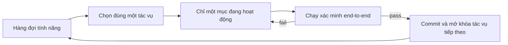
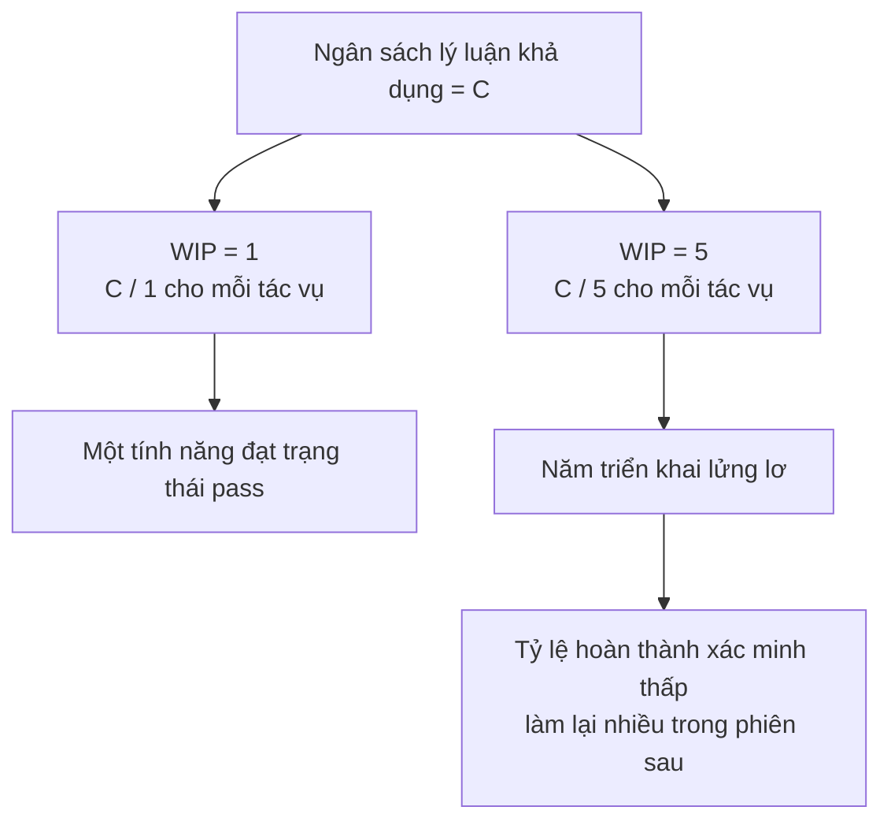

[English Version →](../../../en/lectures/lecture-07-why-agents-overreach-and-under-finish/) | [中文版本 →](../../../zh/lectures/lecture-07-why-agents-overreach-and-under-finish/)

> Ví dụ code: [code/](https://github.com/walkinglabs/learn-harness-engineering/blob/main/docs/vi/lectures/lecture-07-why-agents-overreach-and-under-finish/code/)
> Dự án thực hành: [Dự án 04. Phản hồi Runtime và Kiểm soát Phạm vi](./../../projects/project-04-incremental-indexing/index.md)

# Bài 07. Vạch ranh giới tác vụ rõ ràng cho agent

Bạn nói với Claude Code "thêm xác thực người dùng vào dự án này", và nó bắt đầu sửa schema cơ sở dữ liệu, viết route, thay đổi component frontend, và tiện thể tái cấu trúc luôn error-handling middleware. Hai tiếng sau bạn kiểm tra: 12 tệp bị sửa, 800 dòng code mới, mà chẳng có tính năng nào chạy được end-to-end.

Agent vốn có xung lực "làm thêm một chút", thấy thứ gì liên quan là xử lý luôn. Vấn đề là làm quá nhiều thứ cùng lúc gần như chắc chắn dẫn đến chẳng cái nào ra hồn.

Bài kỹ thuật "Effective harnesses for long-running agents" của Anthropic nói rất rõ: khi prompt quá rộng, agent có xu hướng "bắt đầu nhiều thứ cùng lúc" thay vì "hoàn thành một thứ trước". Thực hành kỹ thuật của Codex trong OpenAI cũng rút ra kết luận tương tự, các tác vụ không có kiểm soát phạm vi rõ ràng chứng kiến tỷ lệ hoàn thành tụt mạnh. Đây không phải vấn đề mô hình, mà là vấn đề harness. Bạn chưa vạch ranh giới.

## Sự chú ý là tài nguyên hữu hạn

Đây không phải phép ẩn dụ, mà là toán. Giả sử dung lượng ngữ cảnh của agent là C, và nó kích hoạt k tác vụ cùng lúc. Mỗi tác vụ nhận trung bình C/k tài nguyên lý luận. Khi C/k tụt xuống dưới ngưỡng tối thiểu để hoàn thành một tác vụ, chẳng cái nào được xong cả.

Hành vi thật của Claude Code rất minh họa. Bảo nó "thêm đăng ký người dùng" và nó có thể:

1. Tạo User model
2. Viết route đăng ký
3. Thấy cần xác minh email, vậy thêm mail service
4. Thấy mật khẩu cần hash, vậy mang bcrypt vào
5. Thấy error handling chưa nhất quán, vậy tái cấu trúc global error middleware
6. Thấy cấu trúc tệp test lộn xộn, vậy sắp xếp lại thư mục

Sáu bước sau, mỗi cái đều làm dở. Không có xác minh end-to-end, code nửa vời cộng lẫn vào nhau rất phức tạp, phiên sau muốn dọn cũng chẳng biết bắt đầu từ đâu.

Dữ liệu thực nghiệm của Anthropic hỗ trợ trực tiếp điều này: agent sử dụng chiến lược "bước tiếp theo nhỏ" (tương đương WIP=1) đạt tỷ lệ hoàn thành tác vụ cao hơn 37% so với agent nhận prompt rộng. Thú vị hơn, số dòng code agent tạo ra có tương quan âm yếu với tỷ lệ hoàn thành tính năng thực tế, viết nhiều code hơn, hoàn thành ít tính năng hơn. Câu "ăn vội nuốt tươi" được dữ liệu xác nhận.

## Quy trình WIP=1





## Các khái niệm cốt lõi

- **Vượt phạm vi (Overreach)**: Agent kích hoạt nhiều tác vụ hơn mức tối ưu trong một phiên. Chuyện này có thể định lượng được: làm 5 tính năng mà 0 cái pass end-to-end thì gọi là vượt phạm vi.
- **Dở dang (Under-finish)**: Tỷ lệ tác vụ pass xác minh end-to-end trên tổng số tác vụ đã kích hoạt tụt xuống dưới ngưỡng. Code viết ra nhưng test không pass, đó là dở dang.
- **Giới hạn WIP (Work-in-Progress Limit)**: Mượn từ phương pháp Kanban. Ý tưởng cốt lõi: giới hạn số tác vụ đang chảy đồng thời. Với agent, WIP=1 là giá trị mặc định an toàn nhất, xong một cái rồi mới bắt đầu cái tiếp theo.
- **Bằng chứng hoàn thành (Completion Evidence)**: Điều kiện có thể xác minh mà tác vụ phải thoả mãn để chuyển từ "đang làm" sang "xong". Không có cái này, agent sẽ thay "code trông có vẻ ổn" bằng "hành vi pass test".
- **Bề mặt phạm vi (Scope Surface)**: Cấu trúc DAG trong đó mỗi nút là một đơn vị công việc, cạnh là phụ thuộc. Trạng thái chỉ có bốn: not_started, active, blocked, passing.
- **Áp lực hoàn thành (Completion Pressure)**: Lực ràng buộc mà harness tạo ra thông qua giới hạn WIP và yêu cầu bằng chứng hoàn thành, buộc agent phải xong tác vụ hiện tại trước khi mở tác vụ mới.

## Vượt phạm vi và dở dang là cộng sinh

Hai vấn đề này không độc lập, chúng khuếch đại lẫn nhau. Vượt phạm vi làm loãng sự chú ý, sự chú ý bị loãng dẫn đến dở dang, và đống code dở dang để lại làm tăng độ phức tạp hệ thống, từ đó lại thúc đẩy vượt phạm vi ở tác vụ tiếp theo. Một vòng xoáy bệnh lý.

Theo ngôn ngữ Kanban: định luật Little cho ta L = lambda * W. Nếu lượng công việc đang chảy L quá lớn (làm quá nhiều thứ cùng lúc), thời gian hoàn thành W của mỗi tác vụ tất yếu tăng. Với agent, điều này nghĩa là mỗi tính năng mất thêm thời gian từ lúc bắt đầu tới lúc hoàn thành đã xác minh, và xác suất thất bại tăng theo.

Đây cũng là vấn đề cũ trong thế giới con người. Steve McConnell từng ghi nhận trong *Rapid Development* rằng scope creep là nguyên nhân hàng đầu khiến dự án thất bại. Nhưng người ta ít nhất còn có trực giác "mình làm đủ rồi". Agent thì không. Việc nảy ra ý tưởng tiếp theo gần như chẳng tốn thêm token nào, chỉ cần viết thêm "tiện thể sửa luôn cái này" là xong, nhưng mỗi sửa đổi bổ sung lại làm loãng thêm sự chú ý của agent.

## Cách làm đúng

### 1. Thực thi WIP=1

Đây là cách trực tiếp và hiệu quả nhất. Trong harness, hãy nói rõ với agent: **chỉ một tác vụ được phép ở trạng thái "active" tại bất kỳ thời điểm nào.** Trong `CLAUDE.md` của Claude Code hoặc `AGENTS.md` của Codex, viết:

```
## Quy tắc làm việc
- Làm một tính năng tại một thời điểm
- Chỉ bắt đầu tính năng tiếp theo sau khi tính năng hiện tại pass xác minh end-to-end
- Đừng "tiện thể tái cấu trúc" tính năng B trong khi triển khai tính năng A
```

### 2. Định nghĩa bằng chứng hoàn thành rõ ràng cho từng tác vụ

Xong không phải "code đã viết", mà là "xác minh hành vi pass". Trong feature list, mỗi mục cần một lệnh xác minh:

```
F01: Đăng ký người dùng
  Xác minh: curl -X POST /api/register -d '{"email":"test@example.com","password":"123456"}' | jq .status == 201
  Trạng thái: passing
```

### 3. Đưa bề mặt phạm vi ra ngoài

Dùng một tệp máy đọc được (JSON hoặc Markdown) để ghi lại trạng thái của mọi tác vụ. Bất kỳ phiên mới nào đọc tệp này là biết ngay: tác vụ nào đang hoạt động? Hành vi nào tính là xong? Những xác minh nào đã pass?

### 4. Theo dõi tỷ lệ hoàn thành đã xác minh

Harness nên liên tục theo dõi VCR (Verified Completion Rate) = số tác vụ đã xác minh / số tác vụ đã kích hoạt. Chặn kích hoạt tác vụ mới khi VCR < 1.0.

## Câu chuyện thật

Một dự án REST API với 8 tính năng, hai chiến lược đặt cạnh nhau:

**Chế độ không ràng buộc**: Agent kích hoạt 5 tính năng cùng lúc trong phiên 1. Tạo ra khoảng 800 dòng trên 12 tệp. Tỷ lệ pass test end-to-end: 20%, chỉ đăng ký người dùng chạy được. 4 tính năng còn lại: database schema đã tạo nhưng thiếu logic xác thực, route khai báo xong nhưng trả về sai định dạng response. Đến cuối phiên 3, chỉ 3 trên 8 tính năng hoàn thành.

**Chế độ WIP=1**: Phiên 1 chỉ làm đăng ký người dùng. Tạo ra khoảng 200 dòng trên 4 tệp. Test end-to-end: 100% pass. Commit một triển khai sạch, đã xác minh. Đến cuối phiên 4, 7 trên 8 tính năng hoàn thành (tính năng thứ 8 bị chặn bởi phụ thuộc bên ngoài).

Kết quả: tổng code ít hơn (800 so với 1200 dòng) nhưng code hiệu quả hơn. Tỷ lệ hoàn thành: 87.5% so với 37.5%.

## Những điểm chính cần nhớ

- **WIP=1 là cài đặt mặc định an toàn cho harness agent**: xong một rồi mới sang cái tiếp theo, đừng cố song song hoá.
- **Bằng chứng hoàn thành phải có thể thực thi**: "code trông có vẻ ổn" không tính, "curl trả về 201" mới tính.
- **Bề mặt phạm vi phải được đưa ra thành một tệp**: không chỉ nhắc tới trong hội thoại, mà phải ghi vào repo ở định dạng máy đọc được.
- **Vượt phạm vi và dở dang là cộng sinh**: giải quyết được một là giải quyết luôn cái kia.
- **"Làm ít mà xong" luôn thắng "làm nhiều mà bỏ dở"**: số dòng code agent và tỷ lệ hoàn thành tính năng có tương quan âm. Chất lượng bao giờ cũng thắng số lượng.

## Đọc thêm

- [Effective harnesses for long-running agents - Anthropic](https://www.anthropic.com/engineering/effective-harnesses-for-long-running-agents) — Bài kỹ thuật của Anthropic, thảo luận chi tiết chiến lược "bước tiếp theo nhỏ"
- [Harness Engineering - OpenAI](https://openai.com/index/harness-engineering/) — Cách tiếp cận đầy đủ của OpenAI về harness engineering
- [Kanban: Successful Evolutionary Change - David Anderson](https://www.goodreads.com/book/show/1070822.Kanban) — Nguồn kinh điển về giới hạn WIP
- [Rapid Development - Steve McConnell](https://www.goodreads.com/book/show/125171.Rapid_Development) — Dữ liệu thực nghiệm về scope creep là nguyên nhân hàng đầu gây thất bại dự án

## Bài tập

1. **Nguyên tử hoá tác vụ**: Chọn một yêu cầu rộng (ví dụ: "triển khai hệ thống quản lý người dùng") và phân nhỏ thành ít nhất 5 đơn vị công việc nguyên tử. Với mỗi đơn vị, hãy chỉ ra: (a) mô tả một hành vi duy nhất, (b) lệnh xác minh có thể thực thi, (c) các phụ thuộc. Kiểm tra xem việc phân rã có thoả mãn ràng buộc WIP=1 không.

2. **Thí nghiệm so sánh**: Chạy cùng một dự án hai lần, một lần không ràng buộc, một lần có WIP=1 được thực thi. So sánh: tỷ lệ hoàn thành đã xác minh, tổng số dòng code, tỷ lệ code hiệu quả.

3. **Kiểm toán bằng chứng hoàn thành**: Rà lại kết quả một lần chạy agent gần đây, phân loại từng thay đổi code thành "hành vi đã xong", "hành vi chưa xong" hoặc "scaffolding". Bổ sung lệnh xác minh còn thiếu cho mỗi hành vi chưa xong.
