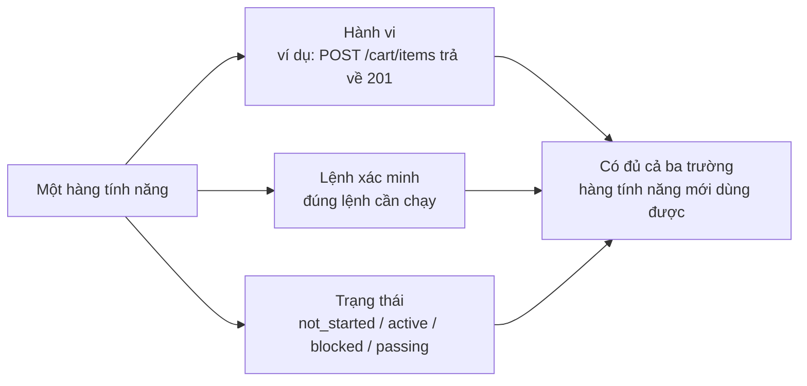
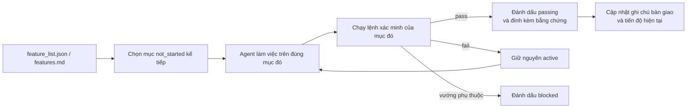

[English Version →](../../../en/lectures/lecture-08-why-feature-lists-are-harness-primitives/) | [中文版本 →](../../../zh/lectures/lecture-08-why-feature-lists-are-harness-primitives/)

> Ví dụ code: [code/](https://github.com/walkinglabs/learn-harness-engineering/blob/main/docs/vi/lectures/lecture-08-why-feature-lists-are-harness-primitives/code/)
> Dự án thực hành: [Dự án 04. Phản hồi Runtime và Kiểm soát Phạm vi](./../../projects/project-04-incremental-indexing/index.md)

# Bài 08. Sử dụng feature list để ràng buộc những gì agent làm

Bạn yêu cầu một agent xây dựng một trang thương mại điện tử. Sau khi nó làm xong, nó báo "xong rồi". Bạn nhìn vào code: phần xác thực người dùng chạy ổn, nhưng nút thanh toán trong giỏ hàng không làm gì cả, còn luồng thanh toán thì chẳng kết nối với ai. Vấn đề ở đâu? Bạn chưa bao giờ nói với nó "xong" nghĩa là cái gì, nên nó tự lấy một chuẩn riêng: "tôi viết khá nhiều code và trông cũng tạm đầy đủ".

Trong mắt nhiều người, feature list chỉ là một ghi chú nhắc nhở, viết ra để khỏi quên, xong rồi vứt sang một bên. Nhưng trong thế giới harness, feature list không phải ghi chú cho người, mà là cấu trúc nền tảng mà cả harness dựa lên. Bộ lập lịch dựa vào nó để chọn tác vụ, bộ xác minh dựa vào nó để phán xét hoàn thành, trình báo cáo bàn giao dựa vào nó để sinh tóm tắt. Không có nó, các thành phần ấy chẳng có chỗ bám víu.

Cả Anthropic và OpenAI đều nhấn mạnh: **các artifact phải được đưa ra ngoài.** Trạng thái tính năng phải nằm trong một tệp máy đọc được trong repo, không phải trôi nổi trong đoạn hội thoại không cấu trúc.

## Agent không biết "xong" nghĩa là gì

Cả Claude Code lẫn Codex đều không tự động biết bạn muốn nói gì khi nói "xong". Bạn bảo "thêm tính năng giỏ hàng", mô hình có thể hiểu thành "viết một Cart component và một addToCart method". Nhưng ý bạn là "người dùng có thể duyệt sản phẩm, thêm vào giỏ và hoàn tất thanh toán end-to-end".

Khoảng cách hiểu biết này cứ tồn tại mãi nếu không có feature list. Agent tự lấy một chuẩn ngầm, thường là "code không có lỗi cú pháp rõ ràng". Điều bạn cần là xác minh hành vi end-to-end. Không có danh sách chung, hai bên sẽ chẳng bao giờ thống nhất được "xong" nghĩa là gì.

Nhìn mẫu ghi chú tiến độ quen thuộc này:

```
Đã làm xác thực người dùng, giỏ hàng hầu như xong, vẫn cần thanh toán
```

Một phiên agent mới đọc ghi chú này thì trả lời được gì? "Hầu như xong" nghĩa là gì? Giỏ hàng đã pass test nào? Cái gì đang chặn thanh toán? Câu trả lời cho tất cả: "không ai biết". Cũng giống như bảo bác sĩ "bụng tôi đau, dạo này có vẻ ổn hơn", bác sĩ biết kê đơn thuốc nào đây?

Hệ quả: phiên mới tốn 20 phút để dò ra trạng thái dự án, và có khi lại triển khai lại những tính năng đã hoàn thành. Dữ liệu kỹ thuật của Anthropic cho thấy bản ghi tiến độ tốt giảm thời gian chẩn đoán lúc khởi động phiên từ 60% đến 80%.

## Máy trạng thái tính năng





## Các khái niệm cốt lõi

- **Feature list là nguyên thuỷ của harness**: Không phải "công cụ lập kế hoạch tuỳ chọn", mà là cấu trúc dữ liệu nền mà mọi thành phần harness khác đều phụ thuộc. Bộ lập lịch, bộ xác minh và trình báo cáo bàn giao đều cần đọc feature list mới vận hành được.
- **Cấu trúc ba trường**: Mỗi mục tính năng gồm ba yếu tố: `(mô tả hành vi, lệnh xác minh, trạng thái hiện tại)`. Hành vi chỉ cho agent biết cần làm gì, lệnh xác minh cho biết cái gì tính là xong, trạng thái cho biết mọi thứ đang tới đâu. Thiếu một yếu tố thì mục đó chưa hoàn chỉnh.
- **Mô hình máy trạng thái**: Mỗi mục có bốn trạng thái: `not_started`, `active`, `blocked`, `passing`. Chuyển trạng thái do harness kiểm soát, agent không được tự ý đổi.
- **Cổng trạng thái pass (Pass-state gating)**: Cách duy nhất để một tính năng đi từ `active` sang `passing` là lệnh xác minh chạy thành công. Chuyển trạng thái này là một chiều, một khi `passing` rồi thì không quay lại được.
- **Nguồn sự thật duy nhất**: Mọi thông tin về "cần làm gì" phải bắt nguồn từ một feature list. Không có mâu thuẫn giữa feature list và lịch sử hội thoại.
- **Áp lực ngược (Back-pressure)**: Số tính năng chưa pass chính là áp lực mà harness đặt lên agent. Áp lực bằng không tức dự án hoàn thành.

## Vì sao feature list phải là "nguyên thuỷ"

Tài liệu là để người đọc, nguyên thuỷ là để hệ thống thực thi. Tài liệu có thể bị bỏ qua, nguyên thuỷ thì hệ thống không thể vượt qua.

Hãy hình dung như ràng buộc trigger trong cơ sở dữ liệu so với kiểm tra ở tầng ứng dụng: cái trước do engine cơ sở dữ liệu ép, không có câu SQL nào bỏ qua được; cái sau phụ thuộc vào tính đúng đắn của code ứng dụng và có thể vô tình bị lách. Feature list với tư cách nguyên thuỷ harness đóng đúng vai trò của ràng buộc mức cơ sở dữ liệu, agent không thể lách.

Cụ thể, feature list phục vụ bốn thành phần harness:

1. **Bộ lập lịch (Scheduler)**: Đọc trạng thái, chọn tính năng `not_started` kế tiếp.
2. **Bộ xác minh (Verifier)**: Chạy lệnh xác minh, quyết định có cho phép chuyển trạng thái hay không.
3. **Trình báo cáo bàn giao (Handoff Reporter)**: Tự động sinh tóm tắt bàn giao phiên từ feature list.
4. **Trình theo dõi tiến độ (Progress Tracker)**: Thống kê phân bố trạng thái, cung cấp chỉ số sức khoẻ dự án.

## Cách làm đúng

### 1. Định nghĩa định dạng feature list tối giản

Bạn không cần hệ thống phức tạp, một tệp Markdown hoặc JSON có cấu trúc là đủ. Điều quan trọng là mỗi mục phải có đủ bộ ba:

```json
{
  "id": "F03",
  "behavior": "POST /cart/items với {product_id, quantity} trả về 201",
  "verification": "curl -X POST http://localhost:3000/api/cart/items -H 'Content-Type: application/json' -d '{\"product_id\":1,\"quantity\":2}' | jq .status == 201",
  "state": "passing",
  "evidence": "commit abc123, test output log"
}
```

### 2. Để harness kiểm soát chuyển trạng thái

Agent không được trực tiếp đổi trạng thái một tính năng thành `passing`. Nó chỉ có thể gửi yêu cầu xác minh. Harness chạy lệnh xác minh và quyết định có cho phép chuyển hay không. Đó chính là "pass-state gating".

### 3. Viết quy tắc trong CLAUDE.md

```
## Quy tắc feature list
- Tệp feature list: /docs/features.md
- Chỉ một tính năng ở trạng thái active tại một thời điểm
- Lệnh xác minh phải pass trước khi đánh dấu passing
- Không tự ý sửa trạng thái feature list, script xác minh sẽ tự cập nhật
```

### 4. Hiệu chỉnh độ hạt

Mỗi mục tính năng nên có phạm vi "hoàn thành được trong một phiên". Quá rộng thì không xong, quá hẹp thì overhead quản lý phình lên. "Người dùng có thể thêm sản phẩm vào giỏ" là độ hạt vừa đẹp. "Triển khai giỏ hàng" là quá rộng. "Tạo trường tên trên Cart model" là quá hẹp. Cũng giống như cắt miếng bít tết, không phải cả tảng, cũng không phải thịt băm nhỏ.

## Câu chuyện thật

Một nền tảng thương mại điện tử với 10 tính năng. Hai cách theo dõi đặt cạnh nhau:

**Chế độ ghi chú**: Agent dùng ghi chú không cấu trúc để theo dõi tiến độ. Sau 3 phiên, ghi chú trở thành "đã làm xác thực người dùng và danh sách sản phẩm, giỏ hàng hầu như xong nhưng có bug, thanh toán chưa bắt đầu". Phiên mới cần 20 phút để dò trạng thái, và cuối cùng vẫn triển khai lại các tính năng đã xong. Cũng giống như danh sách đi chợ ghi "sữa, bánh mì, với cả cái đó", đứng giữa siêu thị bạn vẫn chẳng biết nên mua gì.

**Chế độ có cấu trúc**: Mỗi tính năng có trạng thái và lệnh xác minh rõ ràng. Phiên mới đọc feature list và trong 3 phút đã biết: F01-F05 đang `passing`, F06 đang `active` (đang triển khai), F07-F10 đang `not_started`. Nối tiếp thẳng vào F06, không có phần việc nào phải làm lại.

Kết quả định lượng: các dự án dùng feature list có cấu trúc đạt tỷ lệ hoàn thành tính năng cao hơn 45% so với theo dõi tự do, và số lần triển khai trùng lặp bằng 0.

## Những điểm chính cần nhớ

- **Feature list là cấu trúc nền của harness**, không phải ghi chú cho người. Bộ lập lịch, bộ xác minh và trình báo cáo bàn giao đều dựa vào nó.
- **Mỗi mục tính năng phải có đủ bộ ba**: mô tả hành vi, lệnh xác minh và trạng thái hiện tại. Thiếu một yếu tố thì mục chưa hoàn chỉnh, cũng như ghế ba chân mà mất một chân.
- **Chuyển trạng thái do harness kiểm soát**, agent không tự ý đổi được. Pass xác minh là con đường nâng cấp duy nhất.
- **Feature list là nguồn sự thật duy nhất của dự án**, mọi thông tin dạng "cần làm gì" đều bắt nguồn từ đó.
- **Hiệu chỉnh độ hạt về mức "hoàn thành được trong một phiên"**, quá rộng thì không xong, quá hẹp thì không quản lý nổi.

## Đọc thêm

- [Building Effective Agents - Anthropic](https://www.anthropic.com/research/building-effective-agents) — Xác định rõ feature list là "cấu trúc dữ liệu cốt lõi" để kiểm soát phạm vi agent
- [Harness Engineering - OpenAI](https://openai.com/index/harness-engineering/) — Nhấn mạnh nguyên tắc "đưa artifact ra ngoài"
- [Design by Contract - Bertrand Meyer](https://www.goodreads.com/book/show/130439.Object_Oriented_Software_Construction) — Nguyên tắc thiết kế theo hợp đồng, nền tảng lý thuyết của feature list
- [How Google Tests Software](https://www.goodreads.com/book/show/13563030-how-google-tests-software) — Tháp kiểm thử và thực hành kỹ thuật đặc tả hành vi

## Bài tập

1. **Thiết kế feature list**: Định nghĩa một JSON schema feature list tối giản. Bao gồm: id, mô tả hành vi, lệnh xác minh, trạng thái hiện tại, tham chiếu bằng chứng. Dùng nó để mô tả một dự án thật với 5 tính năng.

2. **So sánh độ khắt khe của xác minh**: Chọn 3 tính năng và thiết kế cả xác minh "lỏng" (ví dụ: "code không có lỗi cú pháp") lẫn xác minh "nghiêm" (ví dụ: "test end-to-end pass"). So sánh tỷ lệ dương tính giữa hai cách.

3. **Kiểm toán nguyên tắc nguồn duy nhất**: Rà một dự án agent hiện có, kiểm tra thông tin phạm vi có mâu thuẫn với feature list hay không (yêu cầu ngầm trong hội thoại, TODO trong code, v.v.). Thiết kế kế hoạch để hợp nhất tất cả thông tin về feature list.
