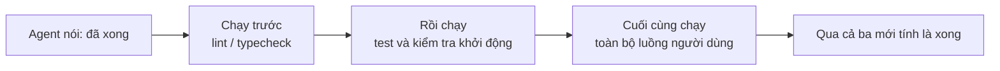
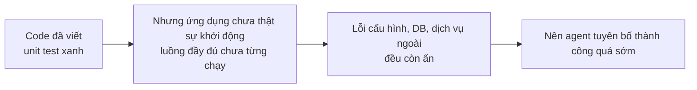

[English Version →](../../../en/lectures/lecture-09-why-agents-declare-victory-too-early/) | [中文版本 →](../../../zh/lectures/lecture-09-why-agents-declare-victory-too-early/)

> Code ví dụ cho bài giảng này: [code/](https://github.com/walkinglabs/learn-harness-engineering/blob/main/docs/vi/lectures/lecture-09-why-agents-declare-victory-too-early/code/)
> Thực hành: [Dự án 05. Để agent tự xác minh công việc của mình](./../../projects/project-05-grounded-qa-verification/index.md)

# Bài 9. Ngăn chặn agent tuyên bố thành công quá sớm

Bạn yêu cầu agent triển khai tính năng "đặt lại mật khẩu". Nó sửa schema cơ sở dữ liệu, viết API endpoint, thêm mẫu email, chạy unit test (tất cả pass) rồi đầy tự tin thông báo "xong rồi". Nhưng đến khi bạn thử chạy thật, liên kết đặt lại mật khẩu gửi không đi vì thiếu cấu hình dịch vụ email; migration cơ sở dữ liệu lỗi giữa chừng, để lại schema không nhất quán; toàn bộ luồng end-to-end chưa hề được chạy dù chỉ một lần.

Đây không phải sự cố cá biệt. Bài báo ICML kinh điển năm 2017 của Guo và cộng sự đã chứng minh: **các mạng nơ-ron hiện đại tự tin thái quá một cách có hệ thống**, độ tự tin mà mô hình báo cáo cao hơn nhiều so với độ chính xác thực tế. AI coding agent cũng không ngoại lệ. Chúng "cảm thấy" xong, nhưng thực tế còn xa mới xong. Harness của bạn phải thay "cảm giác" của agent bằng sự xác minh dựa trên thực thi từ bên ngoài.

## Con dốc trơn trượt

Tuyên bố hoàn thành sớm hầu như luôn đi theo đúng một kịch bản: code trông có vẻ ổn, cú pháp đúng, logic có vẻ hợp lý, phân tích tĩnh không thấy lỗi rõ ràng. Nhưng harness không ép buộc xác minh thực thi toàn diện, nên agent bỏ qua bước thực sự chạy thử, hoặc chỉ chạy một phần test. Nó chạy unit test nhưng bỏ qua integration test; nó chạy test nhưng không kiểm tra coverage. Cuối cùng, "code trông có vẻ ổn" được coi là bằng chứng cho "tính năng đã hoàn thành".

Thông tin bị hao hụt ở mỗi bước. Từ đặc tả tác vụ sang triển khai code rồi sang hành vi runtime, mỗi lần chuyển đổi đều có thể đưa vào sai lệch, và mỗi bước xác minh bị bỏ qua lại càng khiến sự bất đối xứng thông tin trầm trọng thêm.

## Kiểm tra kết thúc ba lớp





## Các khái niệm cốt lõi

- **Tuyên bố hoàn thành sớm (Premature Completion Declaration)**: Agent khẳng định tác vụ xong, nhưng vẫn còn đặc tả đúng đắn chưa được đáp ứng. Bản chất vấn đề: agent phán xét dựa trên sự tự tin cục bộ ở cấp code, trong khi tính đúng đắn ở cấp hệ thống đòi hỏi xác minh tổng thể.
- **Sai lệch hiệu chuẩn độ tự tin (Confidence Calibration Bias)**: Khoảng cách có hệ thống giữa độ tự tin hoàn thành tự báo cáo của agent và chất lượng hoàn thành thực tế. Với tác vụ đa tệp phức tạp, sai lệch này dương rõ rệt, agent luôn tự tin hơn thực lực của mình.
- **Tiêu chí kết thúc (Termination Criteria)**: Tập hợp điều kiện phán xét rõ ràng, có thể thực thi, do harness quy định. Agent phải thoả mãn mọi điều kiện trước khi tuyên bố hoàn thành. "Xong" chuyển từ phán đoán chủ quan sang xác định khách quan.
- **Cổng kép xác minh - xác nhận (Verification-Validation Dual Gate)**: Lớp xác minh kiểm tra "code có triển khai đúng hành vi được chỉ định không", lớp xác nhận kiểm tra "hành vi cấp hệ thống có đáp ứng yêu cầu end-to-end không". Cả hai phải qua mới tính là hoàn thành.
- **Tín hiệu phản hồi runtime (Runtime Feedback Signals)**: Logs, trạng thái tiến trình và health check từ quá trình thực thi chương trình. Đây là cơ sở khách quan để harness đánh giá chất lượng hoàn thành.
- **Ràng buộc ưu tiên hoàn thành (Completion Priority Constraint)**: Xác minh tính đúng đắn của chức năng trước, xử lý hiệu năng sau, rồi mới đến phong cách. Không tái cấu trúc khi chức năng cốt lõi chưa được xác minh.

## Pass unit test không có nghĩa là tác vụ hoàn thành

Đây là cạm bẫy phổ biến nhất và cũng nguy hiểm nhất. Agent viết code, chạy unit test, tất cả xanh, rồi nói "xong". Nhưng triết lý thiết kế của unit test, cô lập đơn vị cần kiểm tra và mock các phụ thuộc, chính là điều khiến chúng không có khả năng phát hiện vấn đề xuyên thành phần:

**Không khớp giao diện (Interface Mismatch)**: Renderer truyền một đường dẫn tương đối cho preload script, nhưng preload script kỳ vọng đường dẫn tuyệt đối. Unit test của mỗi bên đều dùng mock và đều pass. Vấn đề chỉ lộ ra khi chạy end-to-end.

**Lỗi lan truyền trạng thái (State Propagation Errors)**: Một migration cơ sở dữ liệu thay đổi schema bảng, nhưng lớp cache của ORM vẫn giữ các mục cache cho schema cũ. Unit test mỗi lần chạy trong môi trường mock mới, nên kiểu không nhất quán trạng thái xuyên lớp này không bao giờ lộ ra.

**Phụ thuộc môi trường (Environment Dependency)**: Code chạy đúng trong môi trường test (mọi thứ đều được mock) nhưng hỏng trong môi trường thật vì khác biệt cấu hình, độ trễ mạng hoặc dịch vụ không khả dụng.

### "Tiện thể tái cấu trúc luôn" là thuốc độc với phán đoán hoàn thành

Claude Code có một kiểu hành vi khá phổ biến: nó bắt đầu tái cấu trúc code, tối ưu hiệu năng và cải thiện phong cách trước khi chức năng cốt lõi qua được xác minh. Câu nói "tối ưu sớm là nguồn gốc của mọi tội lỗi" của Knuth mang một ý nghĩa mới trong kịch bản agent, tái cấu trúc làm thay đổi ranh giới giữa phần code đã xác minh và chưa xác minh, có nguy cơ phá vỡ những đường đi trước đó vốn ngầm đúng.

### Sai lệch có hệ thống trong tự đánh giá

Nghiên cứu năm 2026 của Anthropic phát hiện một mô hình thất bại sâu hơn: **khi một agent được yêu cầu tự đánh giá công việc của chính nó, nó sẽ đưa ra phán đoán tích cực thái quá một cách có hệ thống, ngay cả khi một người quan sát bình thường đánh giá chất lượng rõ ràng là dưới chuẩn.**

Vấn đề này đặc biệt nghiêm trọng với tác vụ mang tính chủ quan (ví dụ thẩm mỹ thiết kế). "Bố cục có tinh tế hay không" là một phán đoán, và agent luôn nghiêng rõ rệt về phía tích cực. Ngay cả với tác vụ có thể kiểm chứng kết quả, khả năng phán đoán kém của agent cũng kéo hiệu quả xuống.

Giải pháp không phải làm cho agent "khách quan hơn", cùng một mô hình vừa tạo vừa đánh giá, vốn luôn có xu hướng hào phóng với chính mình. **Giải pháp là tách "người làm" ra khỏi "người kiểm".**

Một agent đánh giá độc lập, được tinh chỉnh để cố tình "kén chọn", hiệu quả hơn nhiều so với việc để agent tạo tự đánh giá. Dữ liệu thực nghiệm từ Anthropic:

| Kiến trúc | Thời gian chạy | Chi phí | Tính năng cốt lõi chạy được không? |
|--------------|---------|------|------------------------|
| Một agent (chạy trần) | 20 phút | $9 | Không (các thực thể trong trò chơi không phản hồi input) |
| Ba agent (planner + generator + evaluator) | 6 giờ | $200 | Có (trò chơi chơi được hoàn toàn) |

Đây là cùng một mô hình (Opus 4.5) với cùng một prompt ("xây dựng trình tạo trò chơi retro 2D"). Điểm khác biệt duy nhất nằm ở harness: từ "chạy trần" sang "planner mở rộng yêu cầu, generator triển khai từng tính năng, evaluator thực sự bấm thử bằng Playwright".

> Nguồn: [Anthropic: Harness design for long-running application development](https://www.anthropic.com/engineering/harness-design-long-running-apps)

## Cách ngăn chặn tuyên bố thành công sớm

### 1. Đưa phán đoán kết thúc ra ngoài agent

Phán đoán hoàn thành không nên do chính agent đưa ra. Harness độc lập thực thi xác nhận kết thúc, dùng tín hiệu runtime làm đầu vào thay vì độ tự tin của agent. Trong `CLAUDE.md`, bạn có thể ghi rõ:

```
## Định nghĩa hoàn thành
- Tính năng hoàn thành = xác minh end-to-end đã qua, không phải "code đã viết"
- Các cấp xác minh bắt buộc:
  1. Unit tests pass
  2. Integration tests pass
  3. End-to-end flow verification passes
- Không chuyển sang cấp 2 nếu cấp 1 fail
- Không chuyển sang cấp 3 nếu cấp 2 fail
```

### 2. Xây dựng xác nhận kết thúc ba lớp

- **Lớp 1: Cú pháp và phân tích tĩnh**. Chi phí thấp nhất, ít thông tin nhất, nhưng phải pass. Đây là mức tối thiểu, bạn phải đánh vần đúng từ ngữ trước khi xét tiếp.
- **Lớp 2: Xác minh hành vi runtime**. Thực thi test, kiểm tra khởi động ứng dụng, xác nhận các đường đi quan trọng. Đây là bằng chứng cốt lõi của việc hoàn thành, không chỉ viết ra, mà còn phải chạy được.
- **Lớp 3: Xác nhận cấp hệ thống**. Kiểm thử end-to-end, xác nhận tích hợp, mô phỏng kịch bản người dùng. Tuyến phòng thủ cuối cùng chống lại tuyên bố sớm, không chỉ chạy được, mà còn phải chạy đúng.

### 3. Thiết kế thông báo lỗi có kèm hướng dẫn sửa cho agent

OpenAI giới thiệu một mẫu đặc biệt hiệu quả trong thực hành Codex: **thông báo lỗi viết cho agent phải kèm hướng dẫn sửa chữa.** Đừng chỉ nói "sai rồi", hãy chỉ rõ sai ở đâu và sửa thế nào. Đừng dùng `"Test failed"`, hãy dùng `"Test failed: POST /api/reset-password returned 500. Check that the email service config exists in environment variables. The template file should be at templates/reset-email.html."` Phản hồi cụ thể, có thể hành động được như thế giúp agent tự sửa mà không cần con người can thiệp.

### 4. Thu thập tín hiệu runtime

Các tín hiệu runtime hiệu quả gồm:
- Ứng dụng có khởi động thành công và đạt trạng thái sẵn sàng không?
- Các đường đi tính năng quan trọng có thực thi thành công ở runtime không?
- Thao tác ghi cơ sở dữ liệu, thao tác tệp và các side effect khác có đúng không?
- Tài nguyên tạm có được dọn dẹp không?

## Câu chuyện thật

**Tác vụ**: Triển khai chức năng đặt lại mật khẩu người dùng. Liên quan đến thao tác cơ sở dữ liệu, gửi email và sửa API endpoint.

**Con đường nộp sớm**: Agent sửa schema cơ sở dữ liệu, viết API endpoint, thêm mẫu email, chạy unit test (pass) và tuyên bố hoàn thành. Trông như thể rất nhiều thứ đã được làm, nhưng các bước then chốt đều bị bỏ qua.

**Những điểm bị bỏ sót thật sự**: (1) Luồng end-to-end chưa từng được kiểm tra, việc gửi và xác minh thật sự liên kết đặt lại chưa bao giờ được xác nhận. (2) Migration cơ sở dữ liệu lỗi sau khi thực thi một phần, để lại schema không nhất quán. (3) Cấu hình dịch vụ email bị thiếu trong môi trường đích.

**Harness can thiệp**: Xác nhận kết thúc được thực thi, (1) khởi động toàn bộ ứng dụng để xác minh endpoint đặt lại truy cập được; (2) chạy toàn bộ luồng đặt lại; (3) xác minh tính nhất quán trạng thái cơ sở dữ liệu. Mọi khiếm khuyết đều được phát hiện trong phiên, tiết kiệm chi phí sửa sau gấp 5-10 lần.

## Những điểm chính cần nhớ

- **Agent tự tin thái quá một cách có hệ thống**, sai lệch hiệu chuẩn độ tự tin là thực tế khách quan. Code được viết ra không có nghĩa là viết đúng.
- **Phán đoán hoàn thành phải được đưa ra ngoài**, harness tự xác minh độc lập. Đừng tin "cảm giác" của agent.
- **Cả ba lớp xác nhận đều cần thiết**: cú pháp pass, hành vi pass, hệ thống pass, tiến từng lớp một, không cắt tắt.
- **Thông báo lỗi nên bao gồm bước sửa cụ thể**, giúp agent tự điều chỉnh thay vì chỉ biết "sai rồi".
- **Không tái cấu trúc khi chức năng cốt lõi chưa được xác minh**, ràng buộc ưu tiên hoàn thành chính là chìa khoá ngăn chặn tối ưu hoá sớm.

## Đọc thêm

- [On Calibration of Modern Neural Networks - Guo et al.](https://arxiv.org/abs/1706.04599) — Chứng minh các mạng sâu hiện đại tự tin thái quá có hệ thống
- [Building Effective Agents - Anthropic](https://www.anthropic.com/research/building-effective-agents) — Vai trò cốt lõi của bằng chứng runtime trong phán đoán hoàn thành
- [Harness Engineering - OpenAI](https://openai.com/index/harness-engineering/) — Tuyên bố hoàn thành sớm là một trong các chế độ thất bại chính của agent
- [The Art of Software Testing - Myers](https://www.goodreads.com/book/show/137543.The_Art_of_Software_Testing) — Tài liệu kinh điển về phân cấp và hiệu quả phương pháp kiểm thử

## Bài tập

1. **Thiết kế quy trình xác nhận kết thúc**: Thiết kế một quy trình xác nhận kết thúc hoàn chỉnh cho tác vụ liên quan đến migration cơ sở dữ liệu và sửa API. Liệt kê các tín hiệu runtime cần thiết và tiêu chí pass/fail cho từng tín hiệu. Chạy trên một tác vụ thật và ghi lại những vấn đề ẩn mà nó phát hiện.

2. **Đo lường sai lệch hiệu chuẩn**: Chọn 10 tác vụ lập trình thuộc các loại khác nhau. Ghi lại độ tự tin hoàn thành tự báo cáo của agent cùng chất lượng hoàn thành thực tế. Tính sai lệch và phân tích mối liên hệ với độ phức tạp của tác vụ.

3. **Thí nghiệm phòng thủ đa lớp**: Chạy ba cấu hình trên cùng bộ tác vụ: (a) chỉ phân tích tĩnh, (b) thêm unit testing, (c) xác nhận đầy đủ ba lớp. So sánh tỷ lệ tuyên bố hoàn thành sớm và số khiếm khuyết không bị phát hiện.
