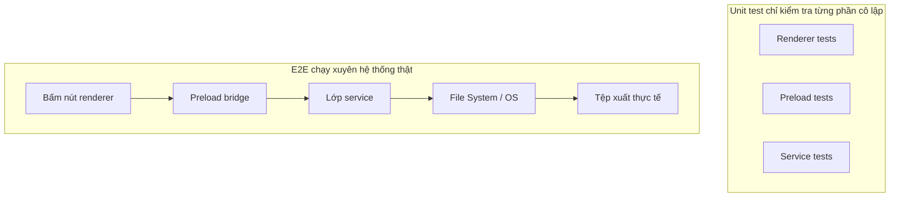
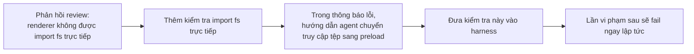

[English Version →](../../../en/lectures/lecture-10-why-end-to-end-testing-changes-results/) | [中文版本 →](../../../zh/lectures/lecture-10-why-end-to-end-testing-changes-results/)

> Code ví dụ cho bài giảng này: [code/](https://github.com/walkinglabs/learn-harness-engineering/blob/main/docs/vi/lectures/lecture-10-why-end-to-end-testing-changes-results/code/)
> Thực hành: [Dự án 05. Để agent xác minh công việc của chính nó](./../../projects/project-05-grounded-qa-verification/index.md)

# Bài 10. Chỉ chạy toàn bộ pipeline mới tính là xác minh thật sự

Bạn yêu cầu agent thêm tính năng xuất tệp vào ứng dụng Electron. Nó viết component cho renderer, preload script và logic lớp service. Unit test cho từng component đều pass. Agent báo "xong rồi". Bạn nhấn thật vào nút xuất, định dạng đường dẫn tệp sai, thanh tiến trình không phản hồi, xuất tệp lớn thì rò rỉ bộ nhớ. Năm lỗi ở ranh giới component, và unit test chẳng bắt được cái nào.

Từng phần nhìn "đúng" khi đứng riêng, nhưng vấn đề lộ ra ngay khi chúng nối vào nhau. Tháp kiểm thử của Google cho thấy một nền unit test lớn là thiết yếu, nhưng dừng ở đó thì bạn sẽ bỏ lỡ có hệ thống các vấn đề tương tác giữa component. Với AI coding agent, chuyện này càng tệ hơn, vì agent có xu hướng chỉ chạy những test nhanh nhất rồi tuyên bố hoàn thành. **Chỉ kiểm thử toàn bộ quy trình mới chứng minh được rằng không có khiếm khuyết ở cấp hệ thống.**

## Điểm mù của unit test

Triết lý thiết kế của unit test là cô lập: mock phụ thuộc, tập trung vào đơn vị đang xét. Triết lý ấy giúp unit test nhanh và chính xác, nhưng cũng tạo ra các điểm mù có hệ thống. Từng module chạy hoàn hảo khi cô lập, nhưng những nhóm vấn đề sau chỉ lộ ra khi mọi thứ vận hành cùng nhau:

**Không khớp giao diện**: Renderer truyền cho preload script một đường dẫn tương đối, nhưng preload script lại kỳ vọng đường dẫn tuyệt đối. Unit test của mỗi bên đều dùng mock và đều pass. Vấn đề chỉ lộ khi luồng end-to-end thật sự được chạy.

**Lỗi lan truyền trạng thái**: Một migration cơ sở dữ liệu đổi schema bảng, nhưng lớp cache ORM vẫn giữ các mục cache theo schema cũ. Unit test mỗi lần lại dựng môi trường mock mới, nên kiểu không nhất quán trạng thái xuyên lớp này chẳng bao giờ lộ ra.

**Vấn đề vòng đời tài nguyên**: Việc cấp phát và giải phóng file handle, kết nối cơ sở dữ liệu, network socket trải dài trên nhiều component. Unit test tạo và dọn tài nguyên độc lập cho từng test case, nên không bắt được tranh chấp hay rò rỉ tài nguyên.

**Phụ thuộc môi trường**: Code chạy đúng trong môi trường test (mọi thứ đều mock) nhưng hỏng trong môi trường thật vì khác biệt cấu hình, độ trễ mạng hoặc dịch vụ không khả dụng.

## Kiểm thử toàn bộ quy trình không chỉ thay đổi kết quả, mà thay đổi cả hành vi

Điểm này nhiều người không nhận ra: khi agent biết công việc của mình sẽ được xác minh bằng test toàn bộ quy trình, cách viết code của nó thay đổi.

1. **Cân nhắc tương tác giữa component**: Trong khi viết code, nó bắt đầu đặt câu hỏi "giao diện này kết nối thế nào với phía trên?" thay vì chỉ chăm chú vào một hàm riêng lẻ.
2. **Tôn trọng ranh giới kiến trúc**: Trong hệ thống có ràng buộc kiến trúc, test toàn bộ quy trình ép agent phải tuân thủ các quy tắc ranh giới.
3. **Xử lý đường lỗi**: Test toàn bộ quy trình thường kèm kịch bản thất bại, buộc agent phải nghĩ tới xử lý ngoại lệ.

## Tháp kiểm thử và thăng cấp phản hồi review





Trong thực hành Codex, OpenAI nhấn mạnh: **thông báo lỗi viết cho agent phải kèm hướng dẫn sửa chữa.** Đừng chỉ viết `"Direct filesystem access in renderer"`, hãy viết `"Direct filesystem access in renderer. All file operations must go through the preload bridge. Move this call to preload/file-ops.ts and invoke it via window.api."` Như vậy quy tắc kiến trúc biến thành một vòng lặp tự sửa. Thông báo lỗi không chỉ nói "sai ở đâu", mà còn nói "sửa thế nào", giúp agent tự điều chỉnh.

## Các khái niệm cốt lõi

- **Khiếm khuyết ở ranh giới component (Component Boundary Defects)**: Component A và B đều pass unit test riêng, nhưng cách chúng tương tác lại sinh hành vi sai. Đây là nhóm vấn đề mà test toàn bộ quy trình bắt giỏi nhất.
- **Gradient đầy đủ kiểm thử (Testing Adequacy Gradient)**: Khiếm khuyết unit test bắt được, số lượng bằng hoặc ít hơn nhóm mà integration test bắt được; nhóm integration test bắt được lại bằng hoặc ít hơn nhóm mà end-to-end test bắt được. Khả năng phát hiện tăng dần theo từng tầng.
- **Quy tắc thực thi ranh giới kiến trúc (Architectural Boundary Enforcement Rules)**: Biến các quy tắc trong tài liệu kiến trúc (ví dụ "renderer process không được truy cập trực tiếp hệ thống tệp") thành các kiểm tra tự động có thể thực thi, từ "viết trên giấy" thành "chạy trong CI".
- **Thăng cấp phản hồi review (Review Feedback Promotion)**: Chuyển các nhận xét code review lặp đi lặp lại thành test tự động. Mỗi lần phát hiện thêm một loại vấn đề lặp, thêm một quy tắc, và harness tự động mạnh lên.
- **Thông báo lỗi hướng agent (Agent-Oriented Error Messages)**: Thông báo lỗi không chỉ nêu "sai ở đâu" mà còn chỉ cho agent cách sửa cụ thể, biến test fail thành vòng phản hồi tự sửa.

## Cách thực hiện

### 0. Định nghĩa ranh giới kiến trúc trước khi viết test toàn bộ quy trình

Điều kiện tiên quyết của test toàn bộ quy trình là hệ thống có ranh giới rõ ràng. Nếu kiến trúc là một đĩa mì xào bò, test toàn bộ quy trình chỉ chứng minh "đĩa mì này chạy được", chứ không cho biết ý đồ thiết kế bị vi phạm ở đâu.

Kinh nghiệm của OpenAI: **với codebase do agent tạo ra, ràng buộc kiến trúc phải được thiết lập như điều kiện tiên quyết ngay từ ngày đầu tiên, chứ không phải thứ phải xem xét lại khi nhóm đã lớn.** Lý do rất đơn giản: agent sao chép các pattern đang có trong kho lưu trữ, ngay cả khi những pattern ấy không nhất quán hoặc chưa tối ưu. Không có ràng buộc kiến trúc, agent sẽ đưa thêm sai lệch vào mỗi phiên.

OpenAI áp dụng "Kiến trúc miền phân lớp", mỗi domain nghiệp vụ được chia thành các lớp cố định: Types → Config → Repo → Service → Runtime → UI. Phụ thuộc chảy nghiêm ngặt về phía trước, và mối quan tâm xuyên domain đi vào qua các interface Provider tường minh. Mọi phụ thuộc khác đều bị cấm và được thực thi cơ học bằng linting tuỳ chỉnh.

Nguyên tắc cốt lõi: **thực thi bất biến, đừng vi quản lý triển khai.** Ví dụ, yêu cầu "dữ liệu được parse tại ranh giới", nhưng không bắt buộc dùng thư viện nào. Thông báo lỗi phải kèm hướng dẫn sửa, không chỉ nói "vi phạm" mà phải nói rõ cách thay đổi.

> Nguồn: [OpenAI: Harness engineering: leveraging Codex in an agent-first world](https://openai.com/index/harness-engineering/)

### 1. Harness phải bao gồm một lớp end-to-end

Ghi rõ trong luồng xác minh: với tác vụ liên quan đến thay đổi xuyên component, pass test toàn bộ quy trình là điều kiện tiên quyết để hoàn thành:

```
## Thứ bậc xác minh
- Mức 1: Unit test (bắt buộc pass)
- Mức 2: Integration test (bắt buộc pass)
- Mức 3: End-to-end test (bắt buộc pass khi có thay đổi xuyên component)
- Bỏ qua bất kỳ mức bắt buộc nào = chưa hoàn thành
```

### 2. Biến quy tắc kiến trúc thành kiểm tra có thể thực thi

Mỗi ràng buộc kiến trúc nên có một test hoặc quy tắc lint tương ứng:

```bash
# Kiểm tra renderer process có gọi trực tiếp Node.js API không
grep -r "require('fs')" src/renderer/ && exit 1 || echo "OK: no direct fs access in renderer"
```

### 3. Thiết kế thông báo lỗi hướng agent

Thông báo lỗi nên chứa ba yếu tố: sai ở đâu, vì sao, và sửa thế nào:

```
LỖI: Phát hiện import trực tiếp 'fs' trong src/renderer/App.tsx:12
VÌ SAO: Renderer process không có quyền truy cập Node.js API vì lý do bảo mật
CÁCH SỬA: Chuyển thao tác tệp sang src/preload/file-ops.ts và gọi qua window.api.readFile()
```

### 4. Thiết lập quy trình thăng cấp phản hồi review

Mỗi lần phát hiện một loại lỗi agent mới trong code review, hãy biến nó thành kiểm tra tự động. Một tháng sau, harness của bạn sẽ mạnh hơn rất nhiều so với đầu tháng.

## Câu chuyện thật

**Tác vụ**: Triển khai tính năng xuất tệp trong ứng dụng Electron. Liên quan đến UI của renderer, proxy hệ thống tệp của preload script và chuyển đổi dữ liệu lớp service.

**Giai đoạn unit test**: Test component renderer (pass, thao tác tệp được mock), test preload script (pass, filesystem được mock), test lớp service (pass, nguồn dữ liệu được mock). Agent tuyên bố hoàn thành.

**Khiếm khuyết được end-to-end test phơi bày**:

| Khiếm khuyết | Mô tả | Unit Test | E2E |
|--------|-------------|-----------|-----|
| Không khớp giao diện | Định dạng đường dẫn tệp không nhất quán | Bỏ sót | Bắt được |
| Lan truyền trạng thái | Tiến trình xuất không được gửi ngược về UI qua IPC | Bỏ sót | Bắt được |
| Rò rỉ tài nguyên | File handle của lệnh xuất tệp lớn không được giải phóng | Bỏ sót | Bắt được |
| Vấn đề quyền | Quyền khác nhau trong môi trường đã đóng gói | Bỏ sót | Bắt được |
| Lan truyền lỗi | Ngoại lệ lớp service không đến được lớp UI | Bỏ sót | Bắt được |

Cả 5 khiếm khuyết đều bị end-to-end test bắt, unit test không bắt được cái nào. Đánh đổi là thời gian test tăng từ 2 giây lên 15 giây, hoàn toàn chấp nhận được trong quy trình làm việc với agent.

## Những điểm chính cần nhớ

- **Unit test mù có hệ thống với khiếm khuyết ở ranh giới component**: thiết kế cô lập của chúng chính là điều ngăn chúng phát hiện vấn đề tương tác.
- **Test toàn bộ quy trình không chỉ phát hiện khiếm khuyết, mà thay đổi cả cách agent viết code**, giúp nó tập trung hơn vào tích hợp và ranh giới.
- **Quy tắc kiến trúc phải có thể thực thi**, không viết trong tài liệu để chờ người đọc, mà tự động kiểm tra trên mỗi commit.
- **Thông báo lỗi phải thiết kế cho agent**, kèm bước sửa cụ thể để hình thành vòng lặp tự sửa.
- **Thăng cấp phản hồi review khiến harness tự động mạnh lên**, mỗi loại khiếm khuyết bắt được trở thành một tuyến phòng thủ vĩnh viễn.

## Đọc thêm

- [How Google Tests Software - Whittaker et al.](https://www.goodreads.com/book/show/13563030-how-google-tests-software) — Nguồn gốc kinh điển của mô hình Tháp kiểm thử
- [Harness Engineering - OpenAI](https://openai.com/index/harness-engineering/) — Thực hành kỹ thuật cho việc thực thi tự động ràng buộc kiến trúc
- [Chaos Engineering - Netflix (Basiri et al.)](https://ieeexplore.ieee.org/document/7466237) — Chủ động cấy lỗi để xác minh độ bền hệ thống
- [QuickCheck - Claessen & Hughes](https://www.cs.tufts.edu/~nr/cs257/archive/john-hughes/quick.pdf) — Phương pháp property testing, nằm giữa example testing và kiểm chứng hình thức

## Bài tập

1. **Phát hiện khiếm khuyết xuyên component**: Chọn một tác vụ sửa đổi liên quan đến ít nhất ba component. Trước tiên chỉ chạy unit test rồi ghi lại kết quả, sau đó chạy end-to-end test. Phân tích mỗi khiếm khuyết phát hiện thêm, phân loại nó thuộc nhóm vấn đề tương tác xuyên lớp nào.

2. **Tự động hoá quy tắc kiến trúc**: Chọn một ràng buộc kiến trúc trong dự án và biến nó thành kiểm tra có thể thực thi (kèm thông báo lỗi hướng agent). Tích hợp vào harness rồi xác minh hiệu quả bằng một tác vụ baseline.

3. **Thăng cấp phản hồi review**: Tìm một loại nhận xét lặp đi lặp lại trong lịch sử code review và chuyển nó thành kiểm tra tự động theo quy trình năm bước. So sánh tần suất loại vấn đề đó trước và sau khi thăng cấp.
