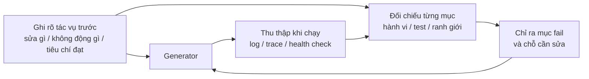

[English Version →](../../../en/lectures/lecture-11-why-observability-belongs-inside-the-harness/) | [中文版本 →](../../../zh/lectures/lecture-11-why-observability-belongs-inside-the-harness/)

> Ví dụ code: [code/](https://github.com/walkinglabs/learn-harness-engineering/blob/main/docs/vi/lectures/lecture-11-why-observability-belongs-inside-the-harness/code/)
> Dự án thực hành: [Dự án 06. Harness Đầy đủ (Capstone)](./../../projects/project-06-runtime-observability-and-debugging/index.md)

# Bài 11. Làm cho runtime của agent có thể quan sát được

Bạn yêu cầu agent triển khai một tính năng. Nó chạy 20 phút, sửa một đống tệp, rồi báo "xong, nhưng hai test đang fail". Bạn hỏi vì sao fail, "không chắc, có khi là vấn đề timing". Bạn hỏi nó đã thay đổi những đường đi quan trọng nào, "để tôi xem code thử...".

Kịch bản này quá phổ biến, và nguyên nhân không nằm ở năng lực agent, mà là harness thiếu khả năng quan sát. Khi agent thực thi tác vụ mà không nhìn thấy trạng thái runtime thật, mỗi quyết định của nó về cơ bản là một phỏng đoán.

**Không có khả năng quan sát, agent ra quyết định trong bất định, đánh giá trở thành phán xét chủ quan, và việc thử lại biến thành lang thang mù quáng.** Cả OpenAI và Anthropic đều coi độ tin cậy là một bài toán bằng chứng: harness phải phơi bày hành vi runtime và các tín hiệu đánh giá ở dạng thật sự có thể dẫn dắt quyết định kế tiếp.

## Giá phải trả khi thiếu khả năng quan sát

Khi harness thiếu khả năng quan sát, bốn nhóm vấn đề sẽ xuất hiện có hệ thống.

**Không phân biệt được "đúng" với "trông có vẻ đúng".** Một hàm nhìn qua code review thì hoàn hảo, cú pháp đúng, logic ổn. Nhưng ở runtime, một lỗi xử lý biên sinh ra kết quả sai với input đặc biệt. Chỉ có runtime trace mới phơi bày được việc đường đi thực thi đã lệch khỏi kỳ vọng. Code review cho thấy "đã viết cái gì", runtime trace cho thấy "thật sự đã chạy cái gì". Cả hai đều cần.

**Đánh giá trở thành huyền bí.** Không có rubric chấm điểm và tiêu chí chấp nhận, người đánh giá (dù người hay agent) buộc phải dựa vào giả định ngầm. Cùng một đầu ra có thể bị các evaluator khác nhau đánh giá hoàn toàn trái ngược. Đánh giá chất lượng mất khả năng tái lập.

**Thử lại trở thành đoán mù.** Khi agent không biết vì sao một việc fail, hướng thử lại hoàn toàn ngẫu nhiên. Nó có khi sửa mãi những đường đi không liên quan, bỏ qua tận gốc nguyên nhân thật. Mỗi lần thử lại mù quáng đốt cả token lẫn thời gian.

**Vực thông tin lúc bàn giao phiên.** Khi phần việc chưa xong được chuyển cho phiên sau, thiếu khả năng quan sát đồng nghĩa với việc phiên mới phải chẩn đoán lại trạng thái hệ thống từ đầu. Quan sát của Anthropic về các long-running agent cho thấy khâu chẩn đoán trùng lặp này có thể nuốt tới 30-50% tổng thời gian phiên.

## Một kịch bản Claude Code thật

Hãy hình dung một harness dùng quy trình ba vai "planner-generator-evaluator", thực thi tác vụ "thêm dark mode cho ứng dụng".

**Không có khả năng quan sát:** Planner đưa ra mô tả mơ hồ. Generator triển khai dark mode dựa trên sự mơ hồ đó, nhưng kết quả không khớp với kỳ vọng ngầm của planner. Evaluator từ chối theo chuẩn ngầm của riêng mình mà không diễn đạt cụ thể được chỗ nào sai, chỉ biết "cảm giác không ổn". Generator thử lại mù quáng dựa trên lý do mơ hồ. Chu kỳ lặp 3-4 lần, mất khoảng 45 phút, và sản phẩm cuối cùng cũng chỉ tạm chấp nhận được.

**Có đầy đủ khả năng quan sát:** Planner đưa ra sprint contract, liệt kê component nào cần sửa, tiêu chuẩn xác minh cho từng cái, và các ngoại lệ (ví dụ không xử lý print styles). Generator triển khai theo contract, và khả năng quan sát runtime ghi lại quá trình tải style của từng component. Evaluator dùng rubric chấm điểm để đánh giá từng chiều, kèm bằng chứng cụ thể: "Độ tương phản màu nút chưa đạt (chuẩn WCAG AA 4.5:1, đo được 2.1:1)". Một vòng lặp cho ra kết quả chất lượng cao, trong khoảng 15 phút.

Hiệu quả chênh nhau 3 lần. Biến duy nhất là khả năng quan sát.

## Quan sát phân lớp

Khả năng quan sát không chỉ là "thêm logging". Nó vận hành trên hai lớp, cả hai đều cần thiết.



**Quan sát runtime:** Tín hiệu cấp hệ thống, gồm log, trace, sự kiện tiến trình, health check. Trả lời câu hỏi "hệ thống đã làm gì".

**Quan sát quá trình:** Tầm nhìn vào các artifact quyết định của harness, gồm kế hoạch, rubric chấm điểm, tiêu chí chấp nhận. Trả lời câu hỏi "vì sao thay đổi này nên được chấp nhận".

## Các khái niệm cốt lõi

- **Quan sát runtime**: Tín hiệu cấp hệ thống, gồm log, trace, sự kiện tiến trình và health check. Trả lời "hệ thống đã làm gì".
- **Quan sát quá trình**: Tầm nhìn vào các artifact quyết định của harness, gồm kế hoạch, rubric chấm điểm, tiêu chí chấp nhận. Trả lời "vì sao thay đổi này nên được chấp nhận".
- **Task trace**: Bản ghi đầy đủ về đường đi quyết định từ khi bắt đầu tác vụ đến khi hoàn thành, tương tự request tracing trong hệ thống phân tán. Mỗi bước agent thực hiện, cùng ngữ cảnh, đều được ghi lại, để khi có trục trặc, bạn có thể tua lại toàn bộ quá trình.
- **Sprint contract**: Thoả thuận ngắn hạn được thương lượng trước khi viết code, chỉ rõ phạm vi tác vụ, tiêu chuẩn xác minh và các ngoại lệ. Công cụ cốt lõi của quan sát quá trình.
- **Evaluator rubric**: Biến đánh giá chất lượng từ phán xét chủ quan thành chấm điểm có cấu trúc dựa trên bằng chứng, để các evaluator khác nhau đi đến kết luận tương tự cho cùng một đầu ra.
- **Quan sát phân lớp**: Quan sát lớp hệ thống và lớp quá trình được thiết kế đồng thời, bổ trợ cho nhau. Tín hiệu runtime giải thích hành vi, artifact quá trình giải thích ý đồ.

## Vì sao agent không tự giải quyết được chuyện này

Bạn có thể nghĩ: "Agent tự in log của nó thì sao?". Vấn đề là:

1. **Agent không biết nó không biết gì.** Nó sẽ không chủ động ghi lại những tín hiệu mà nó không nhận ra là cần. Không có ràng buộc ở cấp harness, agent chỉ log những gì nó cho là quan trọng, và thứ nó cho là quan trọng thường chưa đủ.
2. **Định dạng log không nhất quán.** Mỗi phiên dùng một format khác, khiến phân tích có hệ thống trở nên bất khả thi.
3. **Quan sát quá trình không giải quyết được bằng logging.** Sprint contract và rubric chấm điểm là những artifact có cấu trúc cần sự hỗ trợ ở cấp harness, thêm vài câu print là chưa đủ.

## Cách xây dựng khả năng quan sát

### 1. Đưa thu thập tín hiệu runtime vào harness

Đừng trông cậy vào việc agent tự in log. Harness cần tự động thu thập các tín hiệu sau:

- **Vòng đời ứng dụng**: Các trạng thái pha startup, ready, running, shutdown
- **Thực thi đường đi tính năng**: Bản ghi thực thi các đường đi quan trọng, gồm điểm vào, điểm kiểm tra, điểm thoát
- **Luồng dữ liệu**: Bản ghi dữ liệu chảy giữa các component
- **Sử dụng tài nguyên**: Mẫu sử dụng tài nguyên bất thường (ví dụ bộ nhớ tăng liên tục)
- **Lỗi và ngoại lệ**: Đầy đủ ngữ cảnh lỗi, không chỉ thông báo lỗi

### 2. Triển khai sprint contract

Trước mỗi tác vụ, generator và evaluator (có thể là hai lần gọi khác nhau của cùng một agent) thoả thuận một contract định nghĩa cần xây gì và "xong" nghĩa là gì:

```markdown
# Sprint Contract: Hỗ trợ Dark Mode

## Phạm vi
- Sửa component chuyển theme
- Cập nhật biến CSS toàn cục
- Thêm test cho dark mode

## Tiêu chuẩn xác minh
- Test hồi quy trực quan pass cho từng component
- Test end-to-end luồng chính pass
- Không có flash of unstyled content (FOUC)

## Ngoại lệ
- Không xử lý print styles
- Không xử lý dark mode cho component bên thứ ba
```

### 3. Thiết lập evaluator rubric

Biến "có tốt hay không" thành chấm điểm có thể định lượng:

```markdown
# Rubric chấm điểm

| Chiều | A | B | C | D |
|-------|---|---|---|---|
| Tính đúng đắn code | Tất cả test pass | Luồng chính pass | Pass một phần | Build fail |
| Tuân thủ kiến trúc | Hoàn toàn tuân thủ | Lệch nhẹ | Lệch rõ | Vi phạm nghiêm trọng |
| Phạm vi test | Luồng chính + edge case | Chỉ luồng chính | Chỉ skeleton | Không có test |
```

### 4. Chuẩn hoá bằng OpenTelemetry

Tạo một trace cho mỗi phiên harness, một span cho mỗi tác vụ, và sub-span cho mỗi bước xác minh. Dùng các thuộc tính chuẩn để chú thích thông tin quan trọng. Như vậy dữ liệu quan sát tích hợp được với các toolchain chuẩn (Jaeger, Zipkin).

## Thí nghiệm kiến trúc ba agent của Anthropic

Tháng 3 năm 2026, Anthropic công bố một thí nghiệm harness có hệ thống. Họ chạy cùng một tác vụ ("xây dựng một DAW trên trình duyệt dùng Web Audio API") với ba kiến trúc khác nhau và ghi lại dữ liệu chi tiết theo từng pha:

| Agent và pha | Thời lượng | Chi phí |
|---------------|----------|------|
| Planner | 4.7 phút | $0.46 |
| Build vòng 1 | 2 giờ 7 phút | $71.08 |
| QA vòng 1 | 8.8 phút | $3.24 |
| Build vòng 2 | 1 giờ 2 phút | $36.89 |
| QA vòng 2 | 6.8 phút | $3.09 |
| Build vòng 3 | 10.9 phút | $5.88 |
| QA vòng 3 | 9.6 phút | $4.06 |
| **Tổng** | **3 giờ 50 phút** | **$124.70** |

Mỗi agent trong ba đó giữ vai trò riêng, và mỗi vai đều đóng góp rõ ràng vào khả năng quan sát:

**Planner:** Nhận yêu cầu người dùng từ 1-4 câu rồi mở rộng thành product spec đầy đủ. Nó được nhắc "mạnh dạn về phạm vi" và "tập trung vào ngữ cảnh sản phẩm và thiết kế kỹ thuật cấp cao thay vì chi tiết triển khai". Lý do: nếu planner sớm chốt chi tiết kỹ thuật nhỏ mà sai, lỗi ấy sẽ lan xuống các bước sau. Cách tốt hơn là ràng buộc sản phẩm đầu ra, để agent tự tìm đường đi trong lúc thực thi.

**Generator:** Triển khai từng tính năng, từng sprint. Trước mỗi sprint, nó thương lượng với evaluator một sprint contract định nghĩa "xong" nghĩa là gì cho khối tính năng đó. Rồi nó triển khai theo contract, tự đánh giá, và chuyển giao cho QA.

**Evaluator:** Dùng Playwright MCP để tương tác với ứng dụng đang chạy như một người dùng thật, kiểm thử chức năng UI, API endpoint, và trạng thái cơ sở dữ liệu. Nó chấm mỗi sprint trên bốn chiều: độ sâu sản phẩm, chức năng, thiết kế trực quan, chất lượng code. Mỗi chiều có ngưỡng cứng, nếu chiều nào chưa đạt, sprint fail và generator nhận phản hồi chi tiết để sửa.

Phản hồi mẫu từ QA vòng 1: "Đây là ứng dụng ấn tượng về mặt thị giác với tích hợp AI tốt, nhưng một số tính năng cốt lõi của DAW chỉ mang tính trình diễn, chưa có chiều sâu tương tác: clip không thể kéo/di chuyển, chưa có UI panel cho nhạc cụ (nút synth, pad trống), và chưa có trình chỉnh hiệu ứng trực quan (đường cong EQ, đồng hồ compressor)." Đây không phải edge case, mà là những tương tác cốt lõi làm nên một DAW dùng được. Phản hồi cụ thể, có bằng chứng, không phải "cảm giác không ổn".

Evaluator không phải lúc nào cũng bén nhạy như vậy. Phiên bản đầu có thể phát hiện vấn đề hợp lý, rồi tự thuyết phục mình rằng vấn đề ấy không nghiêm trọng, cuối cùng duyệt. Cách sửa: đọc log của evaluator, tìm chỗ phán đoán của nó lệch khỏi phán đoán của người, rồi cập nhật prompt QA để xử lý đúng những điểm cụ thể đó. Sau vài vòng lặp phát triển thế này, điểm của evaluator trở nên đáng tin.

> Nguồn: [Anthropic: Harness design for long-running application development](https://www.anthropic.com/engineering/harness-design-long-running-apps)

## Những điểm chính cần nhớ

- **Khả năng quan sát là thuộc tính kiến trúc của harness.** Nó không phải tính năng thêm vào sau, mà là năng lực cốt lõi phải được thiết kế từ đầu.
- **Cả hai lớp quan sát đều cần thiết.** Tín hiệu runtime giải thích "chuyện gì đã xảy ra", artifact quá trình giải thích "vì sao lại làm thế này".
- **Sprint contract đẩy việc căn chỉnh lên đầu.** Chúng ngăn generator xây thứ mà evaluator sẽ lập tức từ chối vì lý do có thể dự đoán trước.
- **Rubric chấm điểm làm đánh giá có thể tái lập.** Evaluator khác nhau cho điểm tương tự với cùng một đầu ra.
- **Thiếu khả năng quan sát phí phạm 30-50% thời gian phiên cho khâu chẩn đoán trùng lặp.**

## Đọc thêm

- [Observability Engineering - Charity Majors](https://www.honeycomb.io/blog/observability-engineering-book) — Khung lý thuyết và thực hành cho kỹ thuật quan sát hiện đại
- [Dapper - Google (Sigelman et al.)](https://research.google/pubs/pub36356/) — Thực hành đột phá trong distributed tracing quy mô lớn
- [Harness Design - Anthropic](https://www.anthropic.com/engineering/harness-design-long-running-apps) — Giới thiệu sprint contract và evaluator rubric
- [Site Reliability Engineering - Google](https://sre.google/sre-book/table-of-contents/) — Áp dụng có hệ thống khả năng quan sát trong hệ thống production

## Bài tập

1. **Phân tích khoảng trống quan sát**: Kiểm toán harness hiện tại của bạn dưới góc nhìn quan sát lớp hệ thống và lớp quá trình. Tìm các trạng thái hệ thống không phân biệt được từ tín hiệu hiện có, rồi đề xuất phần cần bổ sung.

2. **Thực hành sprint contract**: Viết sprint contract cho một tác vụ thật. Để agent thực thi theo contract, rồi so sánh hiệu quả và chất lượng với phương án không có contract.

3. **Xây dựng task trace**: Ghi lại mỗi bước agent đi qua trong một tác vụ lập trình hoàn chỉnh. Chú thích theo các quy ước ngữ nghĩa OpenTelemetry. Phân tích trace để tìm điểm nghẽn thông tin, bước nào thiếu tín hiệu đủ dùng cho quyết định của nó.
