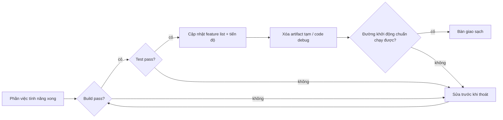
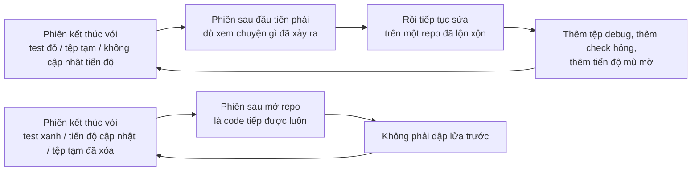

[English Version →](../../../en/lectures/lecture-12-why-every-session-must-leave-a-clean-state/) | [中文版本 →](../../../zh/lectures/lecture-12-why-every-session-must-leave-a-clean-state/)

> Ví dụ code: [code/](https://github.com/walkinglabs/learn-harness-engineering/blob/main/docs/vi/lectures/lecture-12-why-every-session-must-leave-a-clean-state/code/)
> Dự án thực hành: [Dự án 06. Harness Đầy đủ (Capstone)](./../../projects/project-06-runtime-observability-and-debugging/index.md)

# Bài 12. Bàn giao sạch ở cuối mỗi phiên

Agent của bạn chạy cả buổi chiều, sửa 20 tệp, commit code, rồi phiên kết thúc. Phiên agent tiếp theo vừa mở ra đã phát hiện ngay: build hỏng, test đang đỏ, các tệp debug tạm rải rác khắp nơi, feature list chưa cập nhật, và tiến độ hoàn toàn mù mờ. 30 phút đầu của phiên mới chỉ để dò xem "phiên trước thật sự đã làm gì".

Cả OpenAI và Anthropic đều phát biểu rõ: **độ tin cậy dài hạn phụ thuộc vào kỷ luật vận hành, không chỉ thành công một lần chạy.** Chất lượng trạng thái khi thoát phiên trực tiếp quyết định hiệu quả của phiên kế tiếp. Cũng giống như thực hành tốt với Git vậy, mỗi commit nên là một thay đổi nguyên tử, build được, chứ không phải đống code làm dở.

## Tăng trưởng entropy là trạng thái mặc định

Các định luật tiến hoá phần mềm của Lehman cho thấy hệ thống trải qua thay đổi liên tục sẽ tất yếu phức tạp thêm nếu không được quản lý chủ động. Với AI coding agent, chuyện này càng đúng. Mỗi phiên đưa vào thay đổi, nếu không dọn khi thoát, nợ kỹ thuật sẽ tích tụ theo cấp số nhân.

Trong năm tháng thí nghiệm Codex, OpenAI quan sát thấy một điều đáng chú ý: **agent sao chép các pattern đang có trong kho lưu trữ, ngay cả khi những pattern ấy không nhất quán hoặc chưa tối ưu.** Lâu dần, việc sao chép này tất yếu dẫn đến trôi dạt. Người đầu tiên để lại một cái cốc cà phê ở khu vực chung; người thứ hai thấy "chỗ này đã lộn xộn rồi" và cũng để thêm một cái; một tuần sau, cả mặt bàn chìm trong cốc. Một codebase cũng vận hành y hệt thế.

Đội ngũ OpenAI ban đầu dành 20% thời gian mỗi thứ Sáu để dọn thủ công "rác do AI", nhưng cách này rõ ràng không mở rộng được. Cuối cùng họ đi đến một giải pháp có hệ thống:

1. **Mã hoá "quy tắc vàng" vào kho lưu trữ**: Các quy tắc kiểu "ưu tiên dùng package tiện ích dùng chung thay vì helper tự chế tay" (giữ bất biến ở một nơi) và "đừng đoán mò cấu trúc dữ liệu" (xác minh ranh giới hoặc dựa vào SDK có kiểu). Những quy tắc này cụ thể, cơ học và kiểm tra được tự động.
2. **Thiết lập quy trình dọn dẹp định kỳ**: Một đội các task Codex nền thường xuyên quét tìm sai lệch, cập nhật điểm chất lượng, mở PR tái cấu trúc có mục tiêu. Phần lớn có thể review và auto-merge trong vòng một phút.
3. **Ghi lại khẩu vị người dùng một lần, thực thi liên tục**: Nhận xét review, PR tái cấu trúc, và lỗi người dùng thấy được đều được dịch thành cập nhật tài liệu hoặc mã hoá thẳng vào công cụ. Khi tài liệu chưa đủ, hãy thăng cấp quy tắc thành code.

Nợ kỹ thuật là khoản vay lãi cao. Trả dần dần từng phần nhỏ bao giờ cũng tốt hơn để nó dồn lại thành một sự kiện trả nợ lớn.

> Nguồn: [OpenAI: Harness engineering: leveraging Codex in an agent-first world](https://openai.com/index/harness-engineering/)

## Trạng thái sạch không chỉ là "code build được"

Trạng thái sạch không đơn giản là "code build được". Build không lỗi là yêu cầu cơ bản nhất, phiên sau không nên phải sửa build lỗi trước. Tất cả test cũng phải pass, kể cả những test đã có trước phiên, phiên chịu trách nhiệm không phá vỡ chức năng hiện có. Và chuyện này phải được xác minh trong CI, không chỉ "chạy ổn trên máy tôi".



Nhưng thế vẫn chưa đủ. Tiến độ hiện tại phải được ghi vào artifact máy đọc được: các subtask đã hoàn thành kèm tiêu chí pass, các subtask đang làm dở kèm trạng thái hiện tại, các subtask chưa bắt đầu. Bản ghi tiến độ tốt giảm thời gian chẩn đoán lúc khởi động phiên từ 60-80%. Artifact tạm (debug log, tệp tạm, code bị comment out, marker TODO) cũng phải được dọn, vì chúng tăng tải nhận thức cho phiên sau. Đường khởi động chuẩn phải còn chạy được. Phiên sau có thể bắt đầu làm việc mà không cần can thiệp thủ công không? Khởi tạo môi trường, tải codebase, thu thập ngữ cảnh, chọn tác vụ, không đường nào được hỏng cả.



## Các khái niệm cốt lõi

- **Trạng thái sạch (Clean state)**: Hệ thống phải thoả mãn năm điều kiện khi thoát phiên, build pass, test pass, tiến độ đã ghi, không có artifact cũ, đường khởi động khả dụng. Thiếu một cái là phiên chưa "xong".
- **Tính toàn vẹn phiên (Session integrity)**: Tương tự giao dịch cơ sở dữ liệu, hoặc commit đầy đủ và để lại trạng thái sạch, hoặc rollback về trạng thái nhất quán gần nhất. Không có lựa chọn giữa.
- **Tài liệu chất lượng (Quality document)**: Một artifact sống liên tục ghi điểm chất lượng cho từng module. Không phải đánh giá một lần, mà là tracker cho thấy codebase đang mạnh lên hay yếu đi theo thời gian.
- **Vòng lặp dọn dẹp (Cleanup loop)**: Phiên bảo trì định kỳ nhằm giảm entropy trong codebase một cách có hệ thống. Không phải sửa chữa khẩn cấp, mà là vận hành thường ngày.
- **Đơn giản hoá harness (Harness simplification)**: Khi năng lực mô hình cải thiện, định kỳ gỡ bỏ các thành phần harness không còn cần thiết. Một ràng buộc cần thiết hôm nay có thể thành overhead thừa ba tháng sau.
- **Dọn dẹp idempotent (Idempotent cleanup)**: Thao tác dọn dẹp cho cùng kết quả bất kể chạy bao nhiêu lần, đảm bảo dọn vẫn an toàn ngay cả trong kịch bản fail-retry.

## "Dọn sau" nghĩa là không bao giờ dọn

Cái bẫy tâm lý phổ biến nhất là "phiên này không có thời gian dọn, để lần sau". Nhưng phiên agent sau không biết bạn đã để lại gì, nó chỉ thấy một đống code và trạng thái không rõ ràng. Nó sẽ tốn kha khá thời gian suy ra "phần nào của đống code này là cố ý, phần nào là tạm".

Tệ hơn, mỗi phiên có mục tiêu tác vụ riêng. Phiên mới vào để làm việc mới, không phải dọn mớ hỗn độn của phiên trước. Nó sẽ phớt lờ sự lộn xộn rồi xây tiếp lên trên, lại đẻ thêm hỗn loạn. Đó chính là vòng phản hồi dương của entropy.

Con số kể lại tất cả. Một dự án phát triển bằng agent trong 12 tuần, không có chiến lược dọn dẹp:

- Tuần 1: build pass 100%, test pass 100%, khởi động phiên mới 5 phút
- Tuần 4: build 95%, test 92%, khởi động 15 phút
- Tuần 8: build 82%, test 78%, khởi động 35 phút
- Tuần 12: build 68%, test 61%, khởi động hơn 60 phút

Cùng dự án nhưng có chiến lược dọn dẹp:

- Tuần 1: 100%, 100%, 5 phút
- Tuần 12: 97%, 95%, 9 phút

Sau 12 tuần: tỷ lệ build pass chênh 29 điểm phần trăm, thời gian khởi động phiên mới chênh 85%. Đây không phải lý thuyết, đây là khác biệt được quan sát.

## Cách làm đúng

### 1. Trạng thái sạch là điều kiện cần để hoàn thành

Ghi rõ trong harness: **hoàn thành phiên = tác vụ pass xác minh VÀ kiểm tra trạng thái sạch pass.** Thiếu một là phiên chưa hoàn thành. Viết trong CLAUDE.md:

```
## Danh sách kiểm tra thoát phiên
- [ ] Build pass (npm run build)
- [ ] Tất cả test pass (npm test)
- [ ] Feature list đã cập nhật
- [ ] Không còn code debug (console.log, debugger, TODO)
- [ ] Đường khởi động chuẩn khả dụng (npm run dev)
```

### 2. Chiến lược dọn dẹp hai chế độ

Kết hợp hai chế độ dọn dẹp:

**Dọn tức thì (cuối mỗi phiên)**: Dọn các artifact tạm sinh ra trong phiên, cập nhật trạng thái feature list, đảm bảo build và test pass. Đây là kiểu dọn "đếm tham chiếu": dùng xong là dọn ngay.

**Dọn định kỳ (hàng tuần)**: Quét toàn hệ thống, xử lý vấn đề cấu trúc tích tụ, cập nhật tài liệu chất lượng, chạy test benchmark phát hiện trôi dạt. Đây là kiểu dọn "tracing", một lượt bảo trì toàn diện theo nhịp cố định.

### 3. Duy trì tài liệu chất lượng

Tài liệu chất lượng là một artifact sống, liên tục chấm điểm từng module:

```markdown
# Tài liệu chất lượng

## Module xác thực người dùng (Chất lượng: A)
- Xác minh pass: Có
- Agent hiểu được: Có
- Độ ổn định test: Ổn định
- Ranh giới kiến trúc: Tuân thủ
- Quy ước code: Được theo

## Module thanh toán (Chất lượng: C)
- Xác minh pass: Một phần (callback thanh toán chưa test)
- Agent hiểu được: Khó (logic rải trên 3 tệp)
- Độ ổn định test: Chưa ổn (2 test flaky)
- Ranh giới kiến trúc: Có vi phạm
- Quy ước code: Theo một phần
```

Phiên mới đọc tài liệu này là biết ngay ưu tiên ở đâu. Sửa module có điểm thấp nhất trước.

### 4. Định kỳ đơn giản hoá harness

Mỗi thành phần harness tồn tại vì mô hình chưa thể tự làm việc đó một cách đáng tin. Nhưng khi mô hình mạnh lên, những giả định ấy trở nên lỗi thời.

Thí nghiệm của Anthropic chứng minh trực tiếp điều này. Harness ban đầu của họ có cơ chế chia sprint, chia việc thành từng khúc nhỏ để Sonnet 4.5 làm từng khúc một. Khi Opus 4.6 ra mắt, năng lực của mô hình đã tự phân rã công việc được, việc dựng sprint trở thành overhead thừa. Gỡ bỏ xong, agent builder làm việc liên tục hơn hai tiếng không trôi dạt, và còn trôi chảy hơn.

Nhưng câu chuyện ở evaluator lại khác. Kể cả với Opus 4.6 mạnh hơn, khi tác vụ tiệm cận biên năng lực mô hình, evaluator vẫn mang lại giá trị thật, bắt được các tính năng thiếu và stub của generator. Điều này nghĩa là evaluator không phải quyết định có/không cố định, nó phụ thuộc vào vị trí độ khó tác vụ so với năng lực mô hình.

**Thực hành khuyến nghị**: Mỗi tháng, chọn một thành phần harness, tạm thời vô hiệu hoá, rồi chạy các tác vụ benchmark. Nếu kết quả không tụt, hãy gỡ vĩnh viễn. Nếu tụt, hãy khôi phục hoặc thay bằng phương án nhẹ hơn.

Một nguyên lý sâu hơn: **khi mô hình mạnh lên, các tổ hợp thú vị trong harness không co lại, mà dịch chuyển.** Vấn đề trước đây cần giải pháp tường minh giờ được mô hình nuốt, nhưng những biên năng lực mới lại mở ra không gian thiết kế harness mà trước đây chưa khả thi. Công việc của kỹ sư AI là liên tục tìm ra tổ hợp giá trị kế tiếp.

### 5. Thao tác dọn dẹp phải idempotent

Script dọn dẹp phải an toàn để chạy lặp lại, chạy thêm một lần nữa cũng không sinh side effect:

```bash
# Thao tác dọn dẹp idempotent
rm -f /tmp/debug-*.log  # -f đảm bảo không lỗi khi tệp không tồn tại
git checkout -- .env.local  # Khôi phục về trạng thái đã biết
npm run test  # Xác minh dọn dẹp không làm hỏng gì
```

### 6. Thông lượng cao thay đổi triết lý merge

Khi đầu ra của agent vượt xa năng lực review của người, triết lý merge truyền thống cần điều chỉnh. Kinh nghiệm của OpenAI: trong môi trường agent mở 3.5 PR mỗi ngày (và sau đó còn nhiều hơn), tối thiểu hoá các cổng blocking merge là lựa chọn đúng. PR nên sống ngắn, test flakiness thường được giải quyết bằng các lần chạy sau thay vì blocking vô thời hạn. Trong một hệ thống mà chi phí sửa thấp còn chi phí chờ cao, đi nhanh và sửa nhanh là chiến lược tốt hơn so với xác nhận chậm.

**Lưu ý**: Cách này thiếu trách nhiệm trong môi trường thông lượng thấp. Nhưng khi đầu ra của agent vượt xa sự chú ý của con người, đó thường là đánh đổi đúng. Tiêu chí then chốt: **chi phí trung bình sửa một bug so với chi phí trung bình chờ người review một PR.** Khi cái trước thấp hơn cái sau, merge nhanh là lựa chọn đúng.

## Câu chuyện thật

Một ứng dụng Electron phát triển bằng agent trong 12 tuần, so sánh hai cách tiếp cận:

**Không có chiến lược dọn dẹp** (nhóm đối chứng): Tuần 12, build pass 68%, test pass 61%, khởi động phiên mới hơn 60 phút, 103 artifact cũ.

**Có chiến lược dọn dẹp** (nhóm thực nghiệm): Kiểm tra trạng thái sạch đầy đủ cuối mỗi phiên, cộng với vòng dọn hàng tuần. Tuần 12, build pass 97%, test pass 95%, khởi động phiên mới 9 phút, 11 artifact cũ.

Đến tuần 12, nhóm thực nghiệm có build pass cao hơn 29 điểm phần trăm, test pass cao hơn 34 điểm, và thời gian khởi động phiên mới thấp hơn 85%. Mỗi phiên chỉ tốn thêm 5 phút dọn dẹp, nhưng suốt 12 tuần nó tiết kiệm được hàng chục giờ hỗn loạn.

## Những điểm chính cần nhớ

- **Trạng thái sạch là điều kiện cần để hoàn thành phiên**, không phải dọn dẹp tuỳ chọn, mà là một phần của "định nghĩa hoàn thành".
- **Cả năm chiều đều không thể thiếu**, build, test, tiến độ, artifact, khởi động, mỗi cái phải được kiểm tra tường minh.
- **Tài liệu chất lượng làm sức khoẻ codebase trở nên theo dõi được**, bạn chỉ có thể chủ động sửa thứ bạn biết đang tụt dốc.
- **Định kỳ đơn giản hoá harness**, khi năng lực mô hình cải thiện, gỡ các ràng buộc không còn cần thiết.
- **"Dọn sau" nghĩa là không bao giờ dọn.** Tăng trưởng entropy là trạng thái mặc định, chỉ có dọn chủ động mới chống lại được.

## Đọc thêm

- [Clean Code - Robert C. Martin](https://www.goodreads.com/book/show/3735293-clean-code) — Nguyên tắc có hệ thống về sạch sẽ của code
- [Harness Engineering - OpenAI](https://openai.com/index/harness-engineering/) — Khả năng tái lập như yêu cầu thiết kế harness cốt lõi
- [Effective Harnesses - Anthropic](https://www.anthropic.com/engineering/effective-harnesses-for-long-running-agents) — Vai trò then chốt của thoát phiên sạch với độ tin cậy dài hạn
- [Programs, Life Cycles, and Laws of Software Evolution - Lehman](https://ieeexplore.ieee.org/document/1702314) — Định luật tiến hoá phần mềm chứng minh độ phức tạp tất yếu tăng khi không bảo trì chủ động

## Bài tập

1. **Danh sách kiểm tra trạng thái sạch**: Thiết kế danh sách kiểm tra thoát phiên cho codebase của bạn, bao phủ cả năm chiều. Áp dụng qua 5 phiên liên tiếp và ghi lại số vi phạm theo từng chiều.

2. **So sánh benchmark**: Dùng một bộ tác vụ cố định với hai biến thể harness (có/không yêu cầu trạng thái sạch). So sánh tỷ lệ hoàn thành, số lần thử lại và tỷ lệ lỗi lọt qua.

3. **Thực hành đơn giản hoá harness**: Chọn một thành phần harness, tạm thời vô hiệu hoá, rồi chạy các tác vụ benchmark. So sánh kết quả có và không có nó. Quyết định giữ, gỡ hay thay thế.
