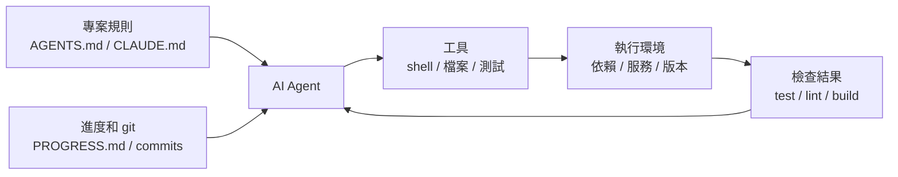

[English Version →](../../../en/lectures/lecture-02-what-a-harness-actually-is/)

> 本篇程式碼示例：[code/](https://github.com/walkinglabs/learn-harness-engineering/blob/main/docs/zh-TW/lectures/lecture-02-what-a-harness-actually-is/code/)
> 實戰練習：[Project 01. 只寫提示詞讓 agent 做，和定好規則再讓它做，差多少](./../../projects/project-01-baseline-vs-minimal-harness/index.md)

# 第二講. Harness 到底是什麼

「harness」這個詞在 AI coding agent 的圈子裡被用得越來越多了，但說實話，大部分人說的 harness 其實就只是「一個 prompt 檔案」。這不是 harness。你開了一家餐廳，只有食材，沒有灶臺、沒有刀具、沒有菜譜、沒有出菜流程，那不叫餐廳，那叫冰箱。

這節課要給你一個精確的、可操作的 harness 定義。這個框架可以直接使用，不同於學術論文裡的抽象概念，harness 由五個子系統組成，分別對應廚房的五個功能區，菜譜架、刀具架、灶臺、備菜臺、和出菜檢查口。每個子系統都有明確的職責和評判標準。

## 以一個類比出發

想象你是一個剛入職的工程師，被丟進一個沒有任何文件的專案裡。沒有 README，程式碼裡沒有註釋，沒有人告訴你怎麼跑測試，CI 配置檔案藏在某個角落裡。你能寫出好程式碼嗎？也許能，如果你足夠聰明又足夠有耐心。但你會花大量時間在「搞清楚這個專案是怎麼回事」上，而不是在「解決問題」上。

AI agent 面對的困境一模一樣。而且更糟，你至少可以問同事，agent 只能看到你放在它面前的檔案和它能執行的命令。它不能拍拍同事的肩膀問「哎，這個專案的 ORM 用的是哪個版本？」

OpenAI 在他們的 harness engineering 文章裡把 harness 的核心原則表述為「儲存庫即規範」，所有必要的脈絡都應該在儲存庫裡，透過結構化的指令檔案、明確的驗證命令和有序的目錄組織來呈現。Anthropic 的 long-running agents 文件則更側重狀態持久化、顯式恢復路徑和結構化的進度跟蹤。兩家公司的側重點不同，但都在說同一件事，**模型之外的一切工程基礎設施，決定了模型能力能被髮揮多少。**

看看幾個你熟悉的工具。

**Claude Code** 的設計就體現了 harness 思想。它會讀你儲存庫裡的 `CLAUDE.md`（菜譜架），能用 shell 跑命令（刀具架），在你的本地環境裡執行（灶臺），有工作階段歷史（備菜臺），能跑測試看結果（出菜檢查口）。但如果你不告訴它怎麼跑測試，出菜檢查口就是斷的，菜做沒做熟誰也不知道。

**Cursor** 也是類似的邏輯。它的 `.cursorrules` 檔案是菜譜架，終端是刀具架，它能讀你的專案結構和 lint 配置是灶臺。但 Cursor 的狀態管理相對弱，你關掉 IDE 再打開，上次的脈絡就沒了。

**Codex**（OpenAI 的 coding agent）用 git worktree 隔離每個任務的執行環境，配合本地的可觀測性棧（日誌、指標、追蹤），讓每個變更都在獨立的環境中驗證。它在有 `AGENTS.md` 和明確驗證命令的儲存庫裡，表現遠超在「裸」儲存庫裡。

**AutoGPT** 則是反面教材，缺乏結構化的狀態管理導致長任務中脈絡不斷累積，缺乏精確的回饋機制導致 agent 陷入循環。很多人說 AutoGPT 「不行」，但其實是它的 harness 不行，你給它一個破灶臺，再好的食材也做不出菜來。

## 核心概念

- **什麼是 harness**：模型權重之外的一切工程基礎設施。OpenAI 把工程師的核心工作概括為三件事：設計環境、表達意圖、建構回饋循環。Anthropic 直接把 Claude Agent SDK 稱為「通用 agent harness」。
- **儲存庫是唯一事實來源**：agent 看不到的東西，對它來說就不存在。OpenAI 把儲存庫當作「記錄系統」，所有必要的脈絡都必須在儲存庫裡，透過結構化的檔案和有序的目錄組織來呈現。
- **給地圖，不給說明書**：OpenAI 的經驗，`AGENTS.md` 應該是目錄頁，不是百科全書。100 行左右就夠了，放不下就拆分到 `docs/` 目錄裡，讓 agent 按需去讀。
- **約束而非微操**：好的 harness 用可執行的規則來約束 agent，而不是在指令裡逐條叮囑。OpenAI 說「執行不變數，不要微管實現」；Anthropic 發現 agent 會自信地誇讚自己的工作，解決方案是把「幹活的人」和「檢查的人」分開。
- **逐個組件拆除法**：想量化 harness 各組件的邊際貢獻，就逐個移除，看哪個移除後效能下降最多。它能告訴你哪些組件目前最有價值，也能暴露哪些組件暫時貢獻不明顯。Anthropic 用這個方法發現：隨著模型變強，某些組件不再關鍵，但總會有新的關鍵組件出現。

## Harness 五子系統模型

回到廚房的類比。一個完整的廚房有五個功能區，harness 也有五個子系統。



**指令子系統（菜譜架）**：建立 `AGENTS.md`（或 `CLAUDE.md`），內容包括專案概覽和目的（一句話說清楚這是什麼）、技術棧和版本（Python 3.11、FastAPI 0.100+、PostgreSQL 15）、首次執行命令（`make setup`、`make test`）、不可違反的硬約束（「所有 API 必須走 OAuth 2.0」）、指向更詳細文件的連結。

**工具子系統（刀具架）**：讓 agent 有足夠的工具訪問權限。不要因為「安全考慮」把 shell 給禁了，agent 連 `pip install` 都跑不了，還怎麼幹活？但也別什麼都開放，按最小權限原則來。

**環境子系統（灶臺）**：讓環境狀態自描述。用 `pyproject.toml` 或 `package.json` 鎖定依賴，用 `.nvmrc` 或 `.python-version` 指定執行時期版本，用 Docker 或 devcontainer 讓環境可重現。

**狀態子系統（備菜臺）**：長任務必須有進度跟蹤。用一個簡單的 `PROGRESS.md` 檔案記錄：哪些做完了，哪些在做，哪些被阻塞。每個工作階段結束前更新，下一個工作階段開始時讀取。

**回饋子系統（出菜檢查口）**：這是投入產出比最高的子系統。在 `AGENTS.md` 裡顯式列出驗證命令：
```
驗證命令：
- 測試：pytest tests/ -x
- 類型檢查：mypy src/ --strict
- Lint：ruff check src/
- 完整驗證：make check（包含以上全部）
```

五個子系統缺一個，廚房裡少了一個功能區，菜還是能做，但總是彆扭。

**量化 harness 組件價值的方法**：用「等模型對照下的組件拆除實驗」。保持模型不變，逐個移除五個子系統，看哪個子系統缺失時效能下降最多。下降最多的組件，說明它在目前任務裡邊際貢獻最大，值得優先保留；是否要加強它，取決於失敗歸因，而不是只看下降幅度。幾乎沒有影響的組件，也不能直接判定為無用，它可能是冗餘、設計失效，或還沒有被這個任務充分觸發。這個實驗回答的是「目前哪個組件最有價值」，不能單獨證明「瓶頸在哪裡」。真正定位瓶頸，要先看失敗記錄和歸因，包含任務沒說清楚、脈絡不足、環境不可復現、驗證回饋缺失，還是狀態管理斷裂；組件拆除結果只能作為輔助證據。

## 一個團隊的真實經歷

一個團隊用 GPT-4o 開發一個 TypeScript + React 前端應用（約 20,000 行程式碼）。他們經歷了四個階段，其實就是在一件一件地添置廚具。

**階段 1，空廚房**：只有 README 裡的基本專案描述。5 次執行成功 1 次（20%）。主要失敗在於選錯了包管理器（npm vs yarn）、沒遵循組件命名約定、跑不了測試。

**階段 2，裝上菜譜架**：添加 `AGENTS.md`，寫明技術棧版本、命名約定、關鍵架構決策。成功率升到 60%。剩餘失敗主要來自環境問題和驗證缺失。

**階段 3，開起出菜檢查口**：在 `AGENTS.md` 裡列出驗證命令 `yarn test && yarn lint && yarn build`。成功率升到 80%。

**階段 4，備菜臺就位**：引入進度檔案範本，agent 在每次執行中記錄完成和未完成的工作。成功率穩定在 80-100%。

四次迭代，模型一個字沒改，成功率從 20% 到接近 100%。這就是 harness 工程的力量。你沒有換更貴的食材，你只是把廚房收拾俐落了。

## 關鍵要點

- Harness = 指令 + 工具 + 環境 + 狀態 + 回饋。五個子系統，分別對應廚房的五個功能區，缺一不可。
- 不是模型權重的部分全是 harness。你的 harness 決定了模型能力能被髮揮多少。
- 五個子系統中，回饋子系統通常是投入最少、回報最高的。先把驗證命令寫清楚，出菜檢查口是最值得先裝的。
- 用「等模型對照下的組件拆除實驗」量化各子系統的邊際貢獻；定位真正瓶頸要靠失敗記錄和歸因，不能只靠拆除實驗。
- Harness 和程式碼一樣會腐化。定期審計，像還技術債一樣還 harness 債。

## 延伸閱讀

- [OpenAI: Harness Engineering](https://openai.com/index/harness-engineering/)
- [Anthropic: Effective Harnesses for Long-Running Agents](https://www.anthropic.com/engineering/effective-harnesses-for-long-running-agents)
- [HumanLayer: Harness Engineering for Coding Agents](https://humanlayer.dev/articles/harness-engineering-for-coding-agents/)
- [SWE-agent: Agent-Computer Interfaces](https://github.com/princeton-nlp/SWE-agent)
- [Thoughtworks: Harness Engineering on Technology Radar](https://www.thoughtworks.com/radar)

## 練習

1. **Harness 五元組審計**：拿你正在用 AI agent 的專案，按五元組框架做一個完整審計。每個子系統打 1-5 分。找出最低分的那個子系統，花 30 分鐘改進它，然後觀察 agent 的表現變化。

2. **等模型對照下的組件價值實驗**：選一個模型和一個有挑戰性的任務。依次移除指令（刪掉 AGENTS.md）、移除回饋（不給驗證命令）、移除狀態（不提供進度檔案），每次只移除一個，測量效能下降幅度。基於結果，排出各子系統在目前任務裡的邊際價值；如果要找瓶頸，還必須同時記錄失敗日誌並做原因歸因。

3. **可供性分析**：找一個 agent 在你的專案中「想做但做不了」的場景（比如知道要用參數化查詢但不知道你專案的 ORM 怎麼寫）。分析這是執行鴻溝（不知道怎麼操作）還是評估鴻溝（不知道做得對不對），然後設計 harness 改進來彌補。
