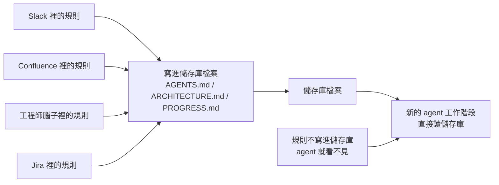
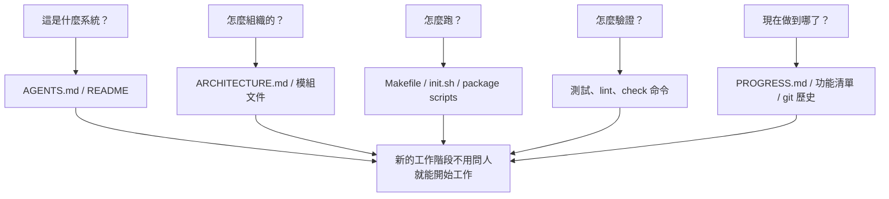

[English Version →](../../../en/lectures/lecture-03-why-the-repository-must-become-the-system-of-record/)

> 本篇程式碼示例：[code/](https://github.com/walkinglabs/learn-harness-engineering/blob/main/docs/zh-TW/lectures/lecture-03-why-the-repository-must-become-the-system-of-record/code/)
> 實戰練習：[Project 02. 讓 agent 看懂專案、接住上次的工作](./../../projects/project-02-agent-readable-workspace/index.md)

# 第三講. 讓程式碼儲存庫成為唯一的事實來源

你團隊的架構決策散落在 Confluence、Slack、Jira、和幾個資深工程師的腦子裡。對人類來說這勉強夠用，你可以問同事、搜聊天記錄、翻文件。實在不行還能去茶水間堵人。但對 AI agent 來說，不在儲存庫裡的資訊等於不存在。

這不是誇張。想想 agent 的輸入，系統提示和任務描述、儲存庫裡的檔案內容、以及工具執行的輸出。就這三樣。你的 Slack 歷史、Jira 工單、Confluence 頁面、和週五下午跟同事在茶水間聊的架構決定，agent 全都看不到。它不能「去問一下」，也不能「搜一下聊天記錄」。它就是一個被關在儲存庫裡的工程師，儲存庫外面的事，它一概不知。

所以問題變成了：你給不給這個工程師一張好地圖？

## 地圖上該畫什麼

OpenAI 在他們的 harness engineering 文章裡把這個問題說得非常直接，**儲存庫裡不存在的資訊，對 agent 來說等於不存在。** 他們把這稱為「儲存庫即規範」原則，儲存庫本身就是最高權威的規範文件。

Anthropic 的 long-running agents 文件也強調了類似的觀點：持久化狀態是長任務連續性的必要條件。跨工作階段的知識可恢復性直接決定了任務成功率。而這些狀態必須存在於儲存庫中，因為那是 agent 唯一穩定可訪問的存儲。

你可能會想：「我們團隊人少，知識都在大家腦子裡，這不也工作得好好的嗎？」沒錯，對人類來說確實可以。但你要用 agent，就得接受一個事實：agent 不能問人。所有它需要知道的東西，都必須寫下來，放在它能找到的地方。

這不是「寫更多文件」的問題。這是「把決策資訊放到正確的位置」的問題。一份在 `src/api/` 目錄下、50 行的 `ARCHITECTURE.md`，比一份在 Confluence 裡、500 頁但沒人維護的設計文件有用一萬倍。就好比一張貼在你工位上的、手畫的辦公室走法圖，比一份精美的、放在檔案室裡的建築藍圖實用得多，因為前者在你需要的時候就在手邊。

## 知識可見性



怎麼檢驗你的地圖畫得夠不夠好？做一個「冷啟動測試」，開一個全新的 agent 工作階段，只看儲存庫內容，看它能不能回答五個基本問題。



如果它答不上來，說明地圖上有空白。空白的地方，agent 就得自己猜，猜錯了就是 bug，猜多了就浪費脈絡。每個新工作階段都要猜一遍，猜的成本遠高於一開始就把地圖畫好的成本。

## 核心概念

- **知識可見性缺口**：專案總知識中不在儲存庫裡的比例。缺口越大，agent 失敗的概率越高。你腦子裡有多少關於這個專案的隱性知識？把它們全算上，再看有多少寫進了儲存庫，兩者的差距就是你的可見性缺口。
- **系統記錄（System of Record）**：程式碼儲存庫作為專案決策、架構約束、執行狀態和驗證標準的權威資訊源。儲存庫說了算，別的地方說了不算。地圖上標出「此路不通」，走的人自然繞行；但這個資訊若只留在老張腦子裡，每次都得去問老張。
- **冷啟動測試**：上一節說的五個問題。能回答幾個，你的地圖就畫了幾分。
- **發現成本**：agent 為了在儲存庫裡找到一條關鍵資訊需要消耗多少脈絡。資訊放得越隱蔽，發現成本越高，留給實際任務的預算越少。把關鍵資訊藏在十層目錄深處的 README 裡，不是沒有，是用的時候找不到。
- **知識衰減率**：儲存庫中單位時間內變得過時的知識條目比例。文件和程式碼脫節是最大的敵人，比沒有文件更危險的是過時的文件。
- **ACID 類比**：把數據庫的事務管理原則（原子性、一致性、隔離性、持久性）用到 agent 的狀態管理上。後面會展開講。

## 怎麼畫好這張地圖

**原則 1：知識靠近程式碼。** 一條關於 API 端點認證的規則，應該放在 API 程式碼旁邊，而不是藏在一個巨大的全域文件裡。每個模組目錄下放一個簡短的文件，說清楚這個模組的職責、介面和特殊約束。圖書館按主題分類書架，找歷史類書籍直接去歷史書架，不用翻遍整個圖書館。

**原則 2：用標準化的入口檔案。** `AGENTS.md`（或 `CLAUDE.md`）是 agent 的「著陸頁」。它不需要包含所有資訊，但必須能讓 agent 快速回答「這是什麼專案」、「怎麼跑」、「怎麼驗證」這三個問題。50-100 行就夠了。

**原則 3：最小但完備。** 每條知識都應該有明確的使用場景。如果你刪掉某條規則不影響 agent 的決策質量，那這條規則就不應該存在。但冷啟動測試中的每個問題都必須有答案。這是一個精妙的平衡，不多不少，剛好夠用。

**原則 4：和程式碼一起更新。** 把知識更新跟程式碼變更綁定在一起。最簡單的方法：把架構文件放在對應的模組目錄裡。改程式碼的時候自然會看到文件，改程式碼之後 CI 提醒你檢查文件是否需要更新。

**具體的儲存庫結構**：

```
project/
├── AGENTS.md              # 入口：專案概覽、執行命令、硬約束
├── src/
│   ├── api/
│   │   ├── ARCHITECTURE.md  # API 层的架构决策
│   │   └── ...
│   ├── db/
│   │   ├── CONSTRAINTS.md   # 資料庫操作的硬約束
│   │   └── ...
│   └── ...
├── PROGRESS.md             # 目前進度：做了什麼、在做什麼、被什麼阻塞
└── Makefile                # 標準化的操作命令：setup、test、lint、check
```

## 用 ACID 原則管理 agent 狀態

這個類比來自數據庫的事務管理，你可能覺得這是在把簡單的事情搞複雜，但實際上它給了你一個非常實用的框架。

- **原子性**：每次「邏輯操作」（比如「添加新端點並更新測試」）用一個 git commit 原子化。中途掛了就 `git stash` 回溯。要麼全做，要麼不做，沒有「做了一半」。
- **一致性**：定義「一致狀態」的驗證謂詞，所有測試通過、lint 無報錯。Agent 每次操作後跑驗證，不一致的中間狀態不要 commit。銀行轉賬不能只扣款不入賬。
- **隔離性**：多個 agent 併發工作時，狀態檔案要避免競爭條件。簡單方案：每個 agent 用獨立的進度檔案，或者用 git 分支隔離。兩個廚師不能同時往同一口鍋裡放鹽，放重了誰負責？
- **持久性**：關鍵的專案知識用 git 跟蹤的檔案持久化。臨時狀態可以只在工作階段的記憶體中，但跨工作階段必須的知識必須寫到檔案裡。腦子裡的不算，寫在紙上的才算。

## 一個真實的改造故事

一個團隊維護一個包含約 30 個微服務的電商平臺。架構決策（服務間通信協定、數據一致性策略、API 版本化規則）散落在：Confluence（部分過時）、Slack（難以搜索）、幾個資深工程師的腦子裡（不可擴展）、以及零星的程式碼註釋（不繫統）。

引入 AI agent 後，70% 的任務需要人工干預。幾乎每次失敗都涉及 agent 違反了某個「所有人都知道但從未寫入儲存庫」的隱性約束。新員工不知道「中午點外賣要在群裡接龍」的規矩，只能猜；猜錯了被罵，被罵了也還是沒人明說。

團隊執行了改造：
1. 儲存庫根目錄建立 `AGENTS.md`，寫明專案概覽、技術棧版本、全域硬約束
2. 每個微服務目錄下添加 `ARCHITECTURE.md`，描述該服務的職責、介面和依賴
3. 建立集中的 `CONSTRAINTS.md`，用「禁止/必須」的明確語言記錄硬約束
4. 每個服務目錄添加 `PROGRESS.md`，記錄目前工作狀態

改造後：同一 agent 能在冷啟動時回答所有關鍵專案問題，任務完成質量顯著提升。

## 關鍵要點

- 不在儲存庫裡的知識對 agent 來說等於不存在。把關鍵決策資訊放進儲存庫是最基本的 harness 投資，畫好地圖，才不會迷路。
- 用「冷啟動測試」檢驗儲存庫質量：全新工作階段能不能只看儲存庫回答五個基本問題。
- 知識要靠近程式碼、最小但完備、跟程式碼一起更新。不是寫更多文件，是把資訊放到正確的位置。
- 用 ACID 原則管理 agent 狀態：原子提交、一致性驗證、隔離併發、持久化關鍵知識。
- 知識衰減是最大敵人。過時的文件比沒有文件更危險，它會讓 agent 走錯方向還以為自己是對的。

## 延伸閱讀

- [OpenAI: Harness Engineering](https://openai.com/index/harness-engineering/)
- [Anthropic: Effective Harnesses for Long-Running Agents](https://www.anthropic.com/engineering/effective-harnesses-for-long-running-agents)
- [Infrastructure as Code — Martin Fowler](https://martinfowler.com/bliki/InfrastructureAsCode.html)
- [ADR: Architecture Decision Records](https://adr.github.io/)
- [The Twelve-Factor App](https://12factor.net/)

## 練習

1. **冷啟動測試**：在你的專案裡開一個全新的 agent 工作階段（不提供任何口頭脈絡），只讓它看儲存庫內容，然後問它五個問題：這是什麼系統？怎麼組織的？怎麼執行？怎麼驗證？現在進度如何？記錄它答不上來的問題，然後改進儲存庫讓它能答上來。

2. **知識外置化量化**：列出你的專案中所有對開發工作重要的決策和約束。標註每個條目是在儲存庫內還是儲存庫外。算一下你的知識可見性缺口有多大（不在儲存庫裡的佔總數的比例）。制定計劃把缺口降到 10% 以下。

3. **ACID 準則評估**：用本講的 ACID 類比評估你的專案狀態管理。原子性，agent 的操作能不能幹淨地回溯？一致性，儲存庫有沒有「一致狀態」的驗證？隔離性，多 agent 併發時會不會互相踩腳？持久性，跨工作階段的知識是不是都持久化了？
