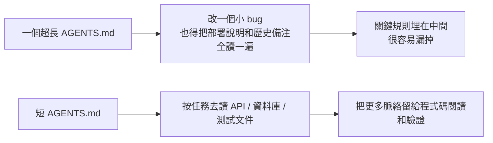
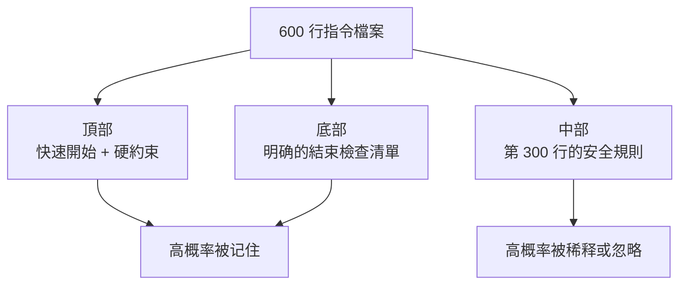

[English Version →](../../../en/lectures/lecture-04-why-one-giant-instruction-file-fails/)

> 本篇程式碼示例：[code/](https://github.com/walkinglabs/learn-harness-engineering/blob/main/docs/zh-TW/lectures/lecture-04-why-one-giant-instruction-file-fails/code/)
> 實戰練習：[Project 02. 讓 agent 看懂專案、接住上次的工作](./../../projects/project-02-agent-readable-workspace/index.md)

# 第四講. 把指令拆分到不同檔案裡

你開始認真對待 harness 了，好事。你建了個 `AGENTS.md`，把你能想到的所有規則、約束、歷史教訓都塞了進去。一個月後這個檔案膨脹到了 300 行，兩個月 450 行，三個月 600 行。然後你發現 agent 的表現反而變差了，改一個小 bug，agent 花大量脈絡處理無關的部署指令；關鍵的安全約束埋在第 300 行，被直接忽略了；檔案裡有三條互相矛盾的程式碼風格規則，agent 每次隨機選一條。

這就是「巨型指令檔案」陷阱。什麼都往裡寫、覺得都有用，最後檔案膨脹，想找一條關鍵規則就得把整份文件翻一遍；agent 真正用到的可能只有三分之一。

## 問題的根源：一個惡性循環

最常見的惡性循環是這樣，agent 犯了個錯 → 你說「加條規則防止這個」 → 加到 AGENTS.md → 暫時管用 → agent 又犯了另一個錯 → 再加一條 → 重複 → 檔案膨脹到不可控。

這不是你的錯。這是一個非常自然的反應，每次出問題就「加條規則」感覺很合理，但累積效應是災難性的。讓我們看看具體出了什麼問題。

**脈絡預算被吃掉了。** Agent 的脈絡視窗是有限的。假設你的 agent 有 200K tokens 的視窗（Claude 的標準），一個膨脹的指令檔案可能佔掉 10-20K。看起來還有不少餘量？但一個複雜的任務可能需要讀幾十個源檔案、工具執行的輸出也占脈絡、對話歷史也在累積。到真正需要理解程式碼的時候，預算已經不夠了。

**中間迷失。** 「Lost in the Middle」這篇論文（Liu et al., 2023）清楚地證明了：LLM 對長文字中間部分的資訊利用效率顯著低於兩端。你的 AGENTS.md 有 600 行，第 300 行寫的是「所有數據庫查詢必須用參數化查詢」，這是安全硬約束。但它被埋在中間，agent 幾乎一定會忽略它。

**優先級衝突。** 檔案裡混合了不可違反的硬約束（「不得使用 eval()」）、重要的設計指導（「優先使用函數式風格」）、和某個特定場景的歷史教訓（「上週修了一個 WebSocket 記憶體洩漏，注意類似的模式」）。這三條規則的重要性完全不同，但在檔案裡看起來一模一樣。Agent 沒有可靠的信號來區分優先級。

**維護衰減。** 大檔案天生難維護。指令過時了沒人刪，因為刪除的後果不確定（「也許別的地方依賴這條規則？」），但加新指令是無成本的。結果檔案只增不減，信噪比持續下降。這和軟體裡的技術債務積累一模一樣。

**矛盾累積。** 不同時期加的指令之間開始出現矛盾，一條說「用 TypeScript 嚴格模式」，另一條說「某些遺留檔案允許用 any」。Agent 每次隨機選一條遵循。Agent 每次碰到矛盾指令只能隨機選一條遵循。

## 核心概念

- **指令膨脹**：當指令檔案佔用了超過脈絡視窗 10-15% 的時候，它就開始擠佔程式碼閱讀和任務推理的預算。600 行的 `AGENTS.md` 可能佔用 10,000-20,000 tokens，對 128K 的視窗來說，這就吃掉了 8-15%。
- **中間迷失效應**：Liu 等人 2023 年的研究證明，LLM 對長文字中間部分的資訊利用效率顯著低於兩端。埋在 600 行檔案中間第 300 行的關鍵約束，被有效忽略的概率非常高。
- **指令信噪比（SNR）**：檔案中與目前任務相關的指令佔總指令的比例。做 bug 修復時被要求讀 50 行部署指令，SNR 很低。
- **路由檔案**：短小的入口檔案，核心功能是引導 agent 去找更詳細的文件，而不是自己包含所有內容。50-200 行就夠了。
- **漸進式披露**：先給概要資訊，需要的時候再給詳細資訊。好的 harness 設計和好的 UI 設計一樣，不把所有選項一次性砸到使用者臉上。
- **優先級模糊度**：當所有指令以相同格式和位置呈現時，agent 分不清哪些是不可違反的硬約束，哪些是建議性的軟約束。

## 指令檔案架構





## 拆分思路

核心原則，常用資訊放手邊，偶爾用的收起來，用不上的別帶。

入口檔案 `AGENTS.md` 控制在 50-200 行，只放最常用的東西，專案概覽（一兩句話說清楚這是什麼）、首次執行命令（`make setup && make test`）、全域硬約束（不超過 15 條不可違反的規則）、指向專題文件的連結（一行描述 + 適用條件）。

```markdown
# AGENTS.md

## 專案概覽
Python 3.11 FastAPI 後端，PostgreSQL 15 資料庫。

## 快速開始
- 安裝：`make setup`
- 測試：`make test`
- 完整驗證：`make check`

## 硬約束
- 所有 API 必須走 OAuth 2.0 認證
- 所有資料庫查詢必須用 SQLAlchemy 2.0 語法
- 所有 PR 必須通過 pytest + mypy --strict + ruff check

## 專題文件
- API 設計規範 (`docs/api-patterns.md`) — 添加新端點時必讀
- 資料庫操作約束 (`docs/database-rules.md`) — 涉及資料庫修改時必讀
- 測試標準 (`docs/testing-standards.md`) — 编寫測試時参考
```

每個專題文件 50-150 行，按主題放在 `docs/` 目錄下或對應模組目錄旁。Agent 只在需要時才去讀。找東西不用翻整份文件。

還有些資訊直接放在程式碼裡更合適，類型定義、介面註釋、配置檔案裡的說明。Agent 讀程式碼的時候自然能看到，不用再在指令裡重複一遍。

每條指令都應該標明來源（「為什麼加這條規則？」）、適用條件（「這條規則在什麼時候需要？」）、過期條件（「什麼情況下可以刪掉這條規則？」）。定期審計，刪掉過時的、冗餘的、矛盾的條目。像管理程式碼依賴一樣管理你的指令，用不上的依賴就該刪掉，不然它們只會拖慢系統。

如果某條指令必須在入口檔案裡，放頂部或底部，不要放中間。「中間迷失」效應告訴我們，LLM 對長文字中間部分的資訊利用效率顯著低於兩端。但更好的做法是把指令放到專題文件裡，讓 agent 按需加載。

OpenAI 和 Anthropic 都隱性支援拆分的做法。OpenAI 說入口檔案應「短小且以路由為導向」，Anthropic 說長執行 agent 的控制資訊應「簡潔且高優先級」。兩家都在說同一件事，別把什麼都塞進一個檔案裡。指令系統得整理，不能只靠不斷追加。

## 實際案例

一個 SaaS 團隊的 `AGENTS.md` 從最初的 50 行膨脹到 600 行。內容混合了技術棧版本、編碼規範、歷史 bug 修復筆記、API 使用說明、部署流程、和團隊成員的個人偏好，整份文件塞得滿滿當當，完全失去可維護性。

Agent 表現開始明顯下降：簡單 bug 修復任務中 agent 花大量脈絡處理無關的部署指令；安全約束「所有數據庫查詢必須用參數化查詢」埋在第 300 行，經常被忽略；三條矛盾的程式碼風格規則導致 agent 隨機選擇。

團隊執行了文件重組：
1. `AGENTS.md` 裁剪到 80 行：只保留專案概覽、執行命令、15 條全域硬約束
2. 建立專題文件：`docs/api-patterns.md`（120 行）、`docs/database-rules.md`（60 行）、`docs/testing-standards.md`（80 行）
3. 路由檔案添加指向專題文件的連結
4. 歷史筆記要麼轉成測試用例，要麼刪除

重構後：同一任務集的成功率從 45% 提升到 72%。安全約束遵循率從 60% 提升到 95%，因為從檔案中間移到了路由檔案頂部，不再被「中間迷失」了。

## 關鍵要點

- 「加條規則」是短期的止痛藥，長期的毒藥。每次加規則前想想：這條規則放專題文件是不是更合適？，別把所有規則都堆進入口文件。
- 入口檔案是路由器，不是百科全書。50-200 行，只放概覽、硬約束、和連結。
- 利用「中間迷失」效應：重要資訊放檔案頂部或底部，不重要的移到專題文件。
- 像管理技術債一樣管理指令膨脹。定期審計，每條指令要有來源、適用條件、和過期條件。
- 拆分之後信噪比提升，agent 把更多脈絡預算花在實際任務上，而不是處理無關指令。

## 延伸閱讀

- [OpenAI: Harness Engineering](https://openai.com/index/harness-engineering/)
- [Anthropic: Effective Harnesses for Long-Running Agents](https://www.anthropic.com/engineering/effective-harnesses-for-long-running-agents)
- [Lost in the Middle: How Language Models Use Long Contexts](https://arxiv.org/abs/2307.03172)
- [HumanLayer: Harness Engineering for Coding Agents](https://humanlayer.dev/articles/harness-engineering-for-coding-agents/)
- [Nielsen Norman Group: Progressive Disclosure](https://www.nngroup.com/articles/progressive-disclosure/)

## 練習

1. **信噪比審計**：拿你目前的入口指令檔案，列出所有指令條目。選 5 個不同的常見任務類型，標註每條指令是否跟該任務相關。計算每個任務類型的 SNR。那些對大多數任務都是噪聲的指令，移到專題文件裡。

2. **漸進式披露重構**：如果你有一個超過 300 行的指令檔案，把它拆成：(a) 不超過 100 行的路由檔案，(b) 3-5 個專題文件。重構前後各跑同一組任務（至少 5 個），對比成功率。

3. **中間迷失驗證**：在一個長指令檔案裡，把一條關鍵約束分別放在頂部、中間、底部各跑一組任務（每組至少 5 次），看遵循率有沒有差別。你可能會驚訝於位置效應有多大。
