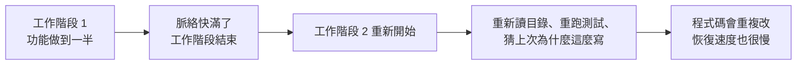
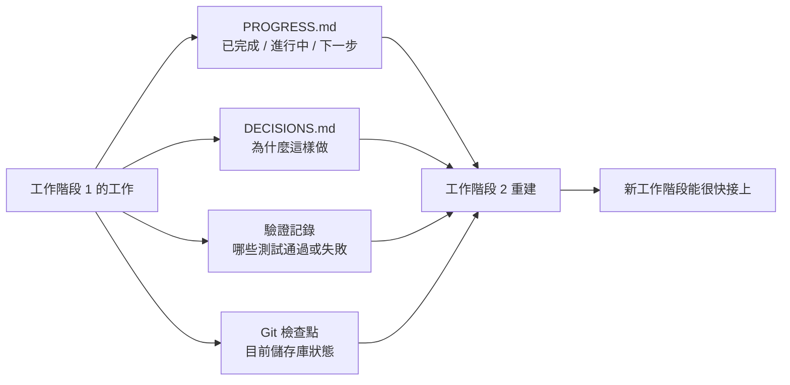

[English Version →](../../../en/lectures/lecture-05-why-long-running-tasks-lose-continuity/)

> 本篇程式碼示例：[code/](https://github.com/walkinglabs/learn-harness-engineering/blob/main/docs/zh-TW/lectures/lecture-05-why-long-running-tasks-lose-continuity/code/)
> 實戰練習：[Project 03. 讓 agent 關掉再打開還能接著幹](./../../projects/project-03-multi-session-continuity/index.md)

# 第五講. 讓跨工作階段的任務保持脈絡連續

你讓 Claude Code 幫你實作一個完整的功能，它跑了 30 分鐘，做了大部分工作，但脈絡快滿了。你開個新工作階段繼續，然後發現，它不記得上次做了什麼決策、為什麼選了方案 A 而不是方案 B、哪些檔案已經改過、測試跑到什麼狀態了。它得花 15 分鐘重新探索一遍專案，而且可能跟上次的做法不一致。

想象一下，如果你是一個工匠，每天早上醒來都不記得昨天幹了什麼。你得重新認識整個工地，哪面牆砌了一半、為什麼用的是紅磚而不是青磚、水電管道走到哪了。更糟的是，你可能會把昨天已經裝好的窗戶拆了重來，因為你不記得它已經裝過了。

這就是 AI coding agent 在跨工作階段任務中面對的困境。本節課講為什麼 agent 會「斷片」，以及如何透過結構化的狀態持久化讓它像一個每天堅持寫日記的工匠，雖然還是會失憶，但日記本裡記著一切。

## 脈絡視窗：不是無限的

脈絡視窗是有限的。這不是一個可以通過模型升級解決的問題，即使視窗大小增長到 1M tokens，複雜任務依然會用完。因為 agent 不只是在生成程式碼，它還要理解程式碼庫、跟蹤自己的決策歷史、處理工具輸出、維護對話脈絡。這些資訊加起來增長得比視窗擴容快得多。

更深層的問題在於，agent 產生的資訊不是均勻重要的。中間推理步驟包含決策的「為什麼」，為什麼選了方案 A 而不是方案 B，為什麼用了這個庫而不是那個庫，為什麼跳過了某個最佳化。最終輸出只包含「是什麼」，程式碼本身。壓縮策略通常保留後者但丟了前者。下一個工作階段看到程式碼但不知道為什麼這麼寫，可能會「最佳化」掉一個有意為之的設計決策。

Anthropic 在他們的長執行 agent 研究中發現了一個很有意思的現象：當 agent 感覺脈絡快滿了，它們會表現出一種「過早收斂」的行為，匆忙結束目前工作，跳過驗證步驟，或者選一個簡單的方案而不是最優方案。Anthropic 把這叫「脈絡焦慮」（Context Anxiety）。

## 工作階段連續性流程

沒有連續性工件的時候，每個新工作階段都是一場災難：



有連續性工件的時候，新工作階段能快速接上：



## 核心概念

- **脈絡視窗是有限的**：不管模型吹多大的視窗（128K、200K、1M），長任務總會用完。用完之後要麼壓縮（丟資訊），要麼重置（開新工作階段）。兩種方式都會丟東西。
- **連續性工件**：持久化的狀態檔案，讓新工作階段能無歧義地恢復到上次離開的地方。最基本的形式：進度日誌 + 驗證記錄 + 下一步行動。就是那個工匠的日記本。
- **重建成本**：新工作階段恢復到可執行狀態所需的時間。好的 harness 能把重建成本從 15 分鐘壓到 3 分鐘。
- **漂移（Drift）**：agent 的理解跟程式碼儲存庫實際狀態之間的偏差。每次工作階段邊界都會引入漂移，不加控制會越漂越遠。
- **脈絡焦慮**：Anthropic 觀察到的現象，agent 在接近脈絡限制時表現異常，過早結束任務以避免資訊遺失。是一種非理性的資源焦慮。
- **壓縮 vs 重置**：壓縮是在同一個工作階段裡把脈絡摘要化（保留「是什麼」，可能丟了「為什麼」）；重置是開新工作階段從持久化狀態重建（乾淨但依賴工件完備性）。

## 連續性斷了以後會發生什麼

上個工作階段花了很多脈絡預算分析了三種方案的優劣，最終選了方案 B。這個工作階段的 agent 不知道這個分析過程，可能基於不完整的資訊重新做了決策，而且可能選了方案 A。新工作階段的 agent 不知道上個工作階段的分析過程，可能基於不完整的資訊重新決策，結果選了不同的方案。

更要命的是重複勞動。Agent 不確定某項工作是否已完成，重新做了一遍。或者更糟，做了一半發現跟已有的實作衝突，需要返工。工地上不能兩撥人同時砌同一面牆，但在沒有進度記錄的情況下，新來的人完全不知道這面牆已經有人在砌了。

幾個工作階段累積下來，實作方向可能已經悄悄偏離了原始需求。每個新工作階段對專案目標的理解都略有偏差，每次偏差微小，累積起來卻可能大相徑庭。

還有驗證缺口。上個工作階段的驗證結果（哪些測試通過、哪些失敗、為什麼失敗）沒有記錄，新工作階段得重新跑一遍驗證才能瞭解目前狀態。每次都重新診斷，每次都浪費寶貴的脈絡。

OpenAI 和 Anthropic 都在他們的文件裡強調了結構化狀態持久化的重要性。OpenAI 的 harness engineering 文章把儲存庫當作「操作記錄」，每次操作的結果都應該在儲存庫裡留下可追溯的痕跡。Anthropic 的 long-running agents 文件則更具體地建議使用「交接檔案」，包含目前狀態、已知問題和下一步行動的結構化文件。

## 給失憶工匠的日記本

核心思路，**把 agent 當成一個會失憶的超級工程師來管理。** 每次它要「下班」之前，必須把關鍵資訊寫下來，讓下一個「接班」的 agent 能快速上手。

**工具 1：進度檔案（PROGRESS.md）**。這是最基本的連續性工件，日記本的核心部分：

```markdown
# 專案進度

## 目前狀態
- 最新 commit: abc1234 (feat: add user preferences endpoint)
- 測試狀態: 42/43 通過 (test_pagination_edge_case 失敗)
- Lint: 通過

## 已完成
- [x] 使用者模型和資料庫迁移
- [x] 基础 CRUD 端點
- [x] 認證中介層整合

## 進行中
- [ ] 分頁功能 (90% - 邊界條件測試失敗)

## 已知問題
- test_pagination_edge_case 在空結果集時返回 500
- 需要确認是否要在列表中包含已删除使用者

## 下一步
1. 修復分頁邊界條件 bug
2. 添加"是否包含已删除使用者"的查询参數
3. 更新 API 文件
```

**工具 2：決策日誌（DECISIONS.md）**。記錄重要的設計決策和原因。不需要詳細的設計文件，只需要「什麼決策、為什麼、什麼時候做的」，這是日記本裡的備忘：

```markdown
# 設計决策

## 2024-01-15: 使用 Redis 快取使用者偏好
- 原因: 讀取频率高（每次 API 呼叫都需要），數據量小
- 否决方案: 用 PostgreSQL 物化视图（變更频率高，物化视图維護成本不劃算）
- 約束: 快取 TTL 設為 5 分鐘，寫入時主動失效
```

**工具 3：git 提交作為檢查點。** 每完成一個原子工作單元就提交。commit message 要說清楚做了什麼和為什麼。這是免費的、自動版本化的狀態快照。

**工具 4：init.sh 或 harness 的初始化流程。** 在 `AGENTS.md` 裡寫明每天「上班」和「下班」的流程：

```markdown
## 每次工作階段開始時（上班打卡）
1. 讀 PROGRESS.md 了解目前狀態
2. 讀 DECISIONS.md 了解重要决策
3. 跑 make check 确認儲存庫處于一致狀態
4. 從 PROGRESS.md 的"下一步"部分继續工作

## 每次工作階段結束前（下班打卡）
1. 更新 PROGRESS.md
2. 跑 make check 确認一致狀態
3. 提交所有已完成的工作
```

**混合策略**：不需要每次都重置脈絡。短任務（30 分鐘以內）可以在同一個工作階段裡完成。長任務（跨工作階段）必須用進度檔案和決策日誌來維持連續性。判斷標準：如果任務需要的脈絡超過視窗的 60%，就開始準備交接。

### 脈絡焦慮的深層分析

Anthropic 在 2026 年 3 月發佈的研究進一步揭示了脈絡焦慮的具體表現：在 Sonnet 4.5 上，當脈絡接近視窗限制時，agent 會表現出強烈的「過早收斂」行為。這種行為是可量化、可預測的。

針對這個現象，有兩種策略：

**壓縮（Compaction）**：在同一個工作階段裡把早期對話摘要化。優點是保留連續性，agent 能看到「是什麼」。缺點是「為什麼」經常在摘要中遺失，為什麼選了方案 B 而非 A，為什麼跳過了某個最佳化。更關鍵的是，壓縮並不能消除脈絡焦慮，agent 知道脈絡曾經很大，心理上仍然傾向於加速收尾。

**重置（Context Reset）**：完全清空脈絡，開一個新工作階段，從持久化工件重建。優點是乾淨的心理狀態，新工作階段沒有「我快沒時間了」的焦慮。缺點是依賴交接工件的完備性。如果日記本裡漏了關鍵資訊，新工作階段可能在錯誤方向上浪費時間。

Anthropic 的實際數據：對於 Sonnet 4.5，脈絡焦慮足夠嚴重，以至於壓縮單獨不夠用，脈絡重置成為 harness 設計的關鍵組件。但對於 Opus 4.5，這種行為大幅減弱，可以不依賴重置而靠壓縮管理脈絡。這意味著：**harness 設計需要對目標模型有具體的理解，而不是套用通用範本。**

> 來源：[Anthropic: Harness design for long-running application development](https://www.anthropic.com/engineering/harness-design-long-running-apps)

## 實際案例

一個 agent 被要求實作一個帶使用者認證的部落格系統，12 個功能點，預計需要 5 個工作階段。

**沒有日記本的基線**：工作階段 1 實作了使用者模型和基礎路由。工作階段 2 開始時，agent 不記得認證中間件的介面約定，花了約 15 分鐘推斷上次的設計意圖。到工作階段 3，累積漂移導致 agent 開始重複已實作的功能。到工作階段 5，儲存庫有大量冗餘程式碼，但核心認證功能仍未通過端對端測試。12 個功能點只完成了 7 個，其中 3 個有隱含的正確性問題。

**有日記本的對照**：使用進度檔案、決策日誌、驗證記錄和 git 檢查點。每個工作階段結束時自動更新狀態報告。工作階段 2 的重建成本降到約 3 分鐘。到工作階段 5，所有 12 個功能點完成且通過驗證。

定量對比，重建時間減少約 78%，功能完成率從 58% 提升到 100%，隱含缺陷率從 43% 降到 8%。工匠還是那個會失憶的工匠，但有了日記本，他的每一天都從昨天停下的地方開始，而不是從零開始。

## 關鍵要點

- 脈絡視窗是有限的資源。長任務一定會跨工作階段，跨工作階段一定會丟資訊，跨工作階段一定會丟資訊，這是客觀現實。
- 解決方案在於更好的狀態持久化，而非更大的視窗。進度檔案 + 決策日誌 + git 檢查點，讓每個工作階段都能從可靠的記錄起步。
- 把 agent 當成會失憶的工程師來管理：每次「下班」前寫清楚做了什麼、為什麼、下一步做什麼。
- 重建成本是關鍵指標。好的 harness 應該讓新工作階段在 3 分鐘內恢復到可執行狀態。
- 混合策略：短任務在工作階段內完成，長任務用結構化工件維持連續性。

## 延伸閱讀

- [Anthropic: Effective Harnesses for Long-Running Agents](https://www.anthropic.com/engineering/effective-harnesses-for-long-running-agents)
- [OpenAI: Harness Engineering](https://openai.com/index/harness-engineering/)
- [Lost in the Middle: How Language Models Use Long Contexts](https://arxiv.org/abs/2307.03172)
- [Claude Code Documentation](https://docs.anthropic.com/en/docs/claude-code)
- [HumanLayer: Harness Engineering for Coding Agents](https://humanlayer.dev/articles/harness-engineering-for-coding-agents/)

## 練習

1. **連續性損耗度量**：選一個需要至少 3 個工作階段的開發任務。不提供任何連續性工件，在每個工作階段開始時記錄 agent 花了多少脈絡來「搞清楚上次做了什麼」。工作階段結束後，建立進度檔案，讓下一個工作階段從進度檔案開始。對比有進度檔案和沒有時的重建成本。

2. **交接範本設計**：設計一個最小化的交接範本，包含四個字段：儲存庫狀態（commit hash）、執行時期狀態（測試通過率）、阻塞項、下一步行動。讓一個全新的 agent 工作階段只憑這個範本恢復專案狀態，記錄恢復過程中出現的歧義點，迭代改進範本。

3. **混合策略實驗**：在一個包含 5 個工作階段的開發任務中，對比三種策略：(a) 每次都開全新工作階段 + 進度檔案，(b) 在同一個工作階段裡儘可能多做（脈絡壓縮），(c) 混合策略（短任務在工作階段內，長任務跨工作階段 + 進度檔案）。對比重建時間、功能完成率和決策一致性。
