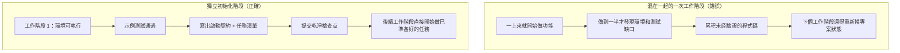

[English Version →](../../../en/lectures/lecture-06-why-initialization-needs-its-own-phase/)

> 本篇程式碼示例：[code/](https://github.com/walkinglabs/learn-harness-engineering/blob/main/docs/zh-TW/lectures/lecture-06-why-initialization-needs-its-own-phase/code/)
> 實戰練習：[Project 03. 讓 agent 關掉再打開還能接著幹](./../../projects/project-03-multi-session-continuity/index.md)

# 第六講. 讓 agent 每次工作前先初始化

你開了一個新的 agent 工作階段，讓它「幫我加個搜索功能」。它上來就開始改程式碼，精神可嘉。改了 20 分鐘發現測試框架沒配好，又花 10 分鐘搞測試框架，然後發現數據庫遷移腳本格式不對，又折騰了一會兒。最後搜索功能倒是加了，但整個工作階段的效率很低，大部分時間花在了「搞清楚這個專案怎麼運作」上，而不是寫搜索功能。

更好的做法是在讓 agent 開始幹活之前，先用一個獨立的階段把基礎環境搭好、驗證命令跑通、專案結構搞清楚。蓋房子必須先打地基，地基幹了再砌牆；若同時進行，牆砌到一半地基未固，整棟樓都得推倒重來。

這節課講的就是為什麼初始化必須是獨立的階段，不能跟實作混在一起。

## 地基和牆：兩種完全不同的工作

初始化和實作的最佳化目標完全不同。實作階段的目標是最大化已驗證功能的數量和質量。初始化階段的目標是最大化後續所有實作的可靠性和效率。

當你把初始化和實作混在一起的時候，agent 面臨一個多目標最佳化問題，它要同時搭基礎設施和寫功能程式碼。在沒有顯式優先級設定的情況下，agent 自然傾向於寫程式碼（因為那是直接可見的產出），而犧牲基礎設施（因為它的價值只能在後續工作階段中體現）。施工隊若同時打地基和砌牆，往往會急著砌牆，因為牆看得見、能交差。但地基沒打好，後面出的問題是系統性的。

## 初始化生命週期



## 混在一起做會怎樣

最直接的問題：基礎設施不紮實。Agent 花了 80% 的精力寫功能程式碼，剩下 20% 隨便搭了點基礎設施。測試框架配了但沒驗證過，lint 規則設了但太寬鬆，進度檔案沒建立。這些缺陷在第一個工作階段裡不明顯（因為 agent 還記得它做了什麼），但到第二個工作階段就暴露了，新 agent 不知道專案怎麼跑、怎麼測、做到哪了。基礎薄弱，後患無窮。

更隱蔽的代價是「未驗證的累積」，在測試框架配好之前寫的功能程式碼，等回頭補測試的時候可能發現設計上就有問題，早知道的話應該用不同的方式實作。等回頭補測試時才發現設計有問題，要重構才能讓測試通過。

脈絡預算也在被浪費。初始化工作（配環境、配測試、理解專案結構）消耗了大量預算，留給實際功能實作的反而不夠了。結果第一個工作階段只完成了一半的功能，第二個工作階段還得從頭理解專案。預算花在了打地基上，但地基也沒打好，兩頭都沒佔著。

最容易被忽略的是隱式假設埋下的雷。Agent 在初始化過程中做的決策（用什麼測試框架、目錄怎麼組織、依賴怎麼管理）如果不顯式記錄下來，後續工作階段就可能做出矛盾的選擇。第一個施工隊用的是水泥地基，第二個施工隊不知道，往上面打了木樁，地基直接裂了。

Anthropic 在他們的長執行應用開發研究中明確建議把初始化和實作分離。他們的實驗數據顯示，使用獨立初始化階段的專案，多工作階段場景中的功能完成率比混合方式高 31%。關鍵是，初始化階段投入的時間在後續 3-4 個工作階段中就能完全收回。地基打得越紮實，上面的樓蓋得越快。

OpenAI 的 Codex harness engineering 指南也強調「儲存庫作為操作記錄」的原則，第一次執行就要建立有效的操作結構，否則每次新工作階段都得重新推斷專案約定。

## 核心概念

- **初始化階段**：agent 生命週期中的第一個階段，不做功能實作，只建立後續所有實作階段的執行前提。輸出的是基礎設施，不是功能程式碼。
- **自舉契約**：一個專案能被全新 agent 工作階段無歧義操作的條件，能啟動、能測試、能看進度、能接手下一步。四個條件缺一不可。
- **冷啟動 vs 熱啟動**：冷啟動是從空目錄開始，agent 要猜專案結構；熱啟動是從範本或已有專案開始，基礎設施已經就位。熱啟動的效果遠好於冷啟動，從有基礎設施的工地開工，效率遠高於在空地從零搭建。
- **交接就緒性**：專案在任何時刻都處於「可以被全新 agent 接手」的狀態。不需要口頭解釋，只看儲存庫內容就能接著幹。
- **首次驗證時間**：從專案開始到第一個功能點通過驗證的時間。這是衡量初始化效率的核心指標。
- **下游可用性**：初始化質量的最佳衡量標準，後續工作階段不需要依賴隱式知識就能成功執行任務的比例。

## 怎麼做好初始化

**把初始化當作一個獨立的階段來執行。** 第一個工作階段只做初始化，不寫任何業務功能程式碼。初始化的產出是：

**1. 可執行的環境。** 專案能啟動、依賴都裝好、沒有環境問題。地基澆好了，沒裂縫。

**2. 可驗證的測試框架。** 至少有一個示例測試能通過。這是對測試框架本身配對的驗證。

**3. 自舉契約文件。** 一個明確的文件告訴後續工作階段：
```markdown
# 初始化契約

## 啟動命令
- 安裝相依：`make setup`
- 啟動開發服務器：`make dev`
- 執行測試：`make test`
- 完整驗證：`make check`

## 目前狀態
- 所有相依已安裝並鎖定
- 測試框架已配置（Vitest + React Testing Library）
- 示例測試通過（1/1）
- Lint 規則已配置（ESLint + Prettier）

## 專案結構
- src/ — 源程式碼
- src/components/ — React 元件
- src/api/ — API 用戶端
- tests/ — 測試檔案
```

**4. 任務分解。** 把整個專案拆成有序的任務列表，每個任務有明確的驗收標準：
```markdown
# 任務分解

## Task 1: 使用者認證基础
- 實作 JWT 認證中介層
- 添加登入/註冊端點
- 驗收標準：pytest tests/test_auth.py 全部通過

## Task 2: 使用者資料頁面
- 實作使用者資料 CRUD
- 添加資料編輯表單
- 驗收標準：pytest tests/test_profile.py 全部通過

## Task 3: 搜索功能
- ...
```

**5. Git 提交作為檢查點。** 初始化完成後提交一個乾淨的 checkpoint。後續所有工作都從這個 checkpoint 開始。

**熱啟動策略**：不要從空目錄開始。用一個專案範本（create-react-app、fastapi-template 等）預置好標準的目錄結構、依賴配置和測試框架。把通用的初始化步驟預置到範本裡，只留下專案特有的初始化工作。在已有通用基礎設施的基礎上開工，效率遠高於從空白目錄起步。

**初始化的完成條件**：自舉契約的四個條件都滿足了，能啟動、能測試、能看進度、能接手下一步。用這個檢查清單驗收初始化：

```markdown
## 初始化驗收清單
- [ ] `make setup` 從零開始能成功
- [ ] `make test` 至少有一個測試通過
- [ ] 新的 agent 工作階段能只看儲存庫回答"怎麼跑"和"怎麼測"
- [ ] 任務分解檔案存在且有至少 3 個任務
- [ ] 所有内容已提交到 git
```

## 實際案例

一個 React 前端專案的兩種初始化方式對比：

**混合方式（邊打地基邊砌牆）**：agent 在第一個工作階段中同時做了專案腳手架建立和首個功能實作。工作階段結束時，儲存庫有可執行的程式碼，但沒有顯式的啟動/測試命令文件、沒有進度跟蹤檔案、沒有任務分解。第二個工作階段花了約 20 分鐘重新推斷專案結構、測試框架和建構流程，耗費大量時間。

**獨立初始化（先打地基）**：第一個工作階段只做初始化，用專案範本建立目錄結構、配置測試框架（Vitest + React Testing Library）、寫一個示例測試並驗證通過、建立自舉契約文件和任務分解檔案、提交初始檢查點。第二個工作階段的重建時間不到 3 分鐘，直接從任務列表開始工作，施工隊來了，看了一眼施工圖就知道從哪裡接著幹。

整個專案週期對比：混合方式的總重建時間（跨所有工作階段）比獨立初始化多約 60%。獨立初始化多花的那 20 分鐘在後續工作階段中被成倍收回。前期投入的時間在後續工作階段中被成倍收回，慢即是快。

## 關鍵要點

- 初始化和實作的最佳化目標不同，混在一起只會互相拖後腿。先打地基，再砌牆。
- 初始化的產出不是程式碼，是基礎設施：可執行的環境、可驗證的測試、自舉契約、任務分解。
- 用「自舉契約」的四個條件驗收初始化：能啟動、能測試、能看進度、能接手下一步。
- 熱啟動優於冷啟動。用專案範本預置標準化的基礎設施。
- 初始化投入的時間會在後續 3-4 個工作階段中完全收回。這不是額外的成本，是前期投資，初始化越紮實，後續工作效率越高。

## 延伸閱讀

- [Anthropic: Effective Harnesses for Long-Running Agents](https://www.anthropic.com/engineering/effective-harnesses-for-long-running-agents)
- [OpenAI: Harness Engineering](https://openai.com/index/harness-engineering/)
- [HumanLayer: Harness Engineering for Coding Agents](https://humanlayer.dev/articles/harness-engineering-for-coding-agents/)
- [Infrastructure as Code — Martin Fowler](https://martinfowler.com/bliki/InfrastructureAsCode.html)
- [SWE-agent: Agent-Computer Interfaces](https://github.com/princeton-nlp/SWE-agent)

## 練習

1. **自舉契約設計**：為一個你正在開發的專案寫一個完整的自舉契約。然後開一個全新的 agent 工作階段，只給它看儲存庫內容（不給任何口頭脈絡），讓它嘗試啟動專案、跑測試、瞭解目前進度。記錄它遇到的問題，每個問題都對應自舉契約中缺失的一個條款。

2. **對比實驗**：選一箇中等複雜度的新專案。方式 A：讓 agent 初始化和首次實作同時做。方式 B：先花一個工作階段做獨立初始化，第二個工作階段開始實作。在 4 個工作階段後對比：首次驗證時間、重建成本、功能完成率。

3. **初始化驗收清單**：為你的專案設計一個初始化驗收清單。讓一個全新的 agent 工作階段執行清單上的每一項，記錄哪些項通過了、哪些沒通過。沒通過的項就是你的 harness 需要補強的地方。
