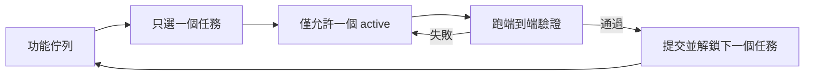
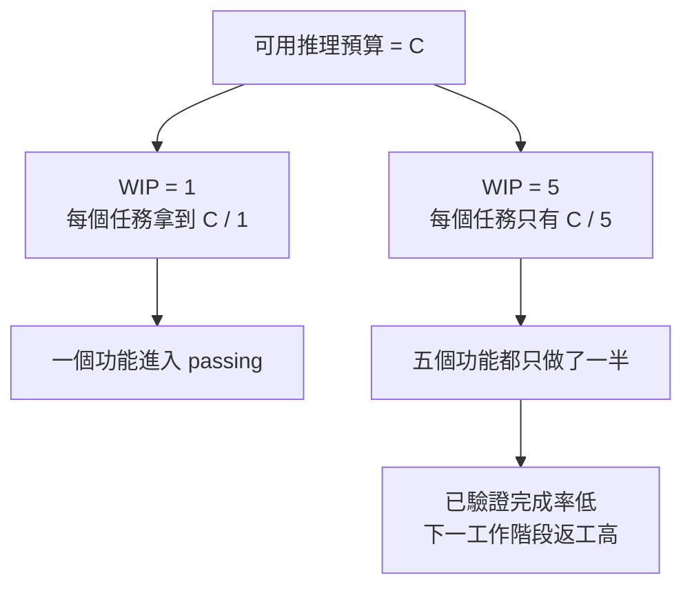

[English Version →](../../../en/lectures/lecture-07-why-agents-overreach-and-under-finish/)

> 本篇程式碼示例：[code/](https://github.com/walkinglabs/learn-harness-engineering/blob/main/docs/zh-TW/lectures/lecture-07-why-agents-overreach-and-under-finish/code/)
> 實戰練習：[Project 04. 用執行回饋修正代理的行為](./../../projects/project-04-incremental-indexing/index.md)

# 第七講. 給 agent 劃清每次任務的邊界

你讓 Claude Code「給這個專案加上使用者認證功能」，結果它同時開始改資料庫 schema、寫路由、改前端元件、還順手重構了錯誤處理中介軟體。兩個小時後你一看——12 個檔案被修改，800 行新程式碼，但沒有一個功能是端到端跑通的。

貪多嚼不爛，這句話放到 AI agent 身上格外貼切。Agent 天生就有「多做一點」的衝動，看到相關的事情就順手一起做了，和那種在超市本來只打算買瓶醬油、結果推著滿滿一車出來的人一個德行。問題是，人類買了太多東西最多浪費錢，agent 同時做太多事情則是每一件都做不好。

Anthropic 在 「Effective harnesses for long-running agents」 工程部落格中明確指出：當提示太寬泛時，agent 傾向於「同時啟動多件事」而非「先做完一件事」。OpenAI 在 Codex 工程實踐中也發現，沒有顯式範圍控制的任務，完成率會暴跌。這不是模型的問題，是你沒有在 harness 裡給它劃清邊界。

## 注意力是有限的資源

這不是比喻，是數學。假設 agent 的脈絡容量為 C，同時啟動 k 個任務，每個任務平均獲得 C/k 的推理資源。當 C/k 低於完成單個任務所需的最小閾值時，所有任務都做不完。這就像你的胃就那麼大，同時塞十個包子進去，十個都消化不良。

Claude Code 的真實行為很說明問題。你讓它「新增使用者註冊功能」，它很可能這樣做：

1. 建立 User model
2. 寫註冊路由
3. 發現需要電子郵件驗證，於是加郵件服務
4. 看到密碼需要加密，於是引入 bcrypt
5. 注意到錯誤處理不統一，於是重構全局錯誤中介軟體
6. 看到測試檔案結構雜亂，於是重組目錄結構

6 步之後，每一個都是半成品。沒有端到端驗證，程式碼之間耦合複雜，下一個工作階段來接手時會一臉懵。就像一個人同時炒六道菜，每道菜都下了鍋但沒有一道出鍋，全糊了。

Anthropic 的實驗數據直接支援這一點：使用「小下一步」策略（等價於 WIP=1）的 agent，任務完成率比使用寬泛提示的 agent 高 37%。更有意思的是，agent 生成的程式碼行數和實際完成的功能數量呈弱負相關，寫得越多，完成得越少。貪多嚼不爛，數據為證。

## WIP=1 工作流





## 核心概念

- **過度延伸（Overreach）**：agent 在一次工作階段中啟動的任務數量超過最優值。它可以量化——同時做 5 個功能但 0 個跑通，就是 overreach。
- **不足完成（Under-finish）**：已啟動的任務中，通過端到端驗證的比例低於閾值。寫了程式碼但沒跑通測試，就是 under-finish。
- **WIP 限制（Work-in-Progress Limit）**：來自 Kanban 方法論。核心思想：限制同時在進行的任務數量。對於 agent，WIP=1 是最安全的預設值，做完一個再做下一個。就像自助餐廳不要一次拿太多盤子，吃完一盤再去拿下一盤。
- **完成證據（Completion Evidence）**：一個任務從「進行中」變成「已完成」必須滿足的可驗證條件。沒有這個，agent 會用「程式碼看起來沒問題」代替「行為通過測試」。
- **範圍表面（Scope Surface）**：一個 DAG 結構，每個節點是一個工作單元，邊是依賴關係。狀態只有四種：未開始、進行中、阻塞、已通過。
- **完成壓力（Completion Pressure）**：harness 通過 WIP 限制和完成證據要求共同產生的約束力，迫使 agent 先完成目前任務再開始新任務。

## Overreach 和 Under-finish 是一對難兄難弟

這兩個問題互相加劇。overreach 導致注意力分散，注意力分散導致 under-finish，under-finish 留下的半成品程式碼又增加了系統複雜度，進一步導致下一個任務的 overreach。惡性循環。

用 Kanban 的語言說：Little 法則告訴我們 L = lambda * W。如果在製品數量 L 過大（同時做太多事），每個任務的前置時間 W 必然增加。對於 agent 來說，這意味著每個功能從開始到驗證通過的時間被拉長，失敗概率被放大。

這在人類世界也是老問題了。Steve McConnell 在《Rapid Development》中記錄，範圍蔓延是專案失敗的首要原因。但人類至少有「我已經做得夠多了」的直覺，agent 完全沒有。生成下一個想法的成本對模型來說太低了，寫一行「順便把這個也改了」幾乎不消耗額外 token，但每個額外的修改都會稀釋 agent 的注意力。就像在自助餐廳裡，每多拿一個盤子的邊際成本幾乎為零，但你的胃只有那麼大。

## 怎麼做才對

### 1. 強制 WIP=1

這是最直接有效的方法。在你的 harness 裡，明確告訴 agent：**任何時刻只允許一個任務處於「進行中」狀態。** 在 Claude Code 的 CLAUDE.md 或 Codex 的 AGENTS.md 裡寫：

```
## 工作規則
- 每次只做一個功能項
- 目前功能項端到端驗證通過後，才能開始下一個
- 不要在實作功能 A 時「順便」重構功能 B
```

就像吃自助餐，一次只拿一盤，吃完再去拿。

### 2. 給每個任務定義顯式的完成證據

完成的標準是「行為驗證通過了」，不是「程式碼寫完了」。在你的功能列表裡，每個條目都要有驗證命令：

```
F01: 使用者註冊
  驗證: curl -X POST /api/register -d '{"email":"test@example.com","password":"123456"}' | jq .status == 201
  狀態: passing
```

### 3. 把範圍表面外部化

用一個機器可讀的檔案（JSON 或 Markdown）記錄所有任務的狀態。任何新工作階段都能直接讀這個檔案，知道：哪個任務在做？什麼行為算完成？已經通過了什麼驗證？

### 4. 追蹤驗證完成率

harness 應該持續跟蹤 VCR（Verified Completion Rate）= 已通過驗證的任務數 / 已啟動的任務數。VCR < 1.0 時，阻止新任務啟動。

## 實際案例

一個 8 個功能項的 REST API 專案，兩種策略對比：

**自助餐模式（無約束）**：agent 在第一個工作階段同時啟動 5 個功能。產出約 800 行程式碼，涉及 12 個檔案。端到端測試通過率只有 20%，只有使用者註冊跑通了。其餘 4 個功能：資料庫 schema 建了但缺驗證邏輯，路由定義了但返回格式錯誤。就像一個人同時炒六道菜，只有一道勉強能吃。到第 3 個工作階段結束，8 個功能只完成 3 個。

**單盤模式（WIP=1）**：agent 在第一個工作階段只做使用者註冊。產出約 200 行程式碼，涉及 4 個檔案。端到端測試 100% 通過。提交乾淨的、已驗證的實現。到第 4 個工作階段結束，8 個功能完成 7 個（第 8 個因外部依賴被阻塞）。

結果：總程式碼量更少（800 行 vs 1200 行），但有效程式碼更多。完成率 87.5% vs 37.5%。一口一口吃，反而吃得最多。

## 關鍵要點

- **WIP=1 是 agent harness 的預設安全設置**，做完一個再做下一個，不要試圖並行。一口吃不成胖子。
- **完成證據必須是可執行的**，「程式碼看起來沒問題」不算完成，「curl 返回 201」才算。
- **範圍表面必須外部化為檔案**，不能只在對話裡說，必須在儲存庫裡有機器可讀的記錄。
- **overreach 和 under-finish 是共生問題**，解決一個就解決了另一個。
- **「少做但做完」永遠優於「多做但做半」**，agent 程式碼行數和功能完成率呈負相關。質量永遠比數量重要。

## 延伸閱讀

- [Effective harnesses for long-running agents - Anthropic](https://www.anthropic.com/engineering/effective-harnesses-for-long-running-agents) — Anthropic 工程部落格，詳細論述了「小下一步」策略
- [Harness Engineering - OpenAI](https://openai.com/index/harness-engineering/) — OpenAI 對 harness 工程的完整論述
- [Kanban: Successful Evolutionary Change - David Anderson](https://www.goodreads.com/book/show/1070822.Kanban) — WIP 限制的經典來源
- [Rapid Development - Steve McConnell](https://www.goodreads.com/book/show/125171.Rapid_Development) — 範圍蔓延作為專案失敗首要原因的實證資料

## 練習

1. **任務原子化練習**：選一個寬泛需求（如「實現使用者管理系統」），把它拆成至少 5 個原子工作單元。每個單元寫清楚：(a) 單一行為描述，(b) 可執行的驗證命令，(c) 依賴關係。檢查是否滿足 WIP=1 的約束。

2. **對比實驗**：在同一個專案上跑兩次，一次不給約束，一次強制 WIP=1。比較：驗證完成率、總程式碼行數、有效程式碼比例。

3. **完成證據審計**：回顧一個最近的 agent 執行結果，把每個程式碼變更分類為「已完成行為」、「未完成行為」或「腳手架」。給每個未完成行為補充缺失的驗證命令。
