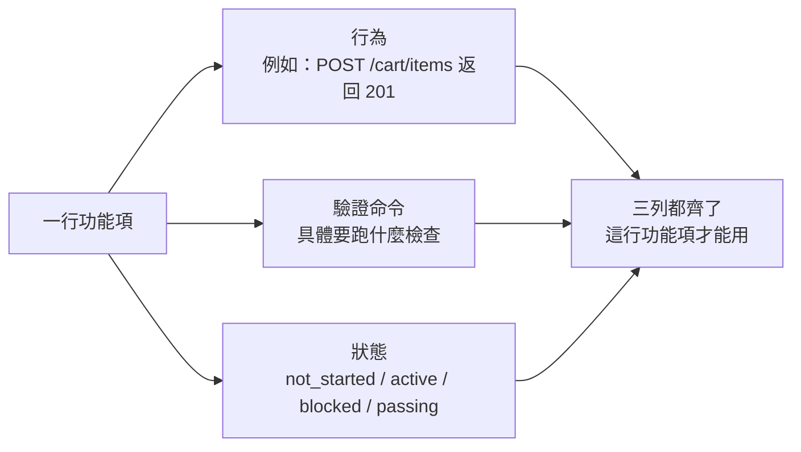
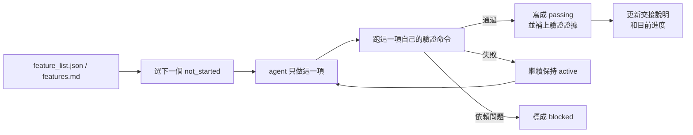

[English Version →](../../../en/lectures/lecture-08-why-feature-lists-are-harness-primitives/)

> 本篇程式碼示例：[code/](https://github.com/walkinglabs/learn-harness-engineering/blob/main/docs/zh-TW/lectures/lecture-08-why-feature-lists-are-harness-primitives/code/)
> 實戰練習：[Project 04. 用執行回饋修正代理的行為](./../../projects/project-04-incremental-indexing/index.md)

# 第八講. 用功能清單約束 agent 該做什麼

你讓 agent 做一個電商網站，跑完之後它告訴你「做完了」。你打開程式碼一看——使用者認證有了，但購物車的結算按鈕點了沒反應，支付流程根本沒接上。問題是：你從來沒告訴它「做完」的標準是什麼，所以它用自己的標準，「程式碼寫了不少，看起來挺完整」。

功能清單（feature list）在很多人眼裡就是個備忘錄，寫下來怕忘了，寫完扔在一邊。但在 harness 的世界裡，功能清單是整個 harness 的脊樑骨，不只是一份給人看的備忘錄。調度器靠它選任務，驗證器靠它判完成，交接器靠它生成報告。脊樑骨斷了，全身都癱。

Anthropic 和 OpenAI 都強調：**工件必須外部化**。功能狀態必須是儲存庫裡機器可讀的檔案，不能是對話裡的非結構化描述。

## Agent 不知道「做完」是什麼意思

Claude Code 和 Codex 都不會自動知道你心目中的「做完」是什麼意思。你說「加一個購物車功能」，模型的理解可能是「寫一個 Cart 元件和 addToCart 方法」。而你的意思是「使用者能從瀏覽商品到下單支付完整走通」。

這個理解鴻溝在沒有功能清單的情況下會持續存在。agent 用自己的隱式標準判斷完成，通常是「程式碼沒有明顯的語法錯誤」。而你需要的是端到端的行為驗證。就像你讓朋友幫你買菜，說「買點水果」，他拎了一袋檸檬回來，他要的水果，你要的水果，不是一個水果。

看看這種常見的進度記錄：

```
做了使用者認證、購物車基本完成了、還需要做支付
```

新的 agent 工作階段看到這個記錄，能回答以下問題嗎？「基本完成」意味著什麼？購物車通過了哪些測試？支付的阻塞條件是什麼？答案都是「不知道」。就像你看病時跟醫生說「我肚子疼，最近還行」，醫生能開出什麼藥來？

結果是：新工作階段花 20 分鐘推斷專案狀態，最終可能重複實現已完成的功能。Anthropic 的工程實踐數據表明，好的進度記錄可以減少 60-80% 的工作階段啟動診斷時間。

## 功能狀態機





## 核心概念

- **功能清單是 harness 原語**：它是其他所有 harness 元件依賴的基礎資料結構，不是「可選的規劃工具」。就像資料庫裡的表結構，你不能說「要不我們省掉主索引鍵吧」，省掉了整個系統就解體了。
- **三元組結構**：每個功能項是 `(行為描述, 驗證命令, 目前狀態)` 的三元組。缺了任何一項，這個功能項就不完整。行為描述告訴 agent 做什麼，驗證命令告訴它怎麼算做完，狀態告訴它現在到哪了。
- **狀態機模型**：每個功能項有四種狀態——`not_started`、`active`、`blocked`、`passing`。狀態轉移由 harness 控制，不是 agent 想改就能改。
- **通過狀態門控**：功能從 `active` 變成 `passing` 的唯一方式是驗證命令執行成功。這是不可逆的，`passing` 了就不能退回去。就像考試及格了就是及格了，不能事後改分數。
- **單一權威來源**：專案裡關於「該做什麼」的所有資訊，必須從一個功能清單派生。不能出現功能清單和對話記錄矛盾的情況。
- **反向壓力**：還沒通過的功能項數量就是 harness 對 agent 施加的壓力。壓力歸零 = 專案完成。

## 為什麼功能清單必須是「原語」

文件是給人看的，原語是給系統用的。文件可以被忽略，原語不能被繞過。

類比資料庫的觸發器約束和應用層的檢查邏輯：前者由資料庫引擎強制執行，任何 SQL 都無法跳過；後者依賴於應用程式碼的正確性，可能被意外繞過。功能清單作為 harness 原語，就是資料庫級別的約束，agent 不能繞過它。

具體來說，功能清單服務四個 harness 元件：

1. **調度器**：讀狀態，選下一個 `not_started` 的功能。就像工廠的排產系統，看完訂單才知道下一步做什麼。
2. **驗證器**：執行驗證命令，判斷是否允許狀態轉移。就像質檢，不是你說合格就合格，得通過檢驗。
3. **交接報告器**：從功能清單自動生成工作階段交接摘要。就像換班時自動生成的交接表，不用手寫，系統自己出。
4. **進度追蹤器**：統計各狀態分佈，提供專案健康度指標。就像儀表盤，一眼看出專案走到哪了。

## 怎麼做

### 1. 定義一個最小化的功能清單格式

不需要複雜的系統，一個結構化的 Markdown 或 JSON 檔案就夠了。關鍵是每個條目必須有三元組：

```json
{
  "id": "F03",
  "behavior": "POST /cart/items with {product_id, quantity} returns 201",
  "verification": "curl -X POST http://localhost:3000/api/cart/items -H 'Content-Type: application/json' -d '{\"product_id\":1,\"quantity\":2}' | jq .status == 201",
  "state": "passing",
  "evidence": "commit abc123, test output log"
}
```

### 2. 讓 harness 控制狀態轉移

agent 不能直接把狀態改成 `passing`。它只能提交驗證請求，harness 執行驗證命令，根據結果決定是否允許狀態轉移。這就是「通過狀態門控」，不是你說考過了就考過了，得看成績單。

### 3. 在 CLAUDE.md 裡寫清楚規則

```
## 功能清單規則
- 功能清單檔案: /docs/features.md
- 每次只啟動一個功能項
- 功能項驗證命令必須通過才能標為 passing
- 不要修改功能清單的狀態，由驗證指令碼自動更新
```

### 4. 粒度校準

每個功能項應該是「一次工作階段能完成」的範圍。太粗了做不完，太細了管理開銷大。「使用者可以新增商品到購物車」是一個好粒度，「實現購物車」太粗了，「建立 Cart 模型的 name 欄位」太細了。就像切牛排，不能整塊啃，也不能切成肉末。

## 實際案例

一個電商平台的開發任務，10 個功能項。對比兩種追蹤方式：

**備忘錄模式**：agent 用非結構化筆記記錄進度。3 個工作階段後，筆記變成了「做了使用者認證和商品列表、購物車基本完成但還有 bug、支付沒開始」。新工作階段需要 20 分鐘推斷狀態，最終重複實現了已完成的功能。就像你的購物清單上寫著「牛奶、麵包、還有那個什麼來著」，到超市了你還是不知道要買什麼。

**脊樑骨模式**：每個功能項有明確的狀態和驗證命令。新工作階段讀取功能清單，3 分鐘內知道：F01-F05 是 `passing`，F06 是 `active`（正在做），F07-F10 是 `not_started`。直接從 F06 繼續，零重複。

定量結果：使用結構化功能清單的專案，功能完成率比自由形式高 45%，零重複實現。

## 關鍵要點

- **功能清單是 harness 的脊樑骨**，不是給人看的備忘錄。調度器、驗證器、交接器都依賴它。
- **每個功能項必須有三元組**：行為描述 + 驗證命令 + 目前狀態。缺一項就不完整，就像三條腿的凳子少一條腿。
- **狀態轉移由 harness 控制**，agent 不能自己改狀態。通過驗證 = 唯一的升級路徑。
- **功能清單是專案的單一權威來源**，任何關於「該做什麼」的資訊都從這裡派生。
- **粒度控制在「一次工作階段能完成」的範圍**。太粗做不完，太細管不過來。

## 延伸閱讀

- [Building Effective Agents - Anthropic](https://www.anthropic.com/research/building-effective-agents) — 明確指出功能清單是控制 agent 執行範圍的「核心資料結構」
- [Harness Engineering - OpenAI](https://openai.com/index/harness-engineering/) — 強調「將工件外部化」的原則
- [Design by Contract - Bertrand Meyer](https://www.goodreads.com/book/show/130439.Object_Oriented_Software_Construction) — 契約式設計原則，功能列表的理論基礎
- [How Google Tests Software](https://www.goodreads.com/book/show/13563030-how-google-tests-software) — 測試金字塔和行為規格的工程實踐

## 練習

1. **功能清單設計**：定義一個最小化的功能清單 JSON schema。包含：id、行為描述、驗證命令、目前狀態、證據引用。用它描述一個包含 5 個功能的真實專案。

2. **驗證嚴格性對比**：選 3 個功能，分別設計「寬鬆」驗證（如「程式碼無語法錯誤」）和「嚴格」驗證（如「端到端測試通過」）。對比兩種驗證下的假陽性率。

3. **單一來源原則審查**：審查一個已有的 agent 專案，檢查是否存在與功能清單矛盾的範圍資訊（對話裡的隱式需求、程式碼裡的 TODO 注解等）。設計一個方案，把所有資訊統一到功能清單中。
