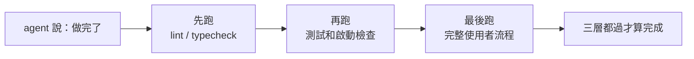

[English Version →](../../../en/lectures/lecture-09-why-agents-declare-victory-too-early/)

> 本篇程式碼示例：[code/](https://github.com/walkinglabs/learn-harness-engineering/blob/main/docs/zh-TW/lectures/lecture-09-why-agents-declare-victory-too-early/code/)
> 實戰練習：[Project 05. 讓 agent 自己檢查自己做的對不對](./../../projects/project-05-grounded-qa-verification/index.md)

# 第九講. 防止 agent 提前宣告完成

你讓 agent 實現「密碼重置」功能。它改了資料庫 schema、寫了 API 端點、加了郵件範本，跑了單元測試（全部通過），然後自信地告訴你「做完了」。你實際一跑，密碼重置連結發不出去（郵件服務配置缺失）、資料庫遷移半途失敗（schema 不一致）、端到端流程根本沒走過一遍。

這種感覺你一定不陌生，考試時把卷子寫得滿滿當當，信心滿滿地第一個交卷，結果成績出來不及格。卷子寫滿了，不代表做對了。

這不是偶然事件。Guo 等人 2017 年在 ICML 上的經典論文證明：**現代神經網路一致性地過度自信**——模型自報的置信度顯著高於實際準確率。AI 程式碼代理也一樣，它「覺得」做完了，但實際上差得遠。你的 harness 必須用外部化的、基於執行的驗證來替代 agent 的「感覺」。

## 滑坡效應

過早完成聲明幾乎總是一樣的手法，程式碼看著還行，語法正確、邏輯似乎合理，靜態檢查沒有明顯錯誤。但 harness 沒有強制要求全面執行驗證，agent 跳過了實際執行或只跑了部分測試。跑了單元測試但跳過整合測試，跑了測試但沒檢查覆蓋率。最後「程式碼看起來沒問題」就被當作了「功能已完成」的證據。交卷了。

每一步都在遺失資訊。從任務規範到程式碼實現到執行時期行為，每次轉換都可能引入偏差，而每次跳過的驗證都加劇了資訊不對稱。

## 三層終止檢查




## 核心概念

- **過早完成聲明**：agent 斷言任務完成，但實際上存在未滿足的正確性規範。問題在於，agent 依據程式碼層面的局部信心做判斷，系統級正確性需要全局驗證。
- **置信度校準偏差**：agent 自報的完成信心與實際完成質量之間的系統性差距。對複雜多檔案任務，這個偏差顯著為正，agent 總是比實際做得更自信。這種過度自信在跨任務類型的測試中一致重現，不因任務難度降低而消失。
- **終止標準**：一組明確的、可執行的判定條件，定義在 harness 裡。agent 必須滿足所有條件才能聲明完成。「完成」從主觀判斷變成了客觀判定。
- **驗證-確認雙閘門**：第一層驗證檢查「程式碼是否正確實現了指定行為」；第二層確認檢查「系統級行為是否滿足端到端需求」。兩層都通過才算完成。
- **執行時期回饋信號**：來自程式執行的日誌、程式狀態、健康檢查。這是 harness 判定完成質量的客觀基礎。
- **完成優先級約束**：先驗證功能正確性，再處理效能，最後管風格。核心功能沒驗證通過之前，不許做重構。

## 單元測試通過 ≠ 任務完成

這是最常見的陷阱，也是最危險的一個。agent 寫了程式碼，跑了單元測試，全部綠色，然後說「做完了」。但單元測試的設計哲學（隔離被測單元、模擬依賴），恰好使其無法檢測跨元件問題：

**介面不相符**，渲染程式傳給預載腳本的檔案路徑是相對路徑，但預載腳本期望絕對路徑。各自的單元測試都用了 mock，都通過了。跨元件的介面契約無法透過隔離測試驗證，只有整合執行才能暴露真正的相容性問題。

**狀態傳播錯誤**，資料庫遷移改了表結構，但 ORM 的快取層還持有舊結構的快取條目。單元測試每次都是全新的 mock 環境，不會暴露這種跨層狀態不一致。

**環境依賴性**，程式碼在測試環境（一切 mock）行為正確，在真實環境因配置差異、網路延遲、服務不可用而失敗。測試環境的完全隔離設計決定了它無法反映真實部署環境中的配置差異與外部依賴狀態。

### 「順便重構」是完成判定的毒藥

Claude Code 有一個常見行為模式，在核心功能還沒驗證通過時就開始重構程式碼、最佳化效能、改進風格。Knuth 說的「過早最佳化是萬惡之源」在 agent 場景中有了新含義，重構會改變已完成驗證和未完成驗證之間的邊界，可能破壞之前隱式正確的程式碼路徑。重構在核心功能未確立前進行，既模糊了驗證邊界，也在新的變更集中引入了額外的偵錯負擔。

### 自我評價的系統性偏差

Anthropic 在 2026 年的研究中發現了一個更深層的失敗模式：**當 agent 被要求評估自己的工作時，它一致性地過度正面評價，即使人類觀察者認為質量明顯不達標。** 同一模型負責生成與評估，其評估結果天然偏向肯定自身的輸出。

這個問題在主觀任務（如設計美感）上尤其嚴重，「版面配置是否精緻」是一個判斷題，agent 可靠地偏向正面。即使在有可驗證結果的任務上，agent 也會因為判斷失誤而影響表現。

解決方案不是讓 agent「更客觀」，同一個模型既生成又評估，內在地傾向對自己慷慨。**解決方案是把「幹活的人」和「檢查的人」分開。** 將評估職責交給獨立的 agent，評估者不受生成者的置信度影響，能更客觀地判定任務是否實際完成。

一個獨立的評估 agent，經過專門調校為「挑剔」之後，比讓生成 agent 自我評估有效得多。Anthropic 的實驗數據：

| 架構 | 執行時期長 | 成本 | 核心功能是否可用 |
|------|---------|------|---------------|
| 單 agent 裸跑 | 20 分鐘 | $9 | 否（遊戲實體無法響應輸入） |
| 三 agent（planner + generator + evaluator） | 6 小時 | $200 | 是（遊戲可以正常遊玩） |

這是同一個模型（Opus 4.5），同一段提示詞（「做一個 2D 復古遊戲編輯器」）。區別只在 harness，從「裸奔」到「planner 擴展需求 → generator 逐功能實現 → evaluator 用 Playwright 實際點擊測試」。

> 來源：[Anthropic: Harness design for long-running application development](https://www.anthropic.com/engineering/harness-design-long-running-apps)

## 怎麼防止提前交卷

### 1. 外部化終止判定

完成判定不應該由 agent 自己做。harness 獨立執行終止校驗，輸入是執行時期信號，不是 agent 的置信度。在 CLAUDE.md 裡寫清楚：

```
## 完成定義
- 功能完成 = 端到端驗證通過，不是「程式碼寫完了」
- 必須執行的驗證層級:
  1. 單元測試通過
  2. 整合測試通過
  3. 端到端流程驗證通過
- 在第 1 層沒通過時，不許進入第 2 層
- 在第 2 層沒通過時，不許進入第 3 層
```

### 2. 構建三層終止校驗

- **第一層：語法與靜態分析**。成本最低，資訊量最小，但必須通過。這是最低限度的檢查，字都沒寫錯才能往下看。
- **第二層：執行時期行為驗證**。測試執行、應用啟動檢查、關鍵路徑驗證。這是核心完成證據。不僅要寫了，還要能跑。
- **第三層：系統級確認**。端到端測試、整合驗證、使用者場景模擬。防止過早聲明的最後一道防線。不僅要能跑，還要跑對。

### 3. 為 agent 設計好的「紅筆批註」

OpenAI 在 Codex 實踐中提出了一個特別有效的模式，**給 agent 寫的錯誤訊息要包含修復指導**。不要像閱卷老師只畫個大紅叉，要像好老師一樣在旁邊寫上「這裡應該怎麼改」。不要用 `「Test failed」`，而用 `「Test failed: POST /api/reset-password returned 500. Check that the email service config exists in environment variables. The template file should be at templates/reset-email.html.」` 這種具體的、可操作的回饋讓 agent 能自我修正，而不需要人類介入。

### 4. 捕獲執行時期信號

有效的執行時期信號包括：
- 應用是否成功啟動並達到就緒狀態？
- 關鍵功能路徑在執行時期是否執行成功？
- 資料庫寫入、檔案操作等副作用是否正確？
- 臨時資源是否被清理？

## 實際案例

**任務**，實現使用者密碼重置功能。涉及資料庫操作、郵件發送和 API 端點修改。

**提前交卷路徑**，agent 修改資料庫 schema、編寫 API 端點、新增郵件範本、跑單元測試（通過）、聲明完成。卷子寫得滿滿當當。

**實際扣分項**，(1) 端到端流程未測試，重置連結的實際發送和驗證未確認。(2) 資料庫遷移在部分執行後失敗，導致 schema 不一致。(3) 郵件服務配置在目標環境中缺失。

**harness 介入**，終止校驗強制執行，(1) 啟動完整應用驗證重置端點可訪問；(2) 執行完整重置流程；(3) 驗證資料庫狀態一致性。所有缺陷在工作階段內被發現，節省了 5-10 倍的後續修復成本。獨立閱卷老師批出了真正的問題。

## 關鍵要點

- **agent 普遍過度自信**，置信度校準偏差是客觀存在的。卷子寫滿了不代表做對了。
- **完成判定必須外部化**——harness 獨立驗證，不信任 agent 的「感覺」。不能讓學生自己批自己的卷子。
- **三層校驗缺一不可**，語法通過、行為通過、系統通過，層層遞進。
- **錯誤訊息要像好老師的紅筆批注**，包含具體修復步驟，讓 agent 能自我修正。
- **核心功能驗證通過之前不許重構**，完成優先級約束是防止過早最佳化的關鍵。

## 延伸閱讀

- [On Calibration of Modern Neural Networks - Guo et al.](https://arxiv.org/abs/1706.04599)，證明現代深度網路普遍過度自信
- [Building Effective Agents - Anthropic](https://www.anthropic.com/research/building-effective-agents)，執行時期證據在完成判定中的關鍵作用
- [Harness Engineering - OpenAI](https://openai.com/index/harness-engineering/)，過早完成聲明是 agent 的主要失敗模式之一
- [The Art of Software Testing - Myers](https://www.goodreads.com/book/show/137543.The_Art_of_Software_Testing)，測試方法層次和有效性的經典參考

## 練習

1. **終止校驗函數設計**：為一個涉及資料庫遷移和 API 修改的任務設計完整的終止校驗。列出需要的執行時期訊號和每個訊號的通過/失敗標準。在一個實際任務上執行，記錄它發現了哪些隱藏問題。

2. **校準偏差測量**：選 10 個不同類型的編碼任務，記錄 agent 的自報完成信心和實際完成品質。計算偏差值，分析它和任務複雜度的關係。

3. **多層防禦實驗**：對同一組任務跑三種配置，(a) 僅靜態分析，(b) 加單元測試，(c) 完整三層校驗。比較過早完成聲明的比例和未捕獲缺陷的數量。
