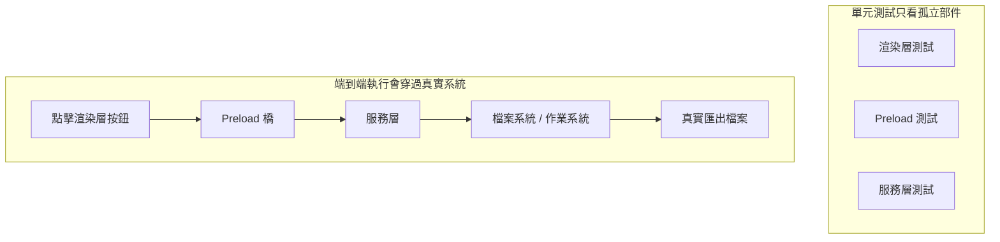
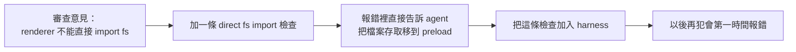

[English Version →](../../../en/lectures/lecture-10-why-end-to-end-testing-changes-results/)

> 本篇程式碼示例：[code/](https://github.com/walkinglabs/learn-harness-engineering/blob/main/docs/zh-TW/lectures/lecture-10-why-end-to-end-testing-changes-results/code/)
> 實戰練習：[Project 05. 讓 agent 自己檢查自己做的對不對](./../../projects/project-05-grounded-qa-verification/index.md)

# 第十講. 跑通完整流程才算真正驗證

你讓 agent 給 Electron 應用加一個檔案匯出功能。它寫了渲染程式元件、預載腳本、服務層邏輯，每個元件的單元測試都通過了。agent 說「做完了」。你實際一點擊匯出按鈕，檔案路徑格式不對、進度列沒反應、大檔案匯出時記憶體洩漏。5 個元件邊界缺陷，單元測試一個都沒發現。

這就像一個合唱團排練——每個聲部單獨唱的時候都完美，但合在一起的時候，女高音比男低音快了半拍，伴奏的調子和主旋律差了半個音。每個部分都「對」了，但整體跑調了。

Google 的測試金字塔告訴我們：大量單元測試是基礎，但如果你止步於此，就會持續漏掉元件互動問題。對於 AI 程式碼代理來說，這個問題更嚴重，agent 傾向於只跑最快的測試然後宣告完成。**只有端到端測試能證明系統級缺陷不存在**。

## 單元測試的盲區

單元測試的設計哲學是隔離，模擬依賴，專注被測單元。這個哲學使單元測試快速且精確，但也製造了系統性的盲區。就像合唱排練時每個聲部戴著耳機對著伴奏唱，聽著都挺好，但真正合在一起才發現問題：

**介面不相符**：渲染程式傳給預載腳本的檔案路徑是相對路徑，但預載腳本期望絕對路徑。各自的單元測試都用了 mock，都通過了。只有端到端跑通時才發現問題，就像兩個聲部各自練的時候都覺得節奏沒問題，一合才發現一個用 4/4 拍一個用 3/4 拍。

**狀態傳播錯誤**：資料庫遷移改了表結構，但 ORM 的快取層還持有舊結構的快取條目。單元測試每次都是全新的 mock 環境，不會暴露這種跨層狀態不一致。就像換了一首歌的歌詞，但有人還在唱舊版本。

**資源生命週期問題**：檔案描述符、資料庫連線、網路通訊端的獲取和釋放跨越多個元件。單元測試為每個測試建立和銷毀獨立資源，不會暴露資源競爭或洩漏。就像排練時每個聲部輪流用麥克風，但演出時所有聲部同時上台，麥克風不夠用了。

**環境依賴性**：程式碼在測試環境（一切 mock）行為正確，在真實環境因配置差異、網路延遲、服務不可用而失敗。就像排練廳裡唱得好好的，到了戶外音樂節風一吹麥克風一嘯叫就全亂了。

## 端到端測試不僅改變結果，還改變行為

這是很多人沒意識到的一點：當 agent 知道它的工作要過端到端測試時，它的編碼行為會改變。

1. **考慮元件互動**：寫程式碼時會想「這個介面和上游怎麼對接」，而不是只關注單個函式。就像知道最終要合在一起唱，練習的時候就會注意聽其他聲部。
2. **尊重架構邊界**：有架構約束的系統裡，端到端測試迫使 agent 遵守邊界規則。就像樂譜上標注了「此處漸強」，你得跟著來。
3. **處理錯誤路徑**：端到端測試通常包含故障場景，迫使 agent 考慮例外處理。就像排練時模擬了「麥克風突然沒聲了」的情況，你知道該怎麼做。

## 測試金字塔與審查回饋提升





OpenAI 在 Codex 工程實踐中強調：**為 agent 寫的錯誤訊息必須包含修復指導**。不寫 `「Direct filesystem access in renderer」`，而寫 `「Direct filesystem access in renderer. All file operations must go through the preload bridge. Move this call to preload/file-ops.ts and invoke it via window.api.」` 這把架構規則變成了自動修正的閉環。就像合唱排練時指揮不只說「你唱錯了」，而是說「這裡你快了半拍，聽一下女低音的節奏，在第 32 小節進入」。

## 核心概念

- **元件邊界缺陷**：元件 A 和 B 各自單元測試通過，但它們的互動產生了不正確的行為。這是端到端測試最擅長捕獲的問題類型，合唱裡各聲部單獨都對但合起來跑調的那種。
- **測試充分性梯度**：單元測試能檢測的缺陷 <= 整合測試能檢測的缺陷 <= 端到端測試能檢測的缺陷。每往上一層，檢測能力增強。
- **架構邊界執行規則**：把架構文件裡的規則（如「渲染程式不能直接存取檔案系統」）變成可執行的自動化檢查。從「寫在紙上」變成「跑在 CI 裡」。
- **審查回饋提升**：把重複出現的程式碼審查意見轉化為自動化測試。每次發現重複問題就加一條規則，harness 會自動變強。就像合唱排練時指揮把常見的錯誤編成練習曲，下次再犯同樣的錯誤，不用指揮說，練習曲自己就暴露了。
- **面向 agent 的錯誤訊息**：失敗資訊不只是說「出了什麼問題」，還要告訴 agent 具體怎麼修。這把測試失敗變成自我修正的回饋循環。

## 怎麼做

### 0. 先定好架構邊界，再寫端到端測試

端到端測試的前提是系統有明確的邊界。如果架構是一團麵條，端到端測試只會證明「這團麵條整體能跑」，不會告訴你哪裡違反了設計意圖。就像合唱團如果連分聲部都沒分好，排練再多也是亂唱。

OpenAI 的經驗：**對 agent 生成的程式碼庫，架構約束必須是第一天就建立的早期前置條件，不是等團隊規模大了再考慮的事。** 原因很直接，agent 會複製儲存庫中已有的模式，即使那些模式是不均勻的或次優的。沒有架構約束，agent 會在每次工作階段中引入更多偏差。

OpenAI 採用了「分層領域架構」，每個業務領域被分成固定的層：Types → Config → Repo → Service → Runtime → UI。依賴方向嚴格向前，跨領域關注點通過顯式的 Providers 介面進入。任何其他依賴都是禁止的，並且通過自訂 lint 機械執行。

關鍵原則：**執行不變數，不微管實現。** 比如要求「資料在邊界解析」，但不規定用哪個程式庫。錯誤訊息要包含修復指導，不只是說「違規了」，還要告訴 agent 具體怎麼改。

> 來源：[OpenAI: Harness engineering: leveraging Codex in an agent-first world](https://openai.com/index/harness-engineering/)

### 1. harness 必須包含端到端層

在你的驗證流程裡明確：對於涉及跨元件修改的任務，端到端測試通過是完成的前置條件：

```
## 驗證層級
- 層級 1: 單元測試 (必須通過)
- 層級 2: 整合測試 (必須通過)
- 層級 3: 端到端測試 (涉及跨元件修改時必須通過)
- 跳過任何必須層級的任務 = 未完成
```

### 2. 把架構規則變成可執行檢查

每條架構約束都應該有對應的測試或 lint 規則：

```bash
# 檢查渲染程式是否直接呼叫 Node.js API
grep -r "require('fs')" src/renderer/ && exit 1 || echo "OK: no direct fs access in renderer"
```

### 3. 設計面向 agent 的錯誤訊息

失敗資訊要包含三要素：什麼出了問題、為什麼、怎麼修：

```
ERROR: Found direct import of 'fs' in src/renderer/App.tsx:12
WHY: Renderer process has no access to Node.js APIs for security
FIX: Move file operations to src/preload/file-ops.ts and call via window.api.readFile()
```

### 4. 建立審查回饋提升流程

每次在程式碼審查中發現新類型的 agent 錯誤，就把它變成自動化檢查。一個月後你的 harness 會比月初強得多。就像合唱團的排練筆記，每次排練發現的問題都記下來，下次排練前先檢查這些點。久而久之，常見錯誤越來越少，音樂越來越和諧。

## 實際案例

**任務**：在 Electron 應用中實現檔案匯出功能。涉及渲染程式 UI、預載腳本檔案系統代理、服務層資料轉換。

**各聲部單獨唱（單元測試通過）**：渲染元件測試（通過，mock 檔案操作）、預載腳本測試（通過，mock 檔案系統）、服務層測試（通過，mock 資料來源）。agent 聲明完成。

**合唱合在一起（端到端測試揭示的缺陷）**：

| 缺陷 | 描述 | 單元測試 | 端到端 |
|------|------|---------|--------|
| 介面不相符 | 檔案路徑格式不一致 | 未檢測 | 檢測 |
| 狀態傳播 | 匯出進度未通過 IPC 傳回 UI | 未檢測 | 檢測 |
| 資源洩漏 | 大檔案匯出描述符未釋放 | 未檢測 | 檢測 |
| 權限問題 | 打包環境權限不同 | 未檢測 | 檢測 |
| 錯誤傳播 | 服務層例外未到 UI 層 | 未檢測 | 檢測 |

5 個缺陷全部被端到端測試捕獲，單元測試一個都沒發現。代價是測試時間從 2 秒增加到 15 秒，在 agent 工作流裡完全可以接受。每個聲部單獨唱得再好，也比不上一次完整的合唱排練。

## 關鍵要點

- **單元測試對元件邊界缺陷系統性盲視**，它們的隔離設計恰好使其無法檢測互動問題。每個人唱得都對，不代表合唱不跑調。
- **端到端測試不僅檢測缺陷，還改變 agent 的編碼行為**——讓它更關注整合和邊界。
- **架構規則必須可執行**，要每次提交自動檢查，不應只寫在文件裡等人查看。
- **錯誤訊息要面向 agent 設計**，包含「怎麼修」的具體步驟，形成自我修正閉環。
- **審查回饋提升讓 harness 自動變強**，每個被捕獲的缺陷類別都變成永久防線。

## 延伸閱讀

- [How Google Tests Software - Whittaker et al.](https://www.goodreads.com/book/show/13563030-how-google-tests-software)，測試金字塔模型的經典來源
- [Harness Engineering - OpenAI](https://openai.com/index/harness-engineering/)，架構約束自動化執行的工程實踐
- [Chaos Engineering - Netflix (Basiri et al.)](https://ieeexplore.ieee.org/document/7466237)，主動注入故障驗證系統彈性
- [QuickCheck - Claessen & Hughes](https://www.cs.tufts.edu/~nr/cs257/archive/john-hughes/quick.pdf)，屬性測試方法，介於示例測試和形式化驗證之間

## 練習

1. **跨元件缺陷檢測**：選一個涉及至少三個元件的修改任務。先只跑單元測試記錄結果，再跑端到端測試。分析每個額外發現的缺陷屬於哪種跨層互動問題。

2. **架構規則自動化**：選專案裡的一條架構約束，把它變成可執行檢查（含面向 agent 的錯誤訊息）。整合到 harness 裡，用基準任務驗證效果。

3. **審查回饋提升**：從程式碼審查歷史中找一個重複出現的意見類型，按五步流程轉化為自動化檢查。比較提升前後該類問題的出現頻率。
