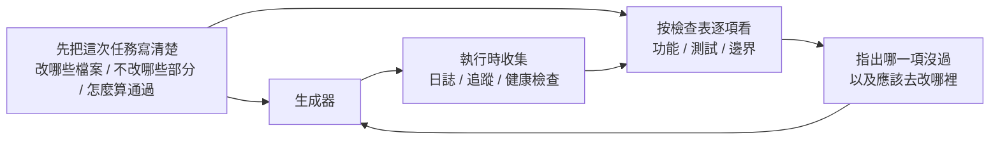

[English Version →](../../../en/lectures/lecture-11-why-observability-belongs-inside-the-harness/)

> 本篇程式碼示例：[code/](https://github.com/walkinglabs/learn-harness-engineering/blob/main/docs/zh-TW/lectures/lecture-11-why-observability-belongs-inside-the-harness/code/)
> 實戰練習：[Project 06. 搭建一套完整的 agent 工作環境](./../../projects/project-06-runtime-observability-and-debugging/index.md)

# 第十一講. 讓 agent 的執行過程可觀測

你讓 agent 做一個功能，它跑了 20 分鐘，改了一堆檔案，然後告訴你「做完了但有兩個測試失敗」。你問它為什麼失敗，它說「不太確定，可能是時序問題」。你問它改了哪些關鍵路徑，它說「讓我看看程式碼……」。

harness 沒有給 agent 裝上所需的儀表盤，才導致這種困境。想象你在開一輛沒有儀表盤的車，沒有速度表、沒有油量表、沒有發動機故障燈。你能開，但你不知道開多快、還剩多少油、發動機是不是快爆了。技術再好的司機，蒙著眼也得出事。

**沒有可觀測性，agent 在不確定狀態中做決策，評估變成主觀判斷，重試變成盲目摸索。** OpenAI 和 Anthropic 都將可靠性定義為證據問題，harness 必須以可指導下一步決策的形式暴露執行時期行為和評估訊號。

## 可觀測性缺失的真實代價

當 harness 缺乏可觀測性時，四類問題系統性出現：

**無法區分「正確」和「看似正確」**，一個函式在程式碼審查時看起來完全正確，語法對、邏輯通。但執行時期因為邊界條件處理錯誤，在特定輸入下產生了不正確結果。只有執行時期追蹤能揭示實際執行路徑偏離了預期。靜態審查只能驗證程式碼結構，無法取代對實際執行路徑的直接觀察。

**評估變成玄學**，沒有評分標準和驗收條件時，評估者（人或 agent）依賴隱式假設。同一個輸出，不同評估者可能給出截然不同的評價。質量評估不可復現。評估標準的缺失使品質判斷無法對齊，同一輸出的評價結果因評估者而異。

**重試變成盲猜**，agent 不知道為什麼失敗時，重試方向是隨機的。它可能在錯誤的方向上反覆嘗試，修復了不相關的程式碼路徑而忽略真正的故障根源。每次錯誤方向的重試都擴大了與真正根因的距離。每次盲重試都消耗 token 和時間。

**工作階段交接資訊斷崖**，當未完成的工作移交給下一個工作階段時，缺乏可觀測性意味著新工作階段必須從零診斷系統狀態。Anthropic 的長期執行 agent 觀察表明，這種重複診斷可能佔工作階段總時間的 30-50%。新工作階段缺乏前一階段的脈絡，必須從頭診斷，重複投入本可省略的工作。

## Claude Code 的真實場景

想象一個使用「計劃者-生成者-評估者」三角色工作流的 harness，執行「為應用添加暗色模式」任務。

**沒有儀表盤**，計劃者輸出模糊描述。生成者根據模糊描述實現暗色模式，但和計劃者的隱式預期不一致。評估者基於自己的隱式標準拒絕，但說不出具體哪裡不對，「感覺不太對」。生成者基於模糊拒絕理由盲重試。循環 3-4 次，總耗時約 45 分鐘，最終勉強產出。

**有完整儀表盤**，計劃者輸出衝刺合約，列明要改哪些元件、每個元件的驗證標準、排除項（不處理列印樣式）。生成者按合約實現。執行時期可觀測性記錄每個元件的樣式加載和應用過程。評估者用評分標準逐維度評估，附具體證據引用，「按鈕顏色對比度不足（WCAG AA 標準 4.5:1，實測 2.1:1）」。一次迭代出高質量結果，總耗時約 15 分鐘。

效率差 3 倍。區別只在可觀測性，給車裝上了儀表盤。

## 雙層可觀測性

可觀測性不是「多打點日誌」那麼簡單。它分兩層，缺一不可：



**執行時期可觀測性**，系統層的訊號——日誌、追蹤、程式事件、健康檢查。回答「系統做了什麼」。這是你車上的儀表盤，速度、油量、發動機溫度。

**過程可觀測性**，harness 決策工件的可見性，計劃、評分標準、驗收條件。回答「為什麼這個變更應該被接受」。這是你的導航系統，不光知道現在在哪，還知道為什麼走這條路。

## 核心概念

- **執行時期可觀測性**：系統層的訊號，日誌、追蹤、程式事件、健康檢查。回答「系統做了什麼」。
- **過程可觀測性**：harness 決策工件的可見性，計劃、評分標準、驗收條件。回答「為什麼這個變更應該被接受」。
- **任務軌跡**：一個任務從開始到完成的完整決策路徑記錄，類似分佈式系統中的請求追蹤。agent 的每一步操作及其脈絡都被記錄。出現問題時，可依任務軌跡完整重播決策過程，精確定位分叉點。
- **衝刺合約**：編碼開始前協商的短期協定，明確任務範圍、驗證標準、排除項。是過程可觀測性的核心工具。
- **評估評分標準**：把質量評估從主觀判斷變成基於證據的結構化評分。使不同評估者對同一輸出產生相似結論。結構化評分使評估流程具備可重現性，避免主觀判斷的不一致性。
- **雙層可觀測性**：系統層和過程層同時設計、相互增強。執行時期信號解釋行為，過程工件解釋意圖。

## 為什麼 agent 自己解決不了這個問題

你可能在想：「agent 不能自己打日誌嗎？」 問題在於：

1. **agent 不知道它不知道什麼**——它不會主動記錄自己沒意識到需要的訊號。agent 只記錄它意識到需要記錄的訊號，對未察覺的問題域天然盲目。
2. **日誌格式不統一**，不同工作階段用不同的日誌格式，無法做系統化分析。格式各異的日誌無法在工作階段間做系統化比對分析。
3. **過程可觀測性不是日誌能解決的**，衝刺合約和評分標準是結構化的工件，需要 harness 層面的支援。不是多 print 幾行就能搞定的。

## 怎麼裝儀表盤

### 1. 在 harness 裡內置執行時期信號採集

不要依賴 agent 自己打日誌。harness 應該自動採集以下信號：

- **應用生命週期**：啟動、就緒、執行、關閉各階段狀態
- **功能路徑執行**：關鍵路徑的執行記錄，包括入口、檢查點和出口
- **資料流**：資料在元件間的流轉記錄
- **資源利用**：異常的資源使用模式（如記憶體持續增長）
- **錯誤和例外**：完整的錯誤脈絡，不只是錯誤訊息

### 2. 實施衝刺合約

在每個任務開始前，生成者和評估者（可能是同一個 agent 的不同呼叫）協商一份合約，協定任務範圍與完成標準：

```markdown
# 衝刺合約: 暗色模式支援

## 範圍
- 修改主題切換元件
- 更新全局 CSS 變數
- 新增暗色模式測試

## 驗證標準
- 每個元件的視覺回歸測試通過
- 主流程端到端測試通過
- 無樣式閃爍 (FOUC)

## 排除項
- 不處理列印樣式
- 不處理第三方元件暗色模式
```

### 3. 建立評估評分標準

把「好不好」轉為可量化的結構化評分：

```markdown
# 評分標準

| 維度 | A | B | C | D |
|------|---|---|---|---|
| 程式碼正確性 | 所有測試通過 | 主流程通過 | 部分通過 | 編譯失敗 |
| 架構合規 | 完全合規 | 輕微偏離 | 明顯偏離 | 嚴重違反 |
| 測試覆蓋 | 主流程+邊緣 | 僅主流程 | 僅有骨架 | 無測試 |
```

### 4. 用 OpenTelemetry 標準化

為每個 harness 工作階段建立一個 trace，每個任務建立一個 span，每個驗證步驟建立子 span。使用標準屬性標注關鍵資訊。這樣可觀測性資料可以和標準工具鏈（Jaeger、Zipkin）整合。

## Anthropic 的三 agent 架構實驗

Anthropic 在 2026 年 3 月發佈了一項系統性的 harness 實驗。他們用三種架構跑同一個任務（「用 Web Audio API 做一個瀏覽器端 DAW」），記錄了詳細的階段資料：

| Agent 和階段 | 時長 | 成本 |
|------------|------|------|
| Planner（規劃者） | 4.7 分鐘 | $0.46 |
| Build 第 1 輪 | 2 小時 7 分鐘 | $71.08 |
| QA 第 1 輪 | 8.8 分鐘 | $3.24 |
| Build 第 2 輪 | 1 小時 2 分鐘 | $36.89 |
| QA 第 2 輪 | 6.8 分鐘 | $3.09 |
| Build 第 3 輪 | 10.9 分鐘 | $5.88 |
| QA 第 3 輪 | 9.6 分鐘 | $4.06 |
| **總計** | **3 小時 50 分鐘** | **$124.70** |

三個 agent 各司其職，每個都有明確的可觀測性角色：

**Planner（規劃者）**，接收一段 1-4 句話的使用者需求，擴展成完整產品規格。被要求「大膽設定範圍」並且「專注於產品脈絡和高層技術設計，而不是詳細的技術實現」。原因是，如果 planner 過早指定了粒度技術細節且搞錯了，錯誤會級聯到下游實現。更好的做法是約束交付物，讓 agent 在執行中自己找到路徑。粒度過細的技術規格若有誤，錯誤會在實現階段逐層放大。

**Generator（生成者）**，按 sprint 逐個功能實現。每個 sprint 前和 evaluator 協商一份 sprint 合約，約定這個功能塊「做完」的標準。然後按合約實現，自評後交給 QA。按合約施工，不按感覺施工。

**Evaluator（評估者）**，用 Playwright MCP 像使用者一樣點擊執行中的應用，測試 UI 功能、API 端點和資料庫狀態。對每個 sprint 按四個維度評分，產品深度、功能性、視覺設計和程式碼品質。每個維度有硬性閾值，任一不達標則 sprint 失敗，generator 收到詳細回饋後修復。評分失敗的 sprint 連同具體說明一併交回 generator 修復，通過後方可進入下一個功能。

QA 第 1 輪回饋的示例，「這是一個視覺上令人印象深刻的應用，AI 整合工作良好，但核心 DAW 功能有幾個是展示性的，沒有互動深度，剪輯不能拖拽/移動，沒有樂器 UI 面板（合成器旋鈕、鼓墊），沒有視覺效果編輯器（EQ 曲線、壓縮器儀表）」。這些不是邊緣情況，它們是讓 DAW 可用的核心互動。具體的、有證據的回饋，不是「感覺不對」。

Evaluator 不是一開始就這麼強。早期版本會識別出合理的問題，然後說服自己這些問題不嚴重，最終批準工作。調校方式是，讀 evaluator 的日誌，找到它的判斷和人類判斷分叉的地方，更新 QA 的 prompt 解決那些問題。經過幾輪這種開發循環，evaluator 的評分才變得合理。evaluator 的初始版本通常過於寬容，需要通過日誌分析與 prompt 迭代才能達到可用的評分標準。

> 來源：[Anthropic: Harness design for long-running application development](https://www.anthropic.com/engineering/harness-design-long-running-apps)

## 關鍵要點

- **可觀測性是 harness 的架構屬性**，是設計時必須考慮的核心能力。儀表盤不是可選配件，是出廠標配。
- **雙層可觀測性缺一不可**，執行時期訊號解釋「發生了什麼」，過程工件解釋「為什麼這樣做」。速度表和導航系統各有各的用處。
- **衝刺合約前置對齊工作**，防止「生成者做了評估者因可預見原因立即拒絕的東西」。施工協定要在開工前簽，不是完工後補。
- **評分標準讓評估可復現**，不同評估者對同一輸出產生相似評分。有了評分標準，十個裁判的分才不會差太遠。
- **可觀測性缺失導致 30-50% 的工作階段時間浪費在重複診斷上**。

## 延伸閱讀

- [Observability Engineering - Charity Majors](https://www.honeycomb.io/blog/observability-engineering-book) — 現代可觀測性工程的理論和實踐框架
- [Dapper - Google (Sigelman et al.)](https://research.google/pubs/pub36356/) — 大規模分佈式追蹤的開創性實踐
- [Harness Design - Anthropic](https://www.anthropic.com/engineering/harness-design-long-running-apps) — 引入衝刺合約和評估評分標準
- [Site Reliability Engineering - Google](https://sre.google/sre-book/table-of-contents/) — 可觀測性在生產系統中的系統化應用

## 練習

1. **可觀測性差距分析**：審查你目前的 harness，評估系統層和過程層可觀測性。找出無法從現有訊號區分的系統狀態，提出補充方案。

2. **衝刺合約實踐**：為一個真實任務寫衝刺合約。讓 agent 按合約執行，對比沒有合約時的效率和品質差異。

3. **任務軌跡構建**：記錄一個完整編碼任務中 agent 的每一步操作。用 OpenTelemetry 語義約定標注。分析軌跡中的資訊瓶頸，哪些步驟的決策缺乏足夠的訊號支援。
