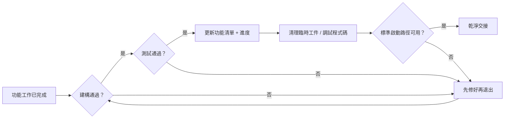
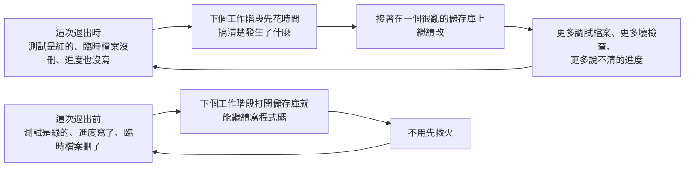

[English Version →](../../../en/lectures/lecture-12-why-every-session-must-leave-a-clean-state/)

> 本篇程式碼示例：[code/](https://github.com/walkinglabs/learn-harness-engineering/blob/main/docs/zh-TW/lectures/lecture-12-why-every-session-must-leave-a-clean-state/code/)
> 實戰練習：[Project 06. 搭建一套完整的 agent 工作環境](./../../projects/project-06-runtime-observability-and-debugging/index.md)

# 第十二講. 每次工作階段結束前都做好交接

你的 agent 跑了一下午，改了 20 個檔案，提交了程式碼，工作階段結束。下一個 agent 工作階段開始，一上來就發現：建構失敗了、測試紅了、臨時調試檔案到處都是、功能清單沒更新、進度完全不清楚。新工作階段的前 30 分鐘全花在「搞清楚上一個工作階段到底幹了什麼」上。

一個工作階段留下的混亂，直接壓縮了下一個工作階段的可用時間。新工作階段本來要做新功能，卻先花半小時釐清上一個工作階段的殘局，環境混亂更會降低後續工作品質。

OpenAI 和 Anthropic 都明確指出：**長期可靠性取決於操作紀律，不僅是單次執行的成功。** 每個工作階段結束時的狀態品質，直接決定下一個工作階段的效率。

## 熵增是預設狀態

Lehman 的軟體演化定律表明，持續變更的系統，除非主動管理，否則複雜性必然增加。這對 AI 程式碼代理尤其成立，agent 每次工作階段都會引入變更，如果不在退出時清理，技術債務會指數級累積。宿舍不打掃，髒衣服和外賣盒只會越堆越多，不會自己消失。

OpenAI 在 5 個月的 Codex 實驗中觀察到，**agent 會複製儲存庫中已有的模式，即使那些模式是不均勻的或次優的。** 隨著時間的推移，這種複製必然導致漂移。初始的模式不均勻性在反覆複製後會逐漸放大，最終導致程式碼庫明顯漂移。

OpenAI 團隊最初花每週五（20% 的工作時間）手動清理「AI slop」。不出所料，這種方式不可擴展。週期性的手動清理無法阻止日常累積的技術債。他們的解決方案是：

1. **把「黃金原則」編碼進儲存庫**，比如「優先使用共享工具套件而非手寫的 ad-hoc 輔助函式」（保持不變數集中）、「不要 YOLO 式地猜資料結構」（驗證邊界或依賴類型化 SDK）。這些原則是具體的、機械的、可自動檢查的。
2. **建立週期性的清理流程**，一組背景 Codex 任務定期掃描偏差，更新品質評分，開針對性的重構 PR。大多數可以在一分鐘內審查並自動合併。自動化清理任務取代了手動定期大掃除，降低維護成本。
3. **人類品味捕獲一次，持續執行**，審查意見、重構 PR、使用者端 bug 都被轉化為文件更新或直接編碼到工具中。當文件不夠用時，把規則提升為程式碼。口頭約定固化為可執行的規則，使品味標準持續生效。

技術債的累積與清償遵循高息貸款邏輯，持續小額還清幾乎總是比攢到一次性爆發好得多。

> 來源：[OpenAI: Harness engineering: leveraging Codex in an agent-first world](https://openai.com/index/harness-engineering/)

## 清潔狀態：不只看地上有沒有垃圾

清潔狀態不是單一的「程式碼能編譯」。程式碼能無錯建構——這是最基本的，下一個工作階段不應該先修建構錯誤。可建構是移交狀態的最低門檻，不可跳過。所有測試也得通過，包括工作階段之前就存在的測試，工作階段有責任不破壞已有功能。而且要在 CI 環境驗證，不是「在我機器上通過」。



但這還不夠。目前進度必須記錄在機器可讀的工件中，已完成的子任務和通過標準、進行中但未完成的子任務和目前狀態、尚未開始的子任務。好的進度記錄減少 60-80% 的工作階段啟動診斷時間。調試日誌、臨時檔案、註解掉的程式碼、TODO 標記這些臨時工件得清理乾淨，它們增加下一個工作階段的認知負擔。標準啟動路徑也必須可用，下一個工作階段能不能不人工干預就開始工作？環境初始化、程式碼庫載入、脈絡獲取、任務選擇，這些路徑不能被破壞。



## 核心概念

- **清潔狀態**：工作階段結束時系統滿足五個條件——建構通過、測試通過、進度已記錄、無過時工件、啟動路徑可用。缺一個都不算「做完」。
- **工作階段完整性**：類比資料庫事務，要麼全部提交並留下清潔狀態，要麼回溯到上一致狀態。沒有中間地帶。
- **品質文件**：對每個模塊的品質等級做持續記錄的活躍工件。持續追蹤程式碼庫是變強了還是變弱了。
- **清理循環**：定期的維護工作階段，目標是系統性減少程式碼庫中的熵。是常規運維，而非一次性緊急處置。
- **harness 簡化**：隨著模型能力提升，定期移除不再必要的 harness 元件。今天必要的約束，三個月後可能是多餘的開銷。
- **冪等清理**：清理操作無論執行多少次都產生相同結果。使清理在失敗重試場景中保持安全。

## 「以後再清理」是永遠不清理

最常見的心理陷阱是「這次來不及清理了，下次再弄」。但下次的 agent 不知道你上次留下了什麼，它看到的是一堆混亂的程式碼和不確定的狀態。它會花大量時間推斷「這堆程式碼裡哪些是有意的，哪些是臨時的」。

更糟的是，每個工作階段都有自己的任務目標。新工作階段來的時候是要做新功能的，不是來清理上一個工作階段的爛攤子的。它會忽略混亂直接開始新工作，然後在混亂的基礎上引入更多混亂。這是熵增的正回饋循環，混亂基礎上引入更多變更，使狀態愈發難以追蹤，形成自我強化的惡性循環。

資料為證。一個使用 agent 持續開發 12 週的專案，沒有清潔策略的情況下：

- 第 1 週：建構通過率 100%，測試通過率 100%，新工作階段啟動 5 分鐘
- 第 4 週：建構 95%，測試 92%，啟動 15 分鐘
- 第 8 週：建構 82%，測試 78%，啟動 35 分鐘
- 第 12 週：建構 68%，測試 61%，啟動 60+ 分鐘

同樣的專案，有清潔策略的情況下：

- 第 1 週：100%，100%，5 分鐘
- 第 12 週：97%，95%，9 分鐘

12 週後，建構通過率差 29 個百分點，新工作階段啟動時間差 85%。以上數據源自實際觀測，有明確的可重現紀錄。每週不倒垃圾的宿舍和每週倒垃圾的宿舍，12 週後的差距是驚人的。

## 怎麼做

### 1. 清潔狀態是完成的必要條件

在 harness 裡明確定義：**工作階段完成 = 任務通過驗證 AND 清潔狀態檢查通過。** 缺任何一個，工作階段不算完成。在 CLAUDE.md 裡寫：

```
## 工作階段退出檢查清單
- [ ] 建構通過 (npm run build)
- [ ] 所有測試通過 (npm test)
- [ ] 功能清單已更新
- [ ] 無調試程式碼殘留 (console.log, debugger, TODO)
- [ ] 標準啟動路徑可用 (npm run dev)
```

### 2. 雙模式清理策略

結合兩種清理模式：

**即時清理（每個工作階段結束時）**，清理本次工作階段建立的臨時工件、更新功能清單狀態、讓建構和測試通過。這是「引用計數式」清理，用完就清，避免積累。

**定期清理（每週一次）**，全系統掃描，處理累積的結構性問題、更新品質文件、執行基準測試檢測漂移。這是「追蹤式」清理，定期做一次大掃除。

### 3. 維護質量文檔

質量文檔持續追蹤每個模塊的品質等級：

```markdown
# 品質文件

## 使用者認證模組 (品質: A)
- 驗證通過: 是
- agent 可理解: 是
- 測試穩定性: 穩定
- 架構邊界: 合規
- 程式碼規範: 遵循

## 支付模組 (品質: C)
- 驗證通過: 部分（支付回調未測試）
- agent 可理解: 困難（邏輯分散在 3 個檔案）
- 測試穩定性: 不穩定（2 個 flaky 測試）
- 架構邊界: 有違規
- 程式碼規範: 部分遵循
```

新工作階段讀這個文件就知道優先處理哪裡。品質評分最低的模組先修。模組評分直接決定下一個工作階段的修復優先順序。

### 4. 定期簡化 harness

harness 裡的每個元件之所以存在，是因為模型無法獨立做好某件事。但隨著模型改進，這些假設會過時。模型能力提升後，原本必要的 harness 元件可能變成多餘的開銷，而部分元件在特定任務難度下仍具價值。

Anthropic 的實驗直接展示了這一點。他們最初的 harness 包含 sprint 拆分機制，把工作分成小塊讓 Sonnet 4.5 逐個完成。當 Opus 4.6 發佈後，模型的原生能力已經可以自主處理工作分解，sprint 構造變成了不必要的開銷。移除後，builder agent 能連續工作超過兩小時而不會跑偏，反而更流暢。

但 evaluator 的情況不同。即使 Opus 4.6 能力更強，在任務接近模型能力邊界時，evaluator 仍然提供了實際價值，捕獲 generator 的遺漏功能和存根實現。這意味著 evaluator 的必要性取決於任務難度相對於模型能力的位置。

**推薦做法**，每月挑一個 harness 元件，暫時停用它，跑基準任務。如果結果沒退化，永久移除。如果退化了，恢復或用更輕量的替代。定期重新評估 harness 元件的必要性，隨模型能力演進移除已過時的約束。

一個更具體的原則：**隨著模型改進，harness 的有趣組合移動了。** 以前必須解決的問題被模型能力覆蓋了，但新的能力邊界打開了以前不可能的 harness 設計。AI 工程師的工作是持續找到下一個有價值的組合。

### 5. 清理操作必須冪等

清理腳本要能安全地重複執行，無論執行幾次都輸出相同結果：

```bash
# 冪等的清理操作
rm -f /tmp/debug-*.log  # -f 確保檔案不存在時不報錯
git checkout -- .env.local  # 恢復到已知狀態
npm run test  # 驗證清理未破壞功能
```

### 6. 高吞吐量改變了 merge 哲學

當 agent 的產出遠超人類審查能力時，傳統的 merge 哲學需要調整。OpenAI 團隊的經驗表明，在一個 agent 每天開 3.5 個 PR（且後來增加到更多）的環境裡，最小化阻塞式 merge gate 是正確的。PR 應該短命。測試 flake 通常用後續執行解決，而不是無限期阻塞進度。在一個修正成本很低、等待成本很高的系統裡，快速前進 + 快速修正是比緩慢確認更好的策略。

**注意**，這在低產出環境裡是不負責任的。但在 agent 產出遠超人類注意力的環境裡，這通常是正確的權衡。關鍵判斷標準，**修正一個 bug 的平均成本 vs 等待人類審查一個 PR 的平均成本。** 前者低於後者時，快速合併是對的。

## 實際案例

一個使用 agent 持續開發的 Electron 應用，12 週演化過程的對比資料：

**無清潔策略（對照組）**，從不倒垃圾的宿舍，第 12 週，建構通過率 68%，測試通過率 61%，新工作階段啟動 60+ 分鐘，過時工件 103 個。

**有清潔策略（實驗組）**，每天值日的宿舍，每個工作階段結束時執行完整清潔檢查 + 每週清理循環。第 12 週，建構通過率 97%，測試通過率 95%，新工作階段啟動 9 分鐘，過時工件 11 個。

到第 12 週，實驗組的建構通過率比對照組高 29 個百分點，測試通過率高 34 個百分點，新工作階段啟動時間減少 85%。每天多花 5 分鐘打掃衛生，12 週後省下了幾十個小時的混亂時間。

## 關鍵要點

- **清潔狀態是工作階段完成的必要條件**，不是可選的善後工作，是「完成定義」的一部分。你不倒垃圾，下一個室友就得替你倒。
- **五個維度缺一不可**，建構、測試、進度、工件、啟動，每個都要顯式檢查。
- **品質文件讓程式碼庫健康可追蹤**，知道哪裡在退化才能主動修復。衛生檢查表不是形式主義，是讓你知道哪塊地還沒拖。
- **定期簡化 harness**，隨著模型能力提升，移除不再必要的約束。大四了就別執行大一的宿舍公約了。
- **「以後再清理」等於永遠不清理**，熵增是預設狀態，主動的清潔操作是對抗熵增的唯一途徑。

## 延伸閱讀

- [Clean Code - Robert C. Martin](https://www.goodreads.com/book/show/3735293-clean-code) — 程式碼清潔性的系統化原則
- [Harness Engineering - OpenAI](https://openai.com/index/harness-engineering/) — 可重複性作為 harness 設計的核心要求
- [Effective Harnesses - Anthropic](https://www.anthropic.com/engineering/effective-harnesses-for-long-running-agents) — 清潔工作階段退出對長期可靠性的關鍵作用
- [Programs, Life Cycles, and Laws of Software Evolution - Lehman](https://ieeexplore.ieee.org/document/1702314) — 軟體演化定律，證明系統複雜性在無主動維護時必然增長

## 練習

1. **清潔狀態檢查表**：為你的程式碼庫設計一個工作階段退出檢查表，涵蓋五個維度。在 5 個連續工作階段中應用，記錄每個維度上的違反次數。

2. **基準對比實驗**：固定任務集，兩種 harness 變體（有/無清潔狀態要求）各跑一遍。比較完成率、重試次數和缺陷逃逸率。

3. **harness 簡化實踐**：選一個 harness 元件，暫時停用，跑基準任務。比較有無該元件的結果。決定保留、移除還是替換。
